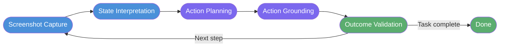

For decades, browser automation meant writing scripts. But a new class of tools—Computer-Using Agents (CUAs) like OpenAI's Operator—is changing that. Locate a DOM element by ID, fire a click event, assert the response. If the website changed its markup, your script broke. If the site used a JavaScript-heavy single-page app with no stable selectors, you were in for a long night of DOM archaeology.

That model is being challenged. In January 2025, OpenAI launched Operator—an agent that doesn't inspect the DOM at all. Instead, it takes screenshots, reasons about what it sees, and moves a virtual mouse and keyboard to interact with any website exactly as a human would. The underlying architecture, called the Computer-Using Agent (CUA) model, sidesteps integration entirely and bets on vision instead.

This is a significant shift. Understanding why it matters—and where it still falls short—requires looking at both the technical architecture and the real-world limitations that define the current state of GUI-interacting AI.

## The Evolution of Agents: From APIs to GUI Interaction

Every generation of automation has expanded the surface area an agent can reach. Shell scripts gave way to web scrapers parsing HTML, which gave way to API-first agent frameworks like LangChain and AutoGPT calling REST endpoints and processing JSON responses. Each step improved reliability and speed—but each step also depended on developers having built the right access layer.

APIs are an explicit contract. If the service doesn't offer an endpoint for an action, the agent can't take it. That covers a surprising portion of the web. Most consumer-facing websites—booking platforms, e-commerce storefronts, government portals, niche business sites—have no public API. The only way to automate interactions with them is to use the front-end designed for humans: the browser.

Computer-Using Agents attack this gap directly. Rather than requiring an API, they operate through the same visual interface any user would encounter. The trade-off is a fundamentally different interaction model: instead of fast, structured data exchanges, you get visual processing, coordinate-based actions, and probabilistic reasoning. That makes CUAs slower and less deterministic—but it means they can operate on surfaces that have historically been beyond the reach of automation entirely.

Whether the tradeoff is worthwhile depends on the task: for high-volume structured workflows on stable systems, it is not; for one-off research and transactional tasks on the open web, it increasingly is.

## Unpacking OpenAI's CUA Model: How Vision Replaces Code

The CUA model combines GPT-4o's multimodal vision with advanced reasoning trained through reinforcement learning. Rather than parsing DOM structure or calling JavaScript APIs, the model processes the visual state of a browser page—raw pixels, text, layout—and reasons about what to do next.

At each step, the model captures a screenshot of the active browser tab, interprets the visual state—reading text, identifying buttons, understanding layout—then plans and grounds the next action to specific screen coordinates, issuing mouse clicks, scrolls, and keyboard input via virtual input devices. After each action, a fresh screenshot confirms whether the step succeeded before the loop repeats.

*The CUA interaction loop: each step produces a new screenshot, grounding the next action in the current page state rather than any pre-compiled selector or assumption.*

This continuous feedback loop enables CUA to navigate unfamiliar interfaces and recover when pages render unexpectedly—with no compiled XPath, no hardcoded selector, no positional assumption baked in at development time.

Benchmark results give a sense of where the capability stands today. The CUA model achieves a 38.1% success rate on OSWorld (general computer-use tasks across desktop applications), 58.1% on WebArena (realistic web navigation and form completion), and 87% on WebVoyager (web research tasks). The pattern is consistent: performance improves as the task scope narrows toward browser-only interaction, and drops as task complexity and the number of required steps increases.

## Operator in Action: Real-World Browser Automation

Operator launched in January 2025 as a research preview for US-based ChatGPT Pro subscribers—those paying $200 per month for the highest-tier plan—accessible at `operator.chatgpt.com` (since absorbed into ChatGPT's built-in agent mode). The deployment model is deliberately transparent: users watch the agent operate in a streaming browser view and can pause or take over at any moment.

At launch, OpenAI partnered with DoorDash, Instacart, Priceline, and Uber—alongside partners including OpenTable, StubHub, Thumbtack, eBay, and Etsy—to demonstrate end-to-end transactional workflows. A user can instruct Operator to order dinner from a specific restaurant, find the cheapest available flight on a given route, or reserve a restaurant table for two people on a specific evening. The agent handles the full multi-page sequence: searching, comparing options, populating form fields, and navigating through checkout steps.

Beyond consumer transactions, early users found the agent useful for comparative shopping across multiple e-commerce sites, extracting structured data from sources that offer no export functionality, and piecing together research from several websites into a coherent summary. The common thread across successful use cases is tasks that span multiple websites, have no public API, and would otherwise require a person to patiently click through many screens.

The streaming, interactive delivery model is not incidental—it is the product's core safety mechanism. Operator is a supervised assistant you hand a task to and watch execute, not a background process running autonomously. That design choice directly shapes what the agent can do and what it is permitted to do.

## Breaking the Rules: Why CUA Succeeds Where RPA Fails

Robotic Process Automation tools like UiPath and Automation Anywhere have dominated UI-level automation in enterprise settings for years. Their architecture is fundamentally different from CUA, and understanding the difference clarifies where each approach wins.

Traditional RPA bots work by recording and replaying interactions against deterministic selectors—element IDs, XPath expressions, fixed pixel coordinates—and deliver excellent throughput on stable internal systems like insurance claims processing and ERP data entry. The failure mode appears when interfaces change: a website redesign or minor DOM restructuring can break a bot that functioned perfectly the day before, and maintaining RPA against external websites that update without notice often requires ongoing engineering effort that exceeds the productivity gains.

CUAs don't break this way. Because the model understands pages semantically—reading what a button says, recognizing a date picker by how it looks and behaves, interpreting error messages in context—it adapts to layout changes the same way a human operator would. A redesigned checkout page gets handled by observing what is on screen and reasoning about what to do, not by matching against stored selectors that may no longer exist.

The tradeoff is real: CUAs are slower, more expensive per task, and less predictable in outcomes than well-configured RPA. For stable high-volume workflows, RPA wins on economics. For tasks on the open web where interface stability cannot be assumed, CUA is the more practical choice.

## The Boundaries of Autonomy: Current Technical Limitations

The 87% success rate on WebVoyager drops considerably when applied to the full variety of consumer websites in the wild, particularly those with heavily interactive front-ends. Several categories of UI consistently cause problems.

**Complex interactive widgets**—custom date pickers, drag-and-drop file uploads, rich text editors, multi-step calendar interfaces—require precise interaction sequences involving hover states, click-and-hold behaviors, or specific keyboard shortcuts that don't map cleanly to the agent's action vocabulary.

**Ephemeral sessions** represent a deeper architectural limitation. Operator cannot run on a schedule or execute tasks in the background. Every task requires a synchronous session: a user initiates it, the agent executes while the user remains present, and the session ends. There is no concept of cron-driven CUA execution, recurring task management, or unattended operation overnight. This fundamentally limits the use cases compared to traditional RPA deployed as a background process.

**Authentication walls** interrupt execution regularly. Two-factor authentication prompts pause execution and return control to the user; sites that deploy CAPTCHAs aggressively on form submissions are effectively off-limits for autonomous completion.

**Performance and cost** remain practical barriers at scale. Processing screenshots and reasoning through each action step is computationally expensive. Tasks that take an API-first agent milliseconds can take Operator several minutes, and the cost per task reflects that compute intensity.

## Security, Sandboxing, and the Human-in-the-Loop Requirement

OpenAI enforces explicit restrictions on what Operator can execute autonomously, spanning two tiers. Hard restrictions—actions the agent will never perform regardless of instructions—include initiating banking transfers and completing any transactional purchase without explicit user confirmation. A second tier of actions requires user approval before proceeding: sending emails on the user's behalf falls into this category, where the agent pauses and presents a confirmation gate rather than acting unilaterally. These are deliberate design constraints rather than temporary limitations.

The sandboxing approach addresses the security risks that come with running an autonomous agent in a browser with access to authenticated sessions and personal data. Operator runs in a sandboxed cloud browser environment, isolated from the user's local machine. The browser environment is persistent: cookies and authentication state are shared across task runs, and users who want to reset state must manually clear their browsing data. The streaming interface means users can watch every action in real time and interrupt at any point.

This architecture reflects a coherent design philosophy: CUAs in their current form should be transparent and interruptible, not opaque and autonomous. The confirmation requirement for consequential actions, the live browser view, and the inability to run scheduled background tasks all enforce the same boundary—the human remains accountable for outcomes, with the agent handling the mechanical execution burden.

Operator is an AI copilot for browser tasks, eliminating tedious manual clicking while keeping humans responsible for decisions that matter.

## Anthropic vs. OpenAI: The Battle for the Browser

Anthropic's Computer Use capability, released in 2024, takes a similar vision-driven approach but targets a different buyer. Where OpenAI has bet on a consumer subscription model—Operator is bundled into the $200/month ChatGPT Pro tier—Anthropic's Computer Use is exposed as an enterprise developer API on a pay-per-use basis. Developers integrating Claude's computer use capability pay per API call; ChatGPT Pro subscribers get Operator included in their flat monthly subscription regardless of usage volume.

The practical implications differ by use case. Anthropic's approach is better suited to teams building custom automation pipelines that need programmatic control and predictable per-task billing. OpenAI's approach is better suited to knowledge workers who want to hand off browser tasks without writing code. Both models validate the same underlying bet: visual, GUI-native automation is the next frontier for AI agents. The delivery mechanisms simply reflect different assumptions about who will use it and how.

## The Future of Web Automation: Hybrid API-GUI Workflows

Hybrid pipelines that combine GUI agents with API-first agents and traditional RPA are the practical trajectory forward. An agent handling corporate travel might use an airline's API for searching fares, navigate through a travel management portal that has no API using GUI automation, and require a user confirmation before submitting payment. Each layer handles the surface it's best suited for.

OpenAI's Operator is the first consumer-facing proof that this approach is viable at scale. Its limitations—authentication walls, stateless sessions, complex UI failures, per-task cost—look more like current engineering constraints than fundamental impossibilities. The core capability—an AI that can see any interface and reason about how to use it—is sound. Execution quality will improve as models improve. The question is not whether GUI agents become a standard automation layer, but how quickly.

## From Copilot to Autonomous Agent: What Comes Next

Browser automation has crossed a threshold. Computer-Using Agents like OpenAI's CUA prove that AI can navigate any website a human can—without a DOM parser, without an API contract, and without a brittle XPath selector waiting to break. The technology today sits squarely in copilot territory: supervised, interruptible, and bounded by sensible safety constraints. That is the right place for it to start. As session persistence, CAPTCHA handling, and multi-step reliability improve, the boundary between copilot and autonomous agent will shift—and with it, the surface area of what machines can do without human hands on the keyboard. If you build or maintain automation workflows, now is the time to understand where GUI agents fit in your stack—before your competitors figure it out first.

---

## Sources

- OpenAI. "Introducing Operator." January 2025. https://openai.com/index/introducing-operator/
- OpenAI. "Computer Using Agent Research." https://openai.com/index/computer-using-agent/
- WorkOS. "Anthropic's Computer Use versus OpenAI's Computer-Using Agent (CUA)." Early 2025. https://workos.com/blog/anthropics-computer-use-versus-openais-computer-using-agent-cua
- Delight.fit. "OpenAI's Operator: A Threat to Traditional RPA?" Early 2025. https://delight.fit/blogs/insight/openais-operator-a-threat-to-traditional-rpa
- Prajwal Nayak. "ChatGPT Operator Limitations." Dev.to, Early 2025. https://dev.to/prajwalnayak/chatgpt-operator-limitations-81g
