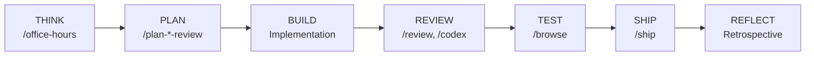
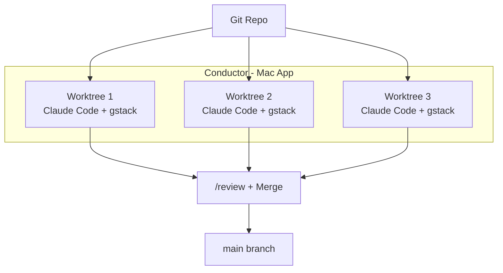
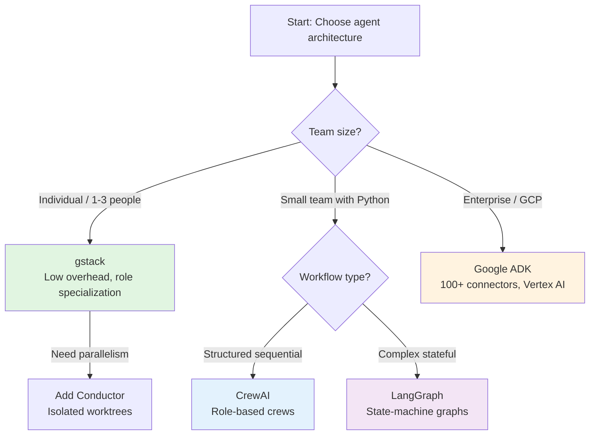

**TL;DR**

- gstack simulates a 15-person engineering org through specialized Claude Code prompts, not true multi-agent orchestration — a distinction that determines whether it fits your workflow.
- Garry Tan reports 600,000 lines of production code in 60 days using gstack plus Conductor for parallel worktrees; the SKILL.md standard underlying gstack is portable across six major AI coding tools.
- Caylent's two-year AWS Bedrock study found prompt engineering delivers better ROI than orchestration frameworks — build eval frameworks and optimize prompts before reaching for CrewAI or LangGraph.

Twenty thousand GitHub stars in under a week. Garry Tan's gstack landed on March 12, 2026, and immediately split the developer community between two camps: those who saw it as proof that one engineer with the right prompts can outproduce a mid-sized team, and those who called it well-branded prompt engineering dressed up as something more.

Both camps are partly right — and missing the practical point. gstack isn't a multi-agent framework. It's a deliberately structured approach to human-mediated role switching inside Claude Code. The real question isn't whether it qualifies as 'real' orchestration. It's whether the pattern delivers better outcomes than ad-hoc prompting — and for which team sizes and use cases. The answer has immediate consequences for how you configure your own AI-assisted development workflow.

## How gstack went viral in 48 hours — and why the debate still matters

When Garry Tan published gstack on March 12, 2026, he included a claim that stopped developers mid-scroll: **600,000 lines of production code in 60 days**, averaging 10,000–20,000 usable lines per day as a part-time activity alongside running Y Combinator [1]. The repository hit approximately 20,000 stars and over 2,200 forks within days of launch [1].

The controversy that followed wasn't really about Tan's numbers. It was about classification. If gstack counts as multi-agent orchestration, it's a landmark demonstration of what a single operator can achieve with the right framework. If it's sophisticated prompt engineering, the bar looks lower — and the implications for enterprise AI adoption shift considerably [2].

TechCrunch noted that gstack attracted both intense admiration and significant skepticism precisely because this classification question has no clean answer [2]. The architecture sits in an uncomfortable middle ground, and understanding where it sits is the prerequisite for deciding whether it belongs in your workflow.

## Deconstructing gstack: how 21 SKILL.md files simulate an engineering org

gstack's README describes its structure plainly: "Fifteen specialists and six power tools, all as slash commands, all Markdown, all free, MIT license" [1]. The 15 specialist roles and 6 power tools are implemented as SKILL.md files — a standard Anthropic introduced on October 16, 2025 and published formally on December 18, 2025 [3].

Each SKILL.md file contains YAML frontmatter with a name and trigger description, followed by an instruction body that defines the agent's behavior, constraints, and output format. When you invoke `/plan-ceo-review`, Claude Code loads that skill and temporarily adopts the persona of a founder-mode CEO focused on product reframing. When you invoke `/review`, it shifts to a staff engineer focused on production risk. The human decides when to switch roles and in what order [1][3].

| Slash Command | Role | Primary Focus |
| --- | --- | --- |
| /office-hours | YC Office Hours (THINK) | Design doc, "Brian Chesky mode" founder review |
| /plan-ceo-review | Founder/CEO | Product strategy, scope |
| /plan-eng-review | Engineering Manager | Architecture, data flow, edge cases |
| /review | Staff Engineer | Bug detection, production risk assessment |
| /browse | QA Engineer | Browser automation with screenshots |
| /ship | Release Engineer | Tests, coverage audit, PR creation |
| /retro | Engineering Manager | Weekly retrospective with commit analysis |
| /codex | Cross-model reviewer | OpenAI Codex CLI integration for second opinion |

The SKILL.md standard is intentionally portable. The same files work across Claude Code, OpenAI Codex CLI, GitHub Copilot, VS Code, Cursor, and LM-Kit.NET [3]. This portability is one of gstack's strongest practical arguments — you're not locked into a single toolchain.

The process Tan describes follows a seven-phase loop: THINK (design doc with `/office-hours`), PLAN (CEO, engineering, and design reviews), BUILD (implementation), REVIEW (`/review` and `/codex` for cross-model analysis), TEST (`/browse` for browser automation), SHIP (`/ship` for tests, coverage, and PR creation), and REFLECT (retrospective and learning capture) [1].

## The multi-agent question: what gstack can and cannot do autonomously

The classification debate hinges on a concrete architectural distinction. True multi-agent systems require dynamic memory shared across agent boundaries, independent tool access, RAG integration during execution, persistent workflow state, and conditional routing where agents delegate tasks to other agents without human intervention [4][5][6]. gstack provides none of these natively [1].

| Dimension | gstack | True Multi-Agent (CrewAI/LangGraph) |
| --- | --- | --- |
| Agent instances | Single instance, role-switching | Multiple distinct instances |
| Communication | Human-mediated | Direct message-passing |
| Coordination | Sequential, user-initiated | Dynamic, conditional |
| Parallelism | External (Conductor app) | Native |
| State management | Git repo state | Explicit state graph |
| Memory | Project files in context | Vector DB, RAG integration |

CrewAI supports role-based crews with structured sequential workflows [4]. LangGraph implements state-machine graphs with persistent state and error isolation [6]. Google ADK provides hierarchical orchestration with 100+ connectors and native Vertex AI deployment [5]. These frameworks support scenarios where an orchestrator agent dynamically delegates subtasks and aggregates results without a human in the loop at every step.

AutoGen, once a prominent player in this space, entered maintenance mode in October 2025 and has been consolidated into Microsoft's Agent Framework [9]. Teams still running AutoGen workflows should plan migrations — the project's own migration guide now points to the Microsoft Agent Framework as the supported path forward [9].


gstack is human-orchestrated role specialization, not autonomous multi-agent coordination. That distinction determines whether it fits your use case — not whether it's 'real' AI.


> [!TIP]
> If your workflow requires agents to delegate tasks to each other without human intervention — for example, a research agent automatically handing off to a synthesis agent when retrieval completes — you need a framework like LangGraph or CrewAI, not gstack.

## The Conductor pattern: achieving real parallelism with isolated worktrees

Tan's 10,000–20,000 lines per day figure isn't achieved with a single Claude Code session. The parallelism comes from Conductor, a Mac application that runs multiple Claude Code instances in isolated Git worktrees [8]. Conductor automates worktree creation, branching, and isolation — allowing independent work streams to proceed simultaneously without merge conflicts.

Users running Conductor alongside gstack report productivity gains of 3x or more compared to sequential single-session workflows [8]. The architecture is straightforward: each worktree represents an independent feature branch; Conductor manages context isolation so that one agent's work doesn't contaminate another's context window. When the work is ready, branches are reviewed with `/review` and merged.

This combination — gstack for role specialization, Conductor for parallelism — is what makes Tan's numbers plausible. Neither tool alone gets you there. The SKILL.md files provide structure; the worktree isolation provides throughput.

## Production patterns that deliver ROI — and the orchestration trap to avoid

Caylent's research across two years of AWS Bedrock deployments reached a counterintuitive conclusion: prompt engineering consistently outperforms complex orchestration frameworks for ROI [7]. Their recommended sequence is build an evaluation framework first, optimize prompts to their ceiling, then add orchestration only when the single-agent approach fails a specific capability test [7]. Jumping straight to orchestration adds coordination overhead without proportional quality gains.

For teams evaluating how much infrastructure to invest in, this research supports starting with gstack-style role specialization and reaching for CrewAI or LangGraph only when you can articulate a concrete capability gap. The patterns with consistently high ROI include: hierarchical delegation with supervisor agents, sequential role-based workflows with human checkpoints, MapReduce-style parallelism for independent subtasks, and consensus patterns for high-stakes decisions [7].

> [!WARNING]
> Adding orchestration complexity before you've maxed out prompt quality is a common trap. Caylent's data shows it typically increases cost and latency without improving output quality [7].

## Choosing your agent architecture: a decision framework by team size

The right architecture depends on two variables: team size and the degree of autonomous coordination your workflow requires. For individuals and teams of one to three, gstack's low learning curve and zero infrastructure overhead make it the pragmatic starting point [1][2]. You get the benefits of role specialization without managing agent state machines, vector databases, or orchestration topologies.

As team size grows or workflows become more complex, the tradeoffs shift. Small teams with Python expertise and a need for structured sequential workflows benefit from CrewAI's role-based crews. Teams already invested in GCP should evaluate Google ADK, which powers Agentspace internally and supports 100+ connectors [5]. Engineering teams building complex stateful workflows — for example, long-running research pipelines with conditional branching — get the most from LangGraph's state-machine approach [6].

| Architecture | Best For | Learning Curve | Key Limitation |
| --- | --- | --- | --- |
| gstack | Individuals, small teams | Low | No native parallelism or state management |
| CrewAI | Python teams, role-based workflows | Low | Limited dynamic routing |
| Google ADK | GCP/enterprise deployments | Medium | Vendor lock-in risk |
| LangGraph | Complex stateful workflows | High | Significant setup overhead |
| Microsoft Agent Framework | AutoGen migrations | Medium | Ecosystem still consolidating |

The SKILL.md standard underlying gstack offers a migration path: skills you author today for Claude Code remain portable to more sophisticated orchestration environments later [3]. This makes gstack a reasonable investment even for teams that expect to outgrow it — your role definitions become reusable assets rather than throwaway prompts.

## Practical Takeaways

1. Start with gstack's `/plan-eng-review` and `/review` skills before adding any others — these two roles address the highest-value gaps in solo AI-assisted development (architecture review and pre-ship risk assessment).
2. Use Conductor for parallel Claude Code sessions only after you've established a reliable single-session workflow with gstack; parallelism amplifies both good and bad practices.
3. Before adopting CrewAI, LangGraph, or Google ADK, document the specific capability your workflow requires that gstack cannot provide — this prevents adding orchestration overhead without a concrete payoff.
4. Treat your SKILL.md files as first-class artifacts: version them in Git, document their trigger conditions precisely, and reuse them across projects. The SKILL.md standard is portable across at least six major AI coding tools.
5. Apply the Caylent sequence when scaling: eval framework first, prompt optimization second, orchestration framework only after single-agent approaches fail a specific test.

## Conclusion

gstack is not a paradigm shift in multi-agent architecture. It's a well-executed implementation of role specialization through the SKILL.md standard, combined with a disciplined workflow and external parallelism via Conductor. That's a more modest claim than its viral launch suggested — and a more useful one.

The practical lesson is that structured role specialization delivers measurable productivity gains long before you need the complexity of true multi-agent orchestration. Tan's numbers are real, but they reflect months of workflow refinement on top of a solid foundation, not a one-command install that transforms a solo developer into a ten-person team.

If you're evaluating how to structure your AI-assisted development, start with gstack's core skills, measure the output quality, and introduce orchestration only when you can name the specific capability gap it closes. The SKILL.md files you write today will transfer to more powerful environments when you're ready.

## Frequently Asked Questions

### Is gstack actually multi-agent orchestration or just prompt engineering?

It's structured prompt engineering. gstack uses a single Claude Code instance that switches roles based on which SKILL.md file is invoked. True multi-agent orchestration requires multiple independent instances with direct message-passing and dynamic coordination — gstack requires a human to sequence every step.

### Can I use gstack's SKILL.md files with tools other than Claude Code?

Yes. The SKILL.md standard is portable across Claude Code, OpenAI Codex CLI, GitHub Copilot, VS Code, Cursor, and LM-Kit.NET. The files are plain Markdown with YAML frontmatter — no proprietary bindings.

### What is Conductor and do I need it to use gstack?

Conductor is a Mac app that runs multiple Claude Code instances in isolated Git worktrees. You don't need it for gstack's role-switching features, but Tan's high line-count productivity figures depend on it for parallelism.

### When should I use LangGraph or CrewAI instead of gstack?

Reach for a full orchestration framework when your workflow requires agents to delegate tasks to other agents without human intervention, persistent shared state across agent boundaries, or RAG integration during execution.

### AutoGen is listed everywhere — is it still worth learning?

No. AutoGen entered maintenance mode in October 2025 and has been consolidated into Microsoft's Agent Framework. Start fresh on Microsoft Agent Framework, or use the official migration guide if you have existing AutoGen workflows.

---

## Sources

| # | Publisher | Title | URL | Date | Type |
| --- | --- | --- | --- | --- | --- |
| 1 | Garry Tan | "gstack — GitHub Repository" | https://github.com/garrytan/gstack | 2026-03 | Technical |
| 2 | TechCrunch | "Why Garry Tan's Claude Code setup has gotten so much love and hate" | https://techcrunch.com/2026/03/17/why-garry-tans-claude-code-setup-has-gotten-so-much-love-and-hate/ | 2026-03-17 | News |
| 3 | lm-kit.com | "Agent Skills Explained — Anthropic SKILL.md Standard" | https://lm-kit.com/blog/agent-skills-explained/ | 2025-12 | Blog |
| 4 | CrewAI | "CrewAI Official Documentation" | https://docs.crewai.com | 2025 | Documentation |
| 5 | Google | "Agent Development Kit (ADK) Documentation" | https://google.github.io/adk-docs/ | 2025 | Documentation |
| 6 | LangChain | "LangGraph Documentation" | https://docs.langchain.com/oss/python/langgraph/ | 2025 | Documentation |
| 7 | Caylent | "Agentic AI: Why Prompt Engineering Delivers Better ROI Than Orchestration" | https://caylent.com/blog/agentic-ai-why-prompt-engineering-delivers-better-roi-than-orchestration | 2025 | Blog |
| 8 | Conductor | "Conductor Documentation" | https://docs.conductor.build | 2025 | Documentation |
| 9 | Microsoft | "Migration Guide: From AutoGen to Microsoft Agent Framework" | https://learn.microsoft.com/en-us/agent-framework/migration-guide/from-autogen/ | 2025-10 | Documentation |

## Image Credits

- **Cover photo**: [Possessed Photography](https://unsplash.com/@possessedphotography) on [Unsplash](https://unsplash.com/photos/TicoyfucU5s)
