**TL;DR**

- Fine-tuning an enterprise model costs $5K–$50K upfront plus $500–$5K per knowledge update cycle; RAG setup runs $4K–$10K with near-zero update costs — making RAG the lower-TCO choice for dynamic data.
- Fine-tuning only wins the cost battle above roughly 100,000 queries per day with knowledge that rarely changes; below that threshold, retrieval overhead is cheaper than continuous retraining.
- The dominant 2026 pattern is hybrid: fine-tune small open-source models (Llama 3 8B) for behavior and output format, use RAG exclusively for factual knowledge injection.

Every enterprise AI project hits the same fork in the road: bake domain knowledge into model weights through fine-tuning, or serve it dynamically at runtime through Retrieval-Augmented Generation? The wrong choice creates architectural debt that compounds every time your data changes.

The answer used to be genuinely ambiguous. Fine-tuning offered lower per-query inference costs; RAG carried a token-cost penalty for large context windows. That balance has shifted. KV caching, prompt caching APIs, and commoditized vector databases have restructured the economics in RAG's favor for the vast majority of enterprise workloads. This piece walks through the actual cost math and defines the specific conditions under which fine-tuning still wins.

## The $50K Misstep: Why Enterprises Overspend on Agent Memory

The appeal of fine-tuning is intuitive: train the model on your proprietary data and it carries that knowledge everywhere — no retrieval step, no latency penalty, no context window overhead. For teams accustomed to traditional ML, it maps cleanly onto existing workflows. Many enterprise AI initiatives in 2023 and 2024 followed this logic and paid the price in delayed deployments and bloated budgets.

The core problem is that fine-tuning was designed to modify *behavior*, not to serve as a knowledge repository. When you fine-tune a model on your HR policy, you're not teaching it facts — you're shifting weight distributions that approximate those facts under specific prompt conditions. The moment your policy changes, those distributions are wrong, and you face two choices: retrain or ship incorrect answers [1].

```mermaid
xychart-beta
    title "12-Month TCO by Query Volume (Lower is Better)"
    x-axis ["10K/day", "100K/day", "500K/day"]
    y-axis "Annual Cost ($K)" 0 --> 400
    bar [45, 75, 180]
    bar [35, 85, 220]
    bar [42, 68, 145]
```

*Chart series in order: Fine-tuning (setup + maintenance + inference); RAG (setup + maintenance + inference); Hybrid (setup + maintenance + inference). Values are estimated annual costs in $K.*

## Decoding the TCO: Upfront Training vs. Runtime Retrieval

Total Cost of Ownership for either approach has three components: initial setup, ongoing maintenance, and per-query inference. The relative weight of each determines which architecture wins for a given workload.

| Cost Component | Fine-Tuning | RAG |
| --- | --- | --- |
| Initial setup | $5,000–$50,000 (data prep, GPU compute, engineering) | $4,000–$10,000 (vector DB, embedding pipeline, orchestration) |
| Knowledge update | $500–$5,000 per cycle (retraining required) | Near $0 (re-index documents only) |
| Per-query inference | Lower (no retrieval overhead) | Higher at scale (retrieval + context tokens) |
| Query volume breakeven | Wins above ~100K queries/day | Wins below ~100K queries/day |

The setup cost gap is significant but not decisive on its own. The decisive factor is the maintenance cost multiplier. An enterprise agent that needs monthly policy or product data updates incurs $6K–$60K per year in retraining costs alone — often more than the initial build [2][3]. RAG's equivalent cost is the engineering time to re-index documents: typically minutes for automated pipelines, zero GPU compute, and a fraction of a cent per page in embedding API calls.

## The Hidden Tax of Knowledge Drift

Knowledge drift is the gradual divergence between a fine-tuned model's encoded knowledge and the actual state of the world it covers. Unlike a software bug — discrete and detectable — drift is probabilistic and silent. The model doesn't error; it confidently returns outdated information.

For a compliance agent at a financial services firm, this isn't abstract. A fine-tuned model trained on Q1 regulations still answering queries in Q3 is a liability, not just technical debt. Drift doesn't trigger alarms — it surfaces in audit failures weeks after the fact [1]. RAG eliminates this by design: facts live in the vector database and update when documents are re-indexed, with no model retraining required.

> [!WARNING]
> **The drift detection gap:** Teams often underestimate how long knowledge drift goes undetected in production. Without an active eval harness testing against known-current facts on a regular cadence, you may be serving stale answers for weeks before anyone notices.

## Context Window Economics: How Prompt Caching Changed the Math

The historical knock against RAG was the token cost penalty. At 100K+ queries per day with 10K-token context payloads, the per-query retrieval cost overwhelmed fine-tuning maintenance savings.

Two shifts have restructured this math. First, providers including Anthropic now offer prompt caching — frequently accessed context cached server-side at a fraction of standard input token rates, cutting effective context costs by 60–90% for RAG systems with a stable retrieval corpus [4]. Second, Flash Attention and efficient KV caching allow modern deployments to process 128K+ token context windows without proportional cost scaling, making large-context RAG economically viable at significant query volumes [4]. Together, these push the fine-tuning cost advantage threshold well above 100,000 queries per day for most workloads [2][3].

## When to Fine-Tune: The 100K Query Threshold

The canonical fine-tuning use case is a high-volume, static-knowledge agent. Consider a customer support routing system processing 500,000 tickets per day: classify incoming requests, emit a specific JSON schema, trigger downstream API calls. The required knowledge — ticket categories, routing rules, output format — is stable across months [1][5].

Here, fine-tuning a small open-source model like Llama 3 8B delivers dramatic cost advantages. No retrieval step, no context overhead beyond the ticket text. At 500K queries per day, eliminating even 2K tokens of context per query translates to hundreds of dollars in daily savings, with breakeven on upfront fine-tuning costs reached in weeks [5].

> [!TIP]
> **The 100K rule of thumb:** If your agent exceeds 100,000 queries per day AND your knowledge domain is stable for 90+ day intervals, fine-tuning is worth modeling seriously. Below either threshold, default to RAG.

Three additional signals favor fine-tuning: your agent needs highly structured output formats consistently; the task is well-defined enough for a smaller model after behavioral training; and you have ML engineering capacity to maintain the retraining pipeline.

## The Hybrid Future: Fine-Tuning for Behavior, RAG for Facts

The 'RAG vs. fine-tuning' frame is a false binary. The enterprise architectures delivering the best ROI in 2026 use both — for explicitly different purposes.

The pattern: fine-tune a small, cheap open-source model to internalize behavioral norms — output format, tone, refusal policies. Then deploy it with a RAG layer that injects factual context at query time. The model handles the *how*; the vector database handles the *what* [2][5]. Behavioral fine-tuning is a one-time cost. RAG handles dynamic knowledge with zero model retraining overhead.

Managed infrastructure has made this practical: [Pinecone](https://try.pinecone.io/tz9zm84oj8g3?utm_source=agentscodex&utm_medium=blog&utm_campaign=2026-03-24-measuring-rag-vs-finetuning-roi-agent-knowledge), Weaviate, and Qdrant offer serverless RAG, while AWS Bedrock Knowledge Bases and Azure AI Search have commoditized the orchestration layer — reducing what previously required custom LangChain code to a configuration exercise [6][7].

## Architecting for Operational Agility

Beyond cost, there's a strategic reason fast-moving data domains should default to RAG: control latency. When a regulatory change or product launch requires your agents to immediately reflect updated information, the RAG update path is minutes. The fine-tuning update path is a multi-day engineering sprint.

For regulated industries — finance, healthcare, legal — this isn't a convenience feature. It's a compliance requirement. The ability to surgically update what an agent knows, and to audit exactly what information was available to the model at any given query timestamp, is only achievable with a RAG architecture where the knowledge layer is decoupled and version-controlled. Fine-tuned weights are opaque to this kind of auditability; a vector database with timestamped document versions is not.

## Measuring Your Breakeven: A Framework for Tech Leaders

Before committing to either architecture, model three cost scenarios over a 12-month horizon: pure fine-tuning, pure RAG, and hybrid. The fine-tuning scenario should account for initial training, evaluation cycles, and projected update cycles. RAG should account for vector database hosting, embedding API costs, and retrieval latency. The hybrid combines one-time behavioral fine-tuning with RAG infrastructure costs.

In practice, most enterprise workloads under 100K daily queries with quarterly-or-more-frequent knowledge updates will find RAG or hybrid wins by 30–60% over 12 months. Above 100K with stable knowledge, fine-tuning becomes compelling — but pair it with a RAG layer for dynamic knowledge injection rather than encoding everything in weights [1][2][3].

**Decision checklist:** (1) Query volume > 100K/day? (2) Knowledge stable for 90+ days? (3) ML engineering capacity for the retraining pipeline? If all three are yes, model fine-tuning seriously. If any are no, default to RAG.

## Practical Takeaways

1. Default to RAG for any enterprise agent with knowledge that updates more frequently than quarterly — the maintenance cost savings alone justify the retrieval overhead below 100K daily queries.
2. Model your 12-month TCO before committing: include fine-tuning update cycles at your actual knowledge change frequency, not an optimistic 'once a year' estimate.
3. If you do fine-tune, use behavioral fine-tuning on a small open-source model (Llama 3 8B) for format and tone — then layer RAG on top for factual knowledge to get the benefits of both.
4. Implement prompt caching for your RAG system's static context (system prompt, reference documents) — it cuts effective context token costs by 60–90% at scale.
5. Build a knowledge drift detection harness before deploying any fine-tuned agent in production: automated evals against known-current facts at a weekly cadence will surface drift before it reaches users.

## Conclusion

The RAG vs. fine-tuning question is a budget allocation decision with measurable inputs and predictable outputs. The math has shifted: for most enterprise agents with dynamic knowledge requirements, RAG delivers lower TCO, faster update cycles, and better operational control. Fine-tuning retains a genuine edge in high-volume, static-knowledge scenarios — and as the behavioral half of a hybrid architecture.

If you're below 100K daily queries or updating knowledge more than quarterly, RAG wins on economics before you factor in operational agility. Above those thresholds, run the detailed math — and default to hybrid rather than pure fine-tuning to preserve flexibility as your data evolves. The tooling is ready: serverless vector databases, prompt caching APIs, and managed RAG pipelines have made both approaches production-viable at scale.

## Frequently Asked Questions

### What is knowledge drift and why does it matter for fine-tuned models?

Knowledge drift is the divergence between what a fine-tuned model 'knows' (encoded in its weights at training time) and the actual current state of the domain it covers. Unlike a software bug, drift doesn't trigger errors — the model confidently returns outdated information. For enterprise agents covering dynamic domains like compliance, pricing, or product catalogs, drift is a silent liability that only surfaces during audits.

### At what query volume does fine-tuning become more cost-effective than RAG?

The crossover point is approximately 100,000 queries per day for static knowledge domains. Below that threshold, RAG's operational flexibility and near-zero update costs outweigh the inference token overhead. Above it, eliminating retrieval overhead and context token costs in a fine-tuned model starts to compound meaningfully — but the calculation also requires factoring in update frequency. High volume with frequent updates can still favor RAG.

### Can I use both RAG and fine-tuning in the same agent?

Yes, and this hybrid approach is increasingly the default for enterprise AI in 2026. The pattern: fine-tune a small model on behavioral norms (output format, tone, refusal policies) once or infrequently, then deploy it with a RAG layer that injects factual knowledge at query time. The model handles the 'how'; the vector database handles the 'what'. This captures cost advantages of both: behavioral fine-tuning is a one-time cost, RAG handles dynamic knowledge with zero retraining overhead.

### How has prompt caching changed the economics of RAG?

Prompt caching allows frequently accessed context — like a system prompt containing static reference documents — to be cached server-side and billed at a fraction of standard input token rates. Providers including Anthropic offer this at 60–90% cost reductions for cached tokens. For RAG systems with a stable retrieval corpus, this dramatically cuts the per-query context cost that previously made RAG expensive at high query volumes.

*This post may contain affiliate links. We may earn a small commission if you sign up through our links, at no extra cost to you.*

---

## Sources

| # | Publisher | Title | URL | Date | Type |
| --- | --- | --- | --- | --- | --- |
| 1 | PEC Collective | "RAG vs Fine-Tuning: A Cost Analysis" | https://pecollective.com/blog/rag-vs-fine-tuning-cost/ | 2025-12 | Technical |
| 2 | Alpha Corp AI | "RAG vs Fine-Tuning in 2026: A Decision Framework with Real Cost Comparisons" | https://www.alphacorp.ai/blog/rag-vs-fine-tuning-in-2026-a-decision-framework-with-real-cost-comparisons | 2026-01 | Technical |
| 3 | Matillion | "RAG vs Fine-Tuning: Enterprise AI Strategy Guide" | https://www.matillion.com/blog/rag-vs-fine-tuning-enterprise-ai-strategy-guide | 2025-11 | Technical |
| 4 | Local AI Zone | "Context Length Optimization: Ultimate Guide 2025" | https://local-ai-zone.github.io/guides/context-length-optimization-ultimate-guide-2025.html | 2025-10 | Technical |
| 5 | Wizr AI | "RAG vs Fine-Tuning LLMs" | https://wizr.ai/blog/rag-vs-fine-tuning-llms/ | 2025-09 | Technical |
| 6 | AWS Documentation | "RAG vs Fine-Tuning: AWS Prescriptive Guidance" | https://docs.aws.amazon.com/prescriptive-guidance/latest/retrieval-augmented-generation-options/rag-vs-fine-tuning.html | 2024-06 | Technical |
| 7 | Monte Carlo Data | "RAG vs Fine-Tuning: A Practical Guide" | https://www.montecarlodata.com/blog-rag-vs-fine-tuning/ | 2025-08 | Technical |

## Image Credits

- **Cover photo**: AI Generated (Flux Pro)
