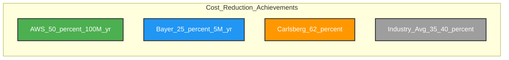
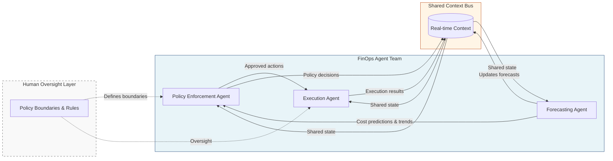

**TL;DR**

- 98% of FinOps teams now manage AI spending directly, up from 63% in 2025—making real-time automation non-negotiable [1].
- Multi-agent architectures split work across forecasting, policy enforcement, and execution agents; one AWS deployment cut a $380K/month bill by 62% [5].
- The shift from monthly reviews to continuous autonomous execution is the defining FinOps move of 2026.

Cloud budgets aren't just growing—they're becoming unpredictable. AI workloads, token-based billing, and GPU infrastructure have broken traditional forecasting models. FinOps agents now detect zombie containers, idle GPU fleets, and overprovisioned clusters the moment they appear—then act without waiting for a human to file a ticket [2]. Organizations running these agents report 25–35% savings in year one [4].

The real shift in 2026 isn't better dashboards: it's autonomous execution. Traditional FinOps relied on monthly reviews, dashboard visibility, and engineering tickets to remediate waste—a cycle too slow for AI cost dynamics. This article explains how multi-agent FinOps architecture works, what agents actually do, and how to build toward full autonomy without losing control.

## Why Traditional FinOps Breaks Down for AI Workloads

AI workloads don't behave like traditional compute: a model swap, a surge in user sessions, or a shift in prompt complexity can double inference costs overnight. That's why 98% of FinOps teams now manage AI spending directly—up from 63% just one year earlier [1]. Monthly review cycles catch this retroactively, never before the damage is done.

GPU infrastructure and token-based billing create cost signals that do not fit legacy CPU/RAM metrics [2]. A rightsizing recommendation built on average CPU utilization tells you nothing about a batch embedding job that idles for 23 hours then burns through an H100 fleet for one hour. Standard autoscaling rules make this worse—they respond to the wrong signals entirely.

72% of global enterprises exceeded their cloud budget in the previous fiscal year [4]. The culprit is the long tail of waste: orphaned storage volumes, forgotten snapshots, zombie containers from canceled experiments, Kubernetes clusters provisioned for peak load that never arrived. Finding this across multi-cloud environments manually takes time teams no longer have.

> [!WARNING]
> Monthly FinOps reviews are a lagging indicator for AI workloads. A single high-traffic day can generate more cost variance than an entire quarter of traditional compute—waiting until month-end means optimizing the past, never preventing the next spike.

## FinOps Agents: Coordinated Forecasting, Policy, and Execution

Effective FinOps architectures in 2026 separate three distinct functions into specialized agents that collaborate rather than operate in isolation [3]. Forecasting agents predict spend spikes using token throughput data, queue depth, and training schedule signals. Policy enforcement agents apply budget guardrails, circuit breakers, and compliance rules before any action executes. Execution agents rightsize instances, move workloads, and reclaim idle resources automatically.

The coordination layer is what makes this architecture deliver. Agents share context continuously: a forecasting agent's prediction triggers the policy agent to pre-position reserved capacity, which the execution agent uses when the spike arrives [3]. This closed loop eliminates the latency between detection and remediation that makes manual approaches structurally ineffective. Engineers define the policies; agents carry them out.

| Agent Role | Primary Function | Key Inputs | Output |
| --- | --- | --- | --- |
| Forecasting | Predict spend spikes before they occur | Token throughput, queue depth, training schedules | Spend forecasts, anomaly alerts |
| Policy Enforcement | Apply guardrails and budget circuit breakers | Forecasts, budget thresholds, compliance rules | Approved action sets |
| Execution | Rightsize, reallocate, and reclaim resources | Approved actions, live utilization data | Configuration changes, workload placements |

Closed-loop automation doesn't mean unsupervised operation. Policy guards define the boundaries—what agents can change without approval, what requires human sign-off [2]. Well-designed systems let engineers expand those boundaries incrementally as confidence in agent behavior grows.

## What Autonomous Agents Find: Waste Detection Across Your Stack

Multi-agent systems surface idle instances, orphaned storage volumes, unused snapshots, zombie containers, and overprovisioned Kubernetes clusters the moment they appear—not at month-end [3]. Zombie containers alone are a persistent drain in AI environments: experimental runs, failed training jobs, and abandoned inference endpoints leave containers alive but idle, consuming GPU memory that prevents other workloads from scheduling efficiently.

Overprovisioned Kubernetes clusters are harder to catch manually. Teams provision for peak load, traffic never reaches projections, and the cluster runs at 30% utilization indefinitely. Continuous rightsizing based on token throughput and queue length—rather than peak CPU headroom—identifies these mismatches automatically and corrects node pool sizing without engineering intervention [2].

AI analysis surfaces an average of 18% in optimization opportunity across total cloud spend [5]. For a team running $500K/month, that's $90K/month in detectable waste (before a single agent takes action). Automation's real edge isn't sophisticated algorithms—it's coverage. No human team can monitor the sheer volume of signals continuously; what's the cost of leaving that long tail of waste undetected? Multi-agent systems close that gap.

## Autonomous Rightsizing: Why CPU/RAM Metrics Give Agents the Wrong Signal

Traditional rightsizing watches CPU and RAM utilization. For AI workloads, the correct metrics are token throughput, queue depth, and inference latency percentiles [2]. An embedding service running at 15% CPU might be correctly sized—or it might be idle because the upstream pipeline is blocked. Standard autoscalers can't distinguish these cases (they weren't built for token-based workloads); agents purpose-built for AI cost optimization can.

Adaptive instance selection across spot, reserved, and on-demand capacity is where execution agents generate sustained savings. Spot instances can cut compute costs by 70–90% compared to on-demand pricing—but only if your workload placement logic handles interruptions gracefully without breaking production SLAs. Execution agents manage this continuously: shifting batch workloads to spot when available, falling back to on-demand for latency-sensitive inference, and purchasing reserved capacity when forecasting agents predict sustained load [3].

Model-aware routing adds another cost lever. Not every request needs your largest model. Agents that route low-complexity queries to cheaper models—and escalate only when necessary—reduce per-request inference cost without degrading output quality for high-value interactions [2]. Teams running LLMs at scale report this as one of the most impactful optimizations available; it's fully automatable once routing rules are defined.


Switch your rightsizing signals from CPU/RAM to token throughput and queue depth before deploying FinOps agents. Teams that instrument AI-specific metrics first report the largest year-one savings—agents given the wrong data produce wrong decisions.


## Real-World Savings: 25–62% Cost Reductions in Production

The results from production deployments are concrete—and consistent. One AWS case study reduced cloud costs by 62% from a $380K/month baseline using agentic AI, without slowing development velocity [5]. Bayer generated $2M in annual savings through autonomous cloud spend optimization [4]. Carlsberg achieved over $400,000 in savings within the first year [4].

Across organizations adopting AI-enabled FinOps, year-one savings average 25–35% through rightsizing and idle resource reduction [4]. Forecast accuracy improves 23–41% compared to traditional costing methods [5]; Fortune 500 companies report up to 30% cost reduction on data cloud platforms [4]. Tech company Kissht freed 18% of their Snowflake budget through autonomous save-as-you-go optimization [4].





```mermaid
quadrantChart
    title Cost Savings from FinOps Agents
    x-axis Lower Savings --> Higher Savings
    y-axis "" --> ""
    quadrant-1 "Industry Average"
    quadrant-2 "Outstanding Results"
    quadrant-3 ""
    quadrant-4 ""
    "AWS": [0.62, 0.9]
    "Bayer": [0.8, 0.85]
    "Carlsberg": [0.7, 0.75]
    "Industry Avg (25-35%)": [0.3, 0.5]
```

## How to Deploy Autonomous FinOps Agents: A Four-Stage Path

Full autonomous execution doesn't happen in week one. Organizations achieving the largest savings built toward it in stages, expanding automation scope only as each stage proved reliable [4]. The sequence matters more than the technology.

Stage 1 establishes the visibility foundation: complete resource tagging, per-service cost attribution, and baseline utilization metrics. Without this, agents act on incomplete data.

Stage 2 adds per-model cost metrics and anomaly detection—replacing generic CPU/RAM monitoring with AI-specific signals like token throughput and inference queue depth [2].

Neither stage automates anything—both are about building a foundation you can trust an agent to act on.

The principle is non-negotiable: instrument your data before you deploy your first automation.

Stage 3 introduces low-risk automation with strict policy guards: automated termination of unused snapshots, rightsizing for non-production environments, spot instance migration for batch workloads. High-confidence, low-blast-radius actions first.

Stage 4 extends automation to production workloads, dynamic cross-cloud workload placement, and model-aware routing—with human escalation paths clearly defined [3].

## Governance: The Guardrails That Keep FinOps Agents Safe

Governance and policy enforcement rank among the top FinOps priorities for 2026 [1]. Autonomous execution without guardrails isn't automation—it's chaos. Guard automation at three levels: budget circuit breakers halt autonomous actions when spend approaches thresholds; A/B testing and canary deployments validate configuration changes before full rollout; compliance rules enforce multi-cloud placement constraints for regulated workloads [3].

FinOps practice has expanded far beyond public cloud. In 2026, 90% of FinOps teams manage SaaS spend (up from 65%), 57% cover private cloud, and 48% include data centers—are your governance frameworks keeping pace [1]? Gartner forecasts that 40% of enterprise applications will integrate task-specific [AI agents](/posts/2026-03-09-mast-taxonomy-enterprise-agent-failures/) by end of 2026, up from less than 5% in 2025 [4]. Governance frameworks that span SaaS, private cloud, and data centers—not just AWS and Azure—are the differentiating capability for mature FinOps programs.

## Practical Takeaways

1. **Instrument AI workloads with token throughput and inference queue depth metrics before deploying FinOps agents.** CPU/RAM data alone leads to wrong rightsizing decisions. Teams that instrument first report the largest year-one savings [2].
2. **Start your automation program with Stage 1 (tagging and attribution) and Stage 2 (anomaly detection) before touching production workloads.** Teams that skip these stages break trust in automation early. Data quality is the prerequisite for agent reliability.
3. **Define policy guard boundaries explicitly before any agent touches a resource.** Document what agents can change autonomously, what requires approval, and what is always off-limits. This is the governance foundation for safe expansion.
4. **Target the first 18% savings from waste detection alone**—zombie containers, orphaned storage, idle snapshots—before optimizing correctly-provisioned resources [5]. It's the fastest path to proving ROI.
5. **Build your governance framework to cover SaaS and private cloud from the start.** The teams reporting the largest savings extended FinOps scope beyond public cloud early in their programs [1].

## Conclusion

Multi-agent FinOps systems have moved past proof-of-concept. The organizations reporting 62% cost reductions and millions in annual savings aren't running pilots—they're running production automation that acts faster and more consistently than any manual review process [5]. The economics are proven: 25–35% year-one savings, 23–41% improvement in forecast accuracy [4][5].

The path is staged and practical. Audit your current cost attribution: is it good enough to trust an agent to act on?

If tagging is incomplete or per-service cost visibility is missing, that's Stage 1—fix it first. Then instrument token throughput for your AI workloads; agents that deliver real savings need accurate signals. Give them that foundation, then expand their authority as they earn it. Start Stage 1 immediately.

## Frequently Asked Questions

### What is a FinOps agent and how does it differ from traditional cost management tools?

A FinOps agent is an autonomous system that detects waste and takes remediation actions automatically—terminating zombie containers, rightsizing instances, or moving workloads—without requiring a human action per decision. Traditional cost tools surface recommendations; FinOps agents execute them. Multi-agent architectures split this work across specialized agents for forecasting, policy enforcement, and execution [3].

### How much can autonomous cloud cost optimization actually save, and how quickly?

Production deployments report 25–35% savings in year one through rightsizing and idle resource reduction [4]. The AWS case study achieved 62% reduction from a $380K/month baseline while maintaining development velocity [5]. Most teams see initial wins from waste detection—orphaned storage, zombie containers—within weeks of initial deployment.

### Is autonomous FinOps safe for production workloads?

Yes, when built with proper policy guards. The recommended approach starts automation with non-production environments, uses A/B testing and canary deployments for configuration changes, and defines explicit budget circuit breakers that halt autonomous actions near spend thresholds [3]. Full production autonomy is Stage 4—reached after validating agent behavior in lower-risk contexts.

### Do FinOps agents work specifically for AI and LLM workloads?

Multi-agent FinOps systems are specifically effective for AI workloads because they use token throughput, queue depth, and inference latency as primary metrics rather than CPU/RAM—which are poor proxies for AI cost drivers [2]. Model-aware routing, which directs low-complexity queries to cheaper models, is one of the most impactful optimizations they enable.

### How do multi-agent FinOps systems handle multi-cloud environments?

Execution agents manage workload placement across cloud regions, availability zones, and providers automatically, subject to compliance and security rules enforced by policy agents [3]. This cross-cloud placement is how organizations minimize cost while maintaining the governance boundaries that regulated industries require.

---

## Sources

| # | Publisher | Title | URL | Date | Type |
| --- | --- | --- | --- | --- | --- |
| 1 | FinOps Foundation | "State of FinOps 2026 Report" | https://data.finops.org | 2026 | Report |
| 2 | CloudMonitor.ai | "AI-Driven Cloud Cost Optimization in 2026: The Future of FinOps" | https://cloudmonitor.ai/2026/03/ai-driven-cloud-cost-optimization-finops/ | 2026-03 | Blog |
| 3 | MSRcosmos | "Multi-Agent AI Systems for Cloud Cost Optimization in 2026" | https://www.msrcosmos.com/blog/scaling-multi-agent-ai-systems-for-cloud-cost-optimization-in-2026/ | 2026 | Blog |
| 4 | Flexera | "Agentic FinOps for AI: Autonomous Optimization for Snowflake, Databricks and AI Cloud Costs" | https://www.flexera.com/blog/finops/agentic-finops-for-ai-autonomous-optimization-for-snowflake-databricks-and-ai-cloud-costs/ | 2025 | Blog |
| 5 | CloudZero | "Smooth Operator: The Role Of Autonomous FinOps In Cloud Cost Management" | https://www.cloudzero.com/blog/autonomous-finops/ | 2025-11-26 | Blog |

## Image Credits

- **Cover photo**: AI Generated (Flux Pro)
