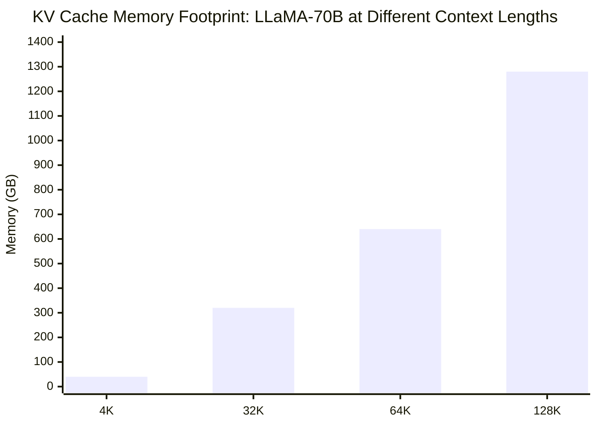
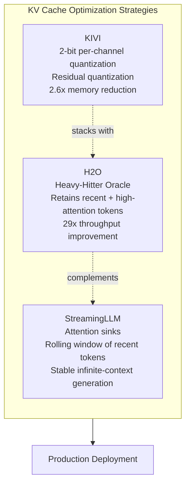

**TL;DR**

- At 128K context, LLaMA-70B needs 1,280 GB of KV cache — making concurrent inference impossible without compression.
- TurboQuant delivers 6x memory reduction and up to 8x speedup on H100s with zero accuracy loss; no calibration needed.
- vLLM FP8 KV cache halves memory; TensorRT-LLM INT8 adds up to 1.45x decode throughput on Hopper hardware.

KV cache [quantization](/posts/2026-03-05-cutting-llm-agent-costs-by-50-a-production-engineers-playbook/) is the most effective answer to a memory crisis that breaks production inference at scale. Serving a single LLaMA-70B request at 128K context requires 1,280 GB of GPU memory just for the KV cache [7] — and that leaves no room for concurrency. As agent context windows scale toward 1M tokens, the KV cache has become the primary bottleneck, growing linearly with context length and frequently eclipsing model weights.

By compressing key-value tensors from FP16 to sub-4-bit representations using techniques like TurboQuant, KIVI, and H2O eviction, KV cache quantization reduces memory by 6x or more while maintaining generation quality. This guide covers how to implement these techniques in production using vLLM and TensorRT-LLM, with concrete benchmarks and operational guidance for long-context agent workloads.

## Why KV cache memory breaks production inference at long context

The KV cache stores the attention key and value tensors for every token in the context, enabling the model to attend back without recomputation; it is the core data structure in autoregressive inference.

At short contexts — 4K tokens — this is manageable. At 128K tokens, it is catastrophic.

For LLaMA-70B, the KV cache footprint at batch size 1 reaches 1,280 GB [7]. That is roughly 16 A100 80GB GPUs consumed by a single conversation thread.

This scaling is strictly linear. Double the context, double the memory. For agent workloads with multi-turn histories, tool call logs, and retrieved documents, hitting 64K–128K tokens per request is not unusual. The consequence is brutal: without compression, you can run exactly one concurrent long-context request per cluster, eliminating any possibility of throughput-driven cost amortization [7].



Quantization addresses this directly. By reducing the precision of KV tensors from FP16 (16 bits) to INT8, FP8, or sub-4-bit representations, you cut the cache footprint proportionally while keeping the model weights and activations untouched. The academic literature has converged on two orthogonal strategies: quantization (reduce bits per stored value) and eviction (discard low-importance tokens entirely). Production deployments combine both.

> [!NOTE]
> KV cache quantization operates on the stored key-value tensors only. It does not quantize the model weights or activations — those are handled separately by techniques like AWQ or GPTQ. The two approaches stack and complement each other.

## TurboQuant: 6x KV cache compression with zero accuracy loss

Most sub-4-bit quantization methods require offline calibration — you pass representative data through the model to compute quantization parameters before deployment. TurboQuant skips this entirely [2]. It is data-oblivious and operates dynamically at inference time, applying a two-stage compression pipeline it calls PolarQuant and QJL error correction [1].

PolarQuant converts key vectors into polar coordinate space, where the angular component carries most of the attention-critical information and can be quantized aggressively. The math works.

The QJL (Quantized Johnson-Lindenstrauss) layer then applies a random projection that provably bounds the reconstruction error, achieving 3.5-bit effective compression [1]. The result: 6x memory reduction and up to 8x inference speedup on H100 GPUs — with zero measurable accuracy loss on standard benchmarks [1].

The data-oblivious property is what makes TurboQuant operationally attractive. Prior product quantization methods require a warm-up phase with calibration data tuned to your specific workload. TurboQuant needs no such pipeline — you can deploy it on a new model or a new domain without re-running calibration [1]. For teams running diverse agent workloads across many models, this removes a significant deployment cost.


TurboQuant's 8x speedup on H100 comes from combining 6x memory reduction with higher batch concurrency — more requests fit on the same GPU, and memory bandwidth bottlenecks shrink proportionally.


## Enabling KV cache quantization in vLLM and TensorRT-LLM

For most teams, TurboQuant is not yet directly integrated into the major serving frameworks. The practical path today is through the quantization modes that vLLM and TensorRT-LLM do support natively: FP8 and INT8 KV cache.

vLLM officially supports FP8 KV cache quantization, reducing the cache footprint by approximately 50% compared to FP16 [5]. Enabling it is a single flag at launch — no model changes, no calibration. INT8 support in vLLM remains experimental and requires non-default backends, making FP8 the production-ready choice for vLLM users today [5].

```bash
# Launch vLLM with FP8 KV cache quantization
vllm serve meta-llama/Llama-3-70b-instruct \
  --kv-cache-dtype fp8 \
  --max-model-len 131072
```

TensorRT-LLM covers more ground. It supports both FP8 and INT8 KV cache natively, and on Hopper GPUs (H100, H200) it delivers up to 1.45x throughput improvement in decode-heavy scenarios [6].

Hopper's FP8 tensor cores handle dequantization in hardware, eliminating the latency tax that Ampere (A100) GPUs pay in software. If you are running decode-heavy agent workloads, the H100 + TensorRT-LLM combination offers the best current price-performance ratio.

| Framework | FP8 KV Cache | INT8 KV Cache | Decode Throughput Gain | Calibration Required |
| --- | --- | --- | --- | --- |
| vLLM | Native (stable) | Experimental | ~50% memory reduction | No |
| TensorRT-LLM | Native (stable) | Native (stable) | Up to 1.45x on Hopper | Yes (for INT8) |
| TurboQuant | N/A (custom) | N/A (custom) | Up to 8x on H100 | No |

The choice between frameworks hinges on hardware and workload type. vLLM's PagedAttention shines for variable-length prefill-heavy workloads and dynamic batching — the scheduler handles heterogeneous request lengths better than TensorRT-LLM's more static execution model. TensorRT-LLM outperforms for sustained decode throughput in steady-state deployments. Neither is universally better — run your own benchmarks with your request distribution.

## KV cache quantization + eviction: KIVI, H2O, and StreamingLLM

Quantization reduces bits per token. Eviction removes tokens entirely. These two strategies are orthogonal and stack — KIVI applies quantization for 2.6x memory reduction, H2O applies selective eviction for up to 29x throughput improvement, and StreamingLLM combines attention anchoring with rolling eviction for stable infinite-context generation. For production agents with indefinitely growing contexts, eviction is not optional — it is what keeps memory bounded as sessions extend.

KIVI applies 2-bit per-channel quantization to the KV cache using residual quantization, cutting peak memory by up to 2.6x without requiring any model fine-tuning — a plug-and-play approach [3]. It is more aggressive than FP8 but needs careful validation on your task distribution. On standard benchmarks, KIVI shows minimal quality degradation, but multi-hop reasoning tasks warrant additional testing.

H2O (Heavy-Hitter Oracle) takes a different angle: it identifies which KV cache tokens receive high attention mass (heavy hitters) and evicts everything else. By retaining only recent tokens plus high-attention tokens, H2O caps cache size while preserving the tokens that [actually matter](/posts/2026-03-06-benchmarking-ai-agents-production/) for generation quality. In throughput benchmarks, H2O achieves up to 29x improvement by enabling much higher concurrency on the same GPU [4].



StreamingLLM solves a different problem: stable infinite-context generation. It keeps the first four tokens as 'attention sinks' — initial tokens that absorb disproportionate attention mass regardless of content — plus a rolling window of recent tokens [8]. This prevents attention score collapse when context exceeds the training window. For agents that must maintain coherent generation across very long sessions, StreamingLLM provides the stability that pure eviction methods lack [8].

> [!WARNING]
> H2O and StreamingLLM both discard tokens permanently. For multi-hop reasoning agents that need to reference facts from early in the conversation, test eviction-based methods carefully before deploying to production. Full quantization (TurboQuant, FP8) is safer for accuracy-sensitive workloads.

## Operational guidelines for long-context agent deployments

Deploying KV cache quantization in production requires more than flipping a flag. The dequantization overhead — converting compressed tensors back to FP16 at attention time — adds latency that varies by hardware.

On Ampere GPUs, this overhead can erode throughput gains for prefill-heavy workloads. On Hopper, dedicated FP8 tensor cores handle this in hardware, making the overhead negligible [6].

Stack quantization strategically. Combining FP8 KV cache with weight quantization (AWQ or GPTQ) multiplies the savings: you reduce both static memory (weights) and dynamic memory (KV cache). PagedAttention in vLLM handles KV cache memory allocation at the page level, reducing fragmentation. Together — weight quantization, KV quantization, and PagedAttention — represent the current state-of-the-art production stack for long-context agents [6] [7].

Precision fallback matters for accuracy-sensitive workloads. Tasks that require high-fidelity recall of early-context information — legal document analysis, multi-step code review, structured data extraction — need a fallback path to full FP16 KV cache.

Route requests above a complexity threshold to a full-precision endpoint; use token count, task type, or expected reasoning depth as your routing signal, whichever is cheapest to compute at request time. The per-request cost will be higher. But that tradeoff beats the alternative: silent accuracy failures that erode user trust [7].

[Agent memory](/posts/2026-03-24-measuring-rag-vs-finetuning-roi-agent-knowledge/) architecture deserves a holistic view. KV cache handles in-context memory — the live window of the current session. For persistent cross-session memory, you need an external retrieval layer. Pairing KV cache quantization with a vector store like [Pinecone](https://try.pinecone.io/tz9zm84oj8g3?utm_source=agentscodex&utm_medium=blog&utm_campaign=2026-04-02-kv-cache-quantization-production-agents){rel="sponsored"} lets you compress the in-context footprint aggressively while offloading long-term facts to fast approximate nearest-neighbor retrieval — keeping GPU spend low without sacrificing memory horizon.

## Practical Takeaways

1. Start with FP8 KV cache in vLLM (--kv-cache-dtype fp8) for a safe ~50% memory reduction that requires zero calibration and is production-stable today.
2. On H100/H200 hardware, switch to TensorRT-LLM for INT8 KV cache — hardware FP8 tensor cores eliminate the dequantization overhead, delivering up to 1.45x decode throughput over FP16.
3. Add H2O eviction for sessions that grow unbounded — retaining only recent and heavy-hitter tokens caps cache size and can improve throughput by up to 29x under high concurrency.
4. For tasks requiring early-context recall (legal, multi-hop reasoning), route to a full-precision fallback endpoint rather than accepting silent accuracy degradation from aggressive quantization.
5. Combine FP8 KV cache with weight quantization (AWQ) and PagedAttention for maximum GPU efficiency — the three techniques are orthogonal and stack multiplicatively.

## Conclusion

KV cache quantization is no longer a research curiosity. The tooling is in vLLM stable, TensorRT-LLM stable, and increasingly in custom kernels like TurboQuant that push below 4 bits with zero accuracy penalty. For teams serving long-context agent workloads, the path forward is clear: FP8 KV cache as the baseline, H2O or StreamingLLM for session-length management, and TurboQuant or KIVI for workloads that demand maximum compression. The economics change dramatically — what required 16 GPUs per concurrent session can fit on one. Start by enabling --kv-cache-dtype fp8 in your next vLLM deployment. Measure your actual memory and throughput before and after — the delta is almost always larger than teams expect. The numbers will make the next optimization decision obvious.

*This post may contain affiliate links. We may earn a small commission if you sign up through our links, at no extra cost to you.*

## Frequently Asked Questions

### Does KV cache quantization affect generation quality?

For FP8 and TurboQuant, measurable accuracy loss is minimal to zero on standard benchmarks. More aggressive methods like KIVI (2-bit) and H2O eviction can degrade performance on multi-hop reasoning tasks. Always benchmark on your specific task distribution before deploying to production — no generic benchmark substitutes for your actual request mix.

### Can I use KV cache quantization with any LLM?

FP8 KV cache in vLLM and TensorRT-LLM works with any model they support. TurboQuant is a custom kernel-level method not yet natively integrated into these frameworks. KIVI and H2O are also framework-dependent — check your serving stack's documentation for current model support.

### What hardware is required for FP8 KV cache?

FP8 KV cache runs on any modern NVIDIA GPU, but Hopper architecture (H100, H200) delivers the best results due to native FP8 tensor core support. On Ampere (A100), software dequantization adds overhead that can reduce throughput gains in prefill-heavy workloads.

### How does KV cache quantization interact with PagedAttention?

They are complementary. PagedAttention manages KV cache memory allocation in fixed-size pages to reduce fragmentation. Quantization reduces the per-token memory cost within each page. Running both together maximizes effective GPU memory utilization.

### Is TurboQuant available in vLLM today?

Not natively. TurboQuant is a research method from Google that requires custom kernel integration. The current production path is FP8 or INT8 KV cache via vLLM and TensorRT-LLM. Monitor the vLLM and TensorRT-LLM release notes for future TurboQuant integration.

---

## Sources

| # | Publisher | Title | URL | Date | Type |
| --- | --- | --- | --- | --- | --- |
| 1 | Google Research | "TurboQuant: Online Vector Quantization with Near-optimal Distortion Rate" | https://arxiv.org/abs/2504.19874 | 2025-04 | Paper |
| 2 | Google Research Blog | "TurboQuant: Redefining AI efficiency with extreme compression" | https://research.google/blog/turboquant-redefining-ai-efficiency-with-extreme-compression/ | 2025 | Blog |
| 3 | MarkTechPost | "KIVI: A Plug-and-Play 2-bit KV Cache Quantization Algorithm Without the Need for Any Tuning" | https://www.marktechpost.com/2024/04/16/kivi-a-plug-and-play-2-bit-kv-cache-quantization-algorithm-without-the-need-for-any-tuning/ | 2024-04-16 | Blog |
| 4 | arXiv | "Heavy-Hitter Oracle for Efficient Generative Inference of Large Language Models" | https://arxiv.org/abs/2306.14048 | 2023-12-18 | Paper |
| 5 | vLLM Documentation | "Quantization FP8 KV Cache" | https://docs.vllm.ai/en/v0.6.5/quantization/fp8.html | 2025 | Documentation |
| 6 | NVIDIA | "Quantization in TRT-LLM" | https://nvidia.github.io/TensorRT-LLM/blogs/quantization-in-TRT-LLM.html | 2025 | Documentation |
| 7 | Youngju Dev Blog | "LLM Inference Optimization: KV Cache" | https://www.youngju.dev/blog/llm/2026-03-07-llm-long-context-kv-cache-optimization.en | 2026-03-07 | Blog |
| 8 | arXiv | "Efficient Streaming Language Models with Attention Sinks" | https://arxiv.org/abs/2309.17453 | 2023-09 | Paper |