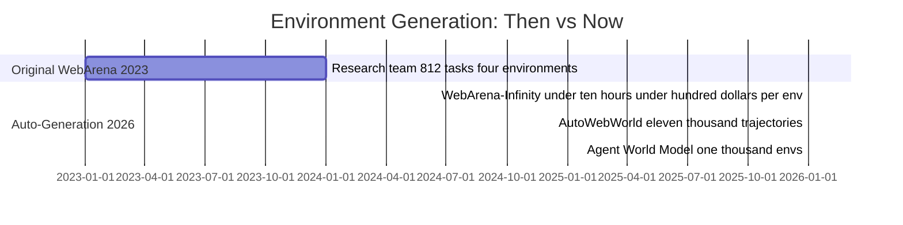
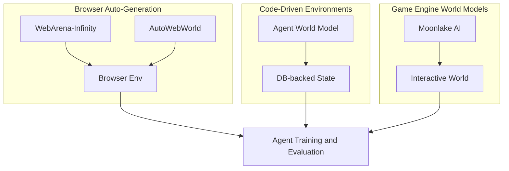

**TL;DR**

- WebArena-Infinity reduces browser environment construction from months of research effort to under 10 hours and under $100 per environment.
- Strong open-source models still score below 50% on WebArena-Infinity's verifiable tasks — yet human performance sits at 78.24% on the original benchmark.
- Three competing paradigms emerged in early 2026: browser auto-generation, code-driven environments (Agent World Model), and game engine world models (Moonlake AI).

Agent simulation used to be expensive. The original WebArena benchmark, published in 2023, required a team of researchers months of engineering work to produce four website environments and 812 tasks [3]. Teams that wanted more coverage either paid that price again or shipped agents into production without adequate testing. That tradeoff is ending. A cluster of papers and startups that emerged in early 2026 can now generate evaluation environments in hours for under $100 [1], [2]. The real shift is not just cost — it is what infinite synthetic environments reveal about capability. When you can generate 10,000 verifiable tasks automatically, the 50% ceiling on today's best open-source models stops looking like a benchmark problem and starts looking like a capability problem.

## Why static benchmarks became a bottleneck for agent simulation

812 tasks across four website environments. That is the scale of the original WebArena benchmark [3] — an achievement that required significant research engineering, but which anyone who tried to replicate the setup immediately understood as expensive. GPT-4 cleared only 14.41% of those tasks; humans cleared 78.24% [3]. The gap was diagnostic: agents had serious problems with multi-step, stateful web interaction. And the benchmark was already expensive enough that most teams couldn't build something comparable.

The practical problem was replication. Every time an underlying app updated, benchmark drift set in. Researchers studying enterprise software, developer tooling, or domain-specific workflows had no path to comparable coverage without comparable effort. Static benchmarks carry a second risk: once a dataset is public, model providers can — intentionally or not — optimize for it. You lose the signal; the benchmark becomes a target, not a test.

By 2025, the bottleneck was clear: environment construction, not task design, was the rate limiter. Generate realistic environments automatically — verifiable ground truth included — and you could scale evaluation to match the scale of model training. Three distinct technical approaches emerged by early 2026. None of them are interchangeable; each solves a different slice of the problem.

## WebArena-Infinity: agent simulation environments for under $100

WebArena-Infinity, from CMU and Ohio State, compresses environment construction to under 10 hours and under $100 per environment [1]. Price the original WebArena honestly — researcher salaries, lab infrastructure, iteration cycles — and the compression is closer to 100x than the headline suggests. What was a multi-month research project is now a cloud bill you can expense on a Tuesday.

The benchmark design is different too: WebArena-Infinity targets verifiable tasks — queries with deterministic correct answers — rather than tasks requiring human judgment to score. This makes automated evaluation tractable at scale; no rubric ambiguity, no inter-annotator variance. When a task has one right answer checked programmatically, benchmark drift from prompt tuning shows up immediately instead of slowly eroding your numbers.

On these harder verifiable tasks, Qwen-3.5-Plus achieves 49.1% and Kimi-K2.5 achieves 45.9% [5]. Neither clears 50%. For comparison: GPT-4 was at 14.41% on the original benchmark in 2023 [3]; OpenAI's [Computer-Using Agent](/posts/2026-03-13-browser-automation-agents-openai-cua-gui-ai/) (CUA) reached 58.1% on that same original benchmark in January 2025 [6]. Progress is real. But human performance on WebArena sits at 78.24% — a ceiling that open-source models are approaching from below, not above.

> [!WARNING]
> WebArena-Infinity's sub-$100 figure comes from the CMU team's own pipeline benchmarks [1] — independent replication at production scale has not been widely published. Budget some margin when planning your first environment generation run; real costs depend on cloud provider pricing and task complexity.


WebArena-Infinity makes environment generation an engineering problem, not a research project — but the benchmark results confirm that cheap evaluation environments will expose, not hide, how far agents still lag human performance.


## Three synthetic environment paradigms competing for your pipeline

WebArena-Infinity is one of three frameworks that appeared in the first quarter of 2026. They are not interchangeable. The table below is the fastest way to understand which one belongs in your stack:

| Framework | Team | Domain | Scale | Core Approach |
| --- | --- | --- | --- | --- |
| WebArena-Infinity | CMU / Ohio State | Browser web apps | <$100, <10 hrs/env [1] | Auto-generated browser environments |
| AutoWebWorld | ByteDance / SJTU | 29 web environments | 11,663 trajectories at $0.04 each [4] | Finite State Machine modeling |
| Agent World Model (AWM) | Snowflake Labs | Tool-use / API agents | 1,000 envs; 35 tools/env avg [8] | Code-driven, database-backed state |
| Moonlake AI | Moonlake AI | Embodied / multimodal AI | $28M seed raised [9] | Game engine-based causal world models |

AutoWebWorld, from ByteDance and Shanghai Jiao Tong University, uses Finite State Machine (FSM) modeling to generate 11,663 verified trajectories across 29 diverse web environments — at $0.04 per trajectory [4]. Sim-to-real transfer works: a 7B agent trained on this synthetic data outperforms baselines on the real-world WebVoyager benchmark [4]. One limitation worth naming is that agents trained on synthetic environments with explicit element IDs may struggle when deployed against interfaces that use dynamic class names or natural language selectors — the structural consistency of training data does not always map onto production UI variability.

Agent World Model (AWM) from Snowflake Labs targets tool-use and API agents — not browser interaction. The numbers are striking: 1,000 code-driven environments backed by real database state, 35 tools per environment on average, and 10,000 tasks total [8]. Performance improves monotonically as you add environments; going from 10 to 100 to 526 environments produces continuous gains with minimal human participation beyond supplying 100 scenario names to seed the generator [8]. In other words: you write a list, AWM builds the eval suite. That approach scales to 5x more environments than EnvScaler, the previous ceiling [8].

Moonlake AI is pursuing a third approach: bootstrapping simulation worlds from game engines to build multimodal, interactive environments with causal relationships [9], [10]. Co-founder Chris Manning frames the philosophy as 'structure, not just scale' — explicit symbolic representations that enable causal reasoning rather than pixel-level pattern matching [10]. Moonlake raised $28M from Threshold, AIX Ventures, and NVIDIA Ventures [9]. Production-ready APIs for most teams are still ahead; this is a 12–18 month horizon bet, not a Q2 tooling decision.

## What current benchmark results tell us about the gap

Across this generation of evaluation frameworks, the story is consistent: agents have improved since 2023, but no system is close to human performance on complex multi-step tasks. The most useful frame is not 'which model wins' — it is 'how far are we from the human ceiling, and what kinds of tasks remain hardest.'

On the original WebArena: OpenAI's CUA reached 58.1% in January 2025, also scoring 87.0% on WebVoyager and 38.1% on OSWorld [6]. On enterprise browser tasks — ServiceNow's WorkArena L2, covering 33 enterprise task types across 23,000+ task instances — Claude 3.5 Sonnet sits at 39.1% [7]. That number explains why most enterprise teams are not deploying autonomous browser agents for sensitive workflows. The gap between 39% and 'production-ready' is not a threshold anyone has formally defined; in practice, it shows up as too many fallback-to-human escalations to justify the automation cost.

GAIA offers a different read: the HAL Generalist Agent with Claude Sonnet 4.5 reached 74.55% as of September 2025 — the closest any system has come to human performance, which sits around 92% [11]. Mind2Web 2, a long-horizon benchmark with 130 tasks, shows OpenAI's Deep Research reaching 50–70% of human performance [12]. Gemini 2.5 Computer Use leads OnlineMind2Web and WebVoyager on accuracy, speed, and cost [13], though specific percentages for those benchmarks haven't been published.

> [!NOTE]
> These numbers are snapshots from early-to-mid 2025. WebArena-Infinity's verifiable task design is specifically intended to resist score inflation from prompt tuning — which is part of why the sub-50% ceiling for open-source models is meaningful rather than a dataset artifact.

## Choosing the right virtual testing approach for your use case

Browser auto-generation is the right choice for web-facing agents: crawlers, form-filling agents, research assistants, customer support bots. WebArena-Infinity gives you verifiable tasks with an established external benchmark for comparison; AutoWebWorld gives you cost-efficient trajectory-level training data at $0.04 per sample [4]. Use WebArena-Infinity for evaluation; AutoWebWorld for training data generation at scale. For a broader view of how browser-capable agents are being deployed today, our browser automation agents deep-dive covers the model landscape and deployment patterns.

Code-driven environments like AWM suit tool-use agents and API-calling systems. Database-backed state means ground truth is reliable — you know exactly what state the environment is in before and after each tool call; browser-simulated environments can't guarantee this at scale. Start with 100 scenario names. AWM's monotonic scaling result means 100 environments will outperform 10, and 526 will outperform 100 [8]. Let the eval numbers tell you when to stop scaling.

One decision criterion cuts across all three: if your agent will face distribution shift in production — new app versions, updated APIs, novel UI layouts — synthetic environment generation is the only cost-effective way to keep evaluation coverage current. Static benchmarks tell you about the past. A continuously regenerated eval suite tells you about now; that difference matters most when you are shipping weekly.

## Practical Takeaways

1. Start with WebArena-Infinity for browser agent evaluation: the sub-$100 environment cost makes a continuous eval pipeline affordable, not just a one-time benchmark run.
2. Use AutoWebWorld's FSM approach when you need training data at scale — $0.04 per verified trajectory means a 10,000-sample training set costs $400.
3. For tool-use agents, AWM's code-driven environments with database-backed state give you reliable ground truth that browser simulation cannot. Start with 100 scenario names and scale from there.
4. Budget for sim-to-real transfer testing: synthetic training data may not capture the full variability of production UI layouts, particularly when interfaces use dynamic class names or natural language selectors [4].
5. Track GAIA and Mind2Web 2 alongside domain-specific benchmarks; they provide the external reference point for whether your agent's capability is competitive with the current state of the art.

## Conclusion

Treating evaluation as a merge gate changes more than your CI pipeline — it changes how your team responds to incidents and ships new capabilities. When a regression surfaces in eval before it surfaces in production, your on-call rotation shrinks from 'why is the agent broken for users' to 'which commit crossed a capability threshold.' Release cadence shifts too: teams with continuous eval can ship weekly with confidence; teams without it batch releases until someone feels brave. The tools to build that pipeline exist now. The question is whether your team treats agent capability as something you measure continuously or something you discover in post-mortems.

## Frequently Asked Questions

### How much does it actually cost to generate a WebArena-Infinity environment?

Under $100 and under 10 hours, according to the CMU/Ohio State team's published benchmarks [1]. That figure comes from the authors' own pipeline — independent third-party replication at scale hasn't been widely published. Floor estimate: expect $150–200 for your first environment run until you have your own data. Real costs vary with cloud provider pricing and task complexity.

### Can synthetic AutoWebWorld training data improve performance on real websites?

Yes. A 7B agent trained on AutoWebWorld trajectories outperforms baselines on WebVoyager [4]. That said, sim-to-real transfer is not guaranteed — synthetic environments may not fully capture the layout variability of production interfaces. Test on real layouts before treating synthetic eval as a production proxy.

### What is the strongest agent benchmark score today?

On GAIA, the HAL Generalist Agent with Claude Sonnet 4.5 reached 74.55% in September 2025, compared to human performance around 92% [11]. On original WebArena browser tasks, OpenAI's CUA holds 58.1% [6]. Enterprise browser tasks are harder: Claude 3.5 Sonnet sits at 39.1% on WorkArena L2 [7]. See the benchmark comparison table above.

### Why does Agent World Model scale better than EnvScaler?

AWM generates 1,000 environments from just 100 human-supplied scenario names — 5x EnvScaler's ceiling [8]. Database-backed state is the key design choice: every environment transition is tracked in real database tables, so ground truth is verifiable. Browser-simulated environments can't guarantee this at scale because rendering is non-deterministic. AWM trades browser fidelity for state reliability — the right tradeoff if you're building tool-use or API agents rather than web-scraping agents.

### Is Moonlake AI production-ready for most teams?

No. Moonlake emerged from stealth with $28M in 2025 [9] and is still building foundational tooling.

---

## Sources

| # | Publisher | Title | URL | Date | Type |
| --- | --- | --- | --- | --- | --- |
| 1 | WebArena Project | "WebArena-Infinity Official Documentation" | https://webarena.dev/webarena-infinity/ | 2025 | Documentation |
| 2 | Latent Space (AINews) | "AINews Dreamer Joins Meta Superintelligence Labs" | https://www.latent.space/p/ainews-dreamer-joins-meta-superintelligence | 2026-03-20 | Blog |
| 3 | Carnegie Mellon University / arXiv | "WebArena: A Realistic Web Environment for Building Autonomous Agents" | https://arxiv.org/abs/2307.13854 | 2023-07-25 | Paper |
| 4 | ByteDance / Shanghai Jiao Tong University / arXiv | "AutoWebWorld: Synthesizing Infinite Verifiable Web Environments via Finite State Machines" | https://arxiv.org/abs/2602.14296 | 2026-02-15 | Paper |
| 5 | WebArena Project | "WebArena-Infinity Benchmark Results" | https://webarena.dev/webarena-infinity/ | 2025 | Documentation |
| 6 | OpenAI | "Computer-Using Agent (CUA) Announcement" | https://openai.com/index/computer-using-agent/ | 2025-01-23 | Blog |
| 7 | ServiceNow | "WorkArena: Benchmarking Agents on Enterprise Tasks" | https://servicenow.github.io/WorkArena/ | 2024 | Technical |
| 8 | Snowflake Labs / arXiv | "Agent World Model: Infinity Synthetic Environments for Agentic Reinforcement Learning" | https://arxiv.org/abs/2602.10090 | 2026-02-10 | Paper |
| 9 | AI Journ | "Moonlake AI Emerges with $28M from AIX Ventures, Threshold, and NVIDIA Ventures" | https://aijourn.com/moonlake-ai-emerges-with-28m-from-aix-ventures-threshold-and-nvidia-ventures-to-let-anyone-vibe-code-interactive-worlds/ | 2025-10-01 | News |
| 10 | Latent Space Podcast | "Moonlake: Causal World Models should be Multimodal, Interactive, and Efficient" | https://www.latent.space/p/moonlake | 2026 | Blog |
| 11 | HAL (Helping Agents Learn) / Princeton | "GAIA Benchmark Leaderboard" | https://hal.cs.princeton.edu/gaia | 2025-09 | Documentation |
| 12 | OSU NLP Group | "Mind2Web 2: Long-horizon Web Task Benchmark" | https://osu-nlp-group.github.io/Mind2Web-2/ | 2025 | Documentation |
| 13 | BrowserBase | "Evaluating Browser Agents — Training with Google DeepMind" | https://www.browserbase.com/blog/evaluating-browser-agents | 2025 | Blog |

## Image Credits

- **Cover photo**: AI Generated (Flux Pro)
