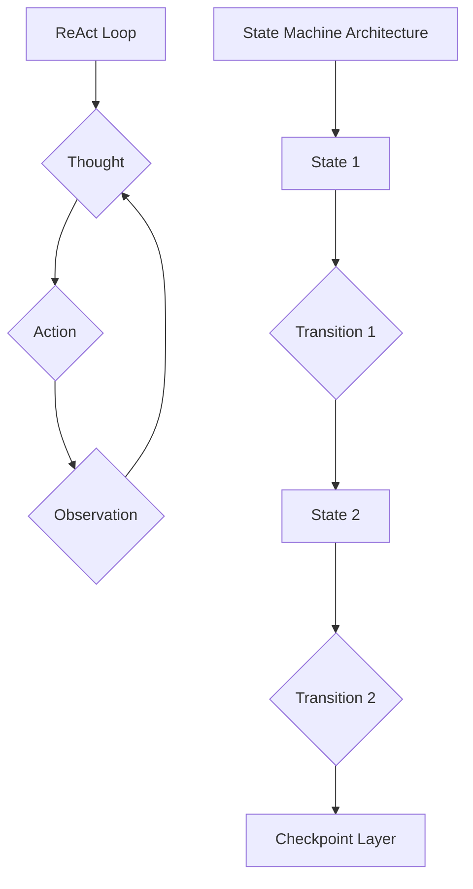
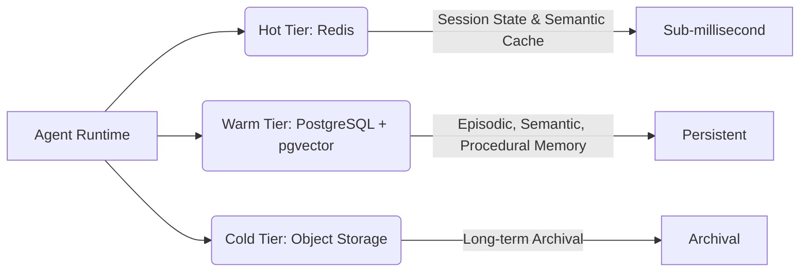

**TL;DR**

- StateFlow-style state machines achieve 13–28% higher success rates than ReAct loops with 3–5x lower cost [1].
- LangGraph's DAG-based StateGraph is the production standard, used by Uber, LinkedIn, and Replit for multi-hour workflows [3].
- Temporal resumes failed workflows without re-executing completed LLM calls; PostgreSQL + pgvector unifies episodic, semantic, and procedural memory in one store [5][7].

A ReAct agent that fails on step 12 of a 15-step workflow restarts from step 1. Every LLM call reruns. Every tool execution repeats. For a pipeline with $0.50 in inference per run, that is not just annoying — it is a compounding reliability and cost problem at scale.

Agent state management is the discipline most teams skip until something breaks in production. The real fix requires moving beyond the prompt loop: model behavior as an explicit state machine with defined transitions, external state persistence, and durable execution semantics.

Research confirms the gap: StateFlow-style state machines achieve 13–28% higher success rates than ReAct while cutting costs 3–5x [1]. Teams at Uber, LinkedIn, and Replit moved to graph-based orchestration because ReAct breaks past toy workflows. This guide covers the patterns that hold in production.

## Why production agents need state machines over ReAct loops

The ReAct (Reasoning + Acting) pattern is a fine starting point. For a single-step tool call or a short Q&A chain, it works. The problem surfaces when workflows grow: multi-hour code migration jobs, multi-turn hiring pipelines, or application builders with hundreds of intermediate steps. ReAct offers no mechanism for checkpointing, no structured recovery path, and no separation between task orchestration and sub-task execution.

StateFlow, a framework from Pennsylvania State University and Microsoft Research, benchmarked the difference directly [1]. On the InterCode SQL benchmark, a state-machine approach achieved a 13% higher success rate than ReAct — with GPT-3.5-Turbo running at 5x lower cost. On ALFWorld, the gap widened to 28% higher success at 3x lower cost. With GPT-4-Turbo, state machines still beat ReAct by 10% at 3x lower cost [1].

These gains come from architectural discipline, not model capability. State machines separate process grounding — which state to enter next, which transitions are valid — from sub-task solving. The LLM handles local reasoning inside each state. The state machine handles workflow logic. That separation prevents the context drift and circular reasoning that degrade ReAct in long-horizon tasks.

Combine StateFlow with Reflexion (iterative self-refinement) and the performance gap widens further: StateFlow + Reflexion reaches 94.8% success on ALFWorld after 6 iterations, while ReAct + Reflexion plateaus at 74.6% [1]. Nearly 20 percentage points. The state machine gives Reflexion a stable structure to refine against — and without that scaffold, iterative self-correction amplifies noise rather than converging on the right answer.

## Graph-based orchestration with LangGraph at production scale

LangGraph implements state machines as directed acyclic graphs (DAGs). A `StateGraph` object holds a centralized state — a typed object containing intermediate results, metadata, and accumulated context across nodes [2]. Each node is a callable that reads from and writes to that state. Conditional edges give you dynamic routing based on any runtime value, so a node can branch to different successors depending on what just happened.

One design choice worth understanding: LangGraph uses immutable data structures under the hood. Rather than modifying the existing state object, each node creates a new version. This prevents race conditions in parallel subgraphs and makes state history auditable — you can reconstruct exactly what happened at any node without relying on logs [2]. For debugging production failures, that property matters more than it sounds.

| Company | Use Case | LangGraph Pattern |
| --- | --- | --- |
| Uber | Large-scale code migration across thousands of files | Checkpointed DAG with specialized sub-agents, multi-hour job recovery |
| LinkedIn | AI Recruiter Agent + SQL Bot for non-technical users | Hierarchical multi-agent graph with conditional routing by intent |
| Replit | Multi-agent app builder from text prompts | Human-in-the-loop edges for file creation and package install review |

Uber's Developer Platform AI team uses LangGraph for code migrations spanning thousands of files [3]. Checkpointing lets multi-hour jobs recover from worker failures without losing progress. LinkedIn runs a hierarchical multi-agent system where a top-level orchestrator delegates to a Recruiter Agent and a SQL Bot, with LangGraph managing context handoffs between layers [3].

Replit's Agent builds complete applications from a single text prompt [3]. Human-in-the-loop edges pause execution before destructive actions — file creation, package installation — and resume once the user approves. The graph manages traces with hundreds of steps. Without explicit state management, that trace history would be unnavigable.

## State machine checkpointing and durable execution that survives worker crashes

Temporal stores workflow state through event sourcing: every action, every LLM response, every tool result appended to an immutable log [5]. When a worker crashes, Temporal replays that log and resumes from the exact failure point. Completed LLM calls are never re-invoked — Temporal replays recorded outputs rather than making new API calls, preventing both duplicate billing and non-deterministic behavior from re-running the same prompt [5].

Heartbeats matter. A 10-minute LLM call with no heartbeat is indistinguishable from a hung process; Temporal's activity heartbeating gives you the signal to tell the difference before the on-call engineer gets paged at 2am.

CrewAI takes a different approach — event-based checkpointing via `CheckpointConfig` at the crew, agent, or flow level [6]. Resume a flow and it inspects the state object, skips any step whose output keys already exist, and continues from there. Idempotent execution — no rebuilding from scratch.

For LangGraph, checkpointing integrates via `PostgresSaver` or Redis-based checkpointers for lower-latency resumption [7][8]. The checkpointer serializes the full state graph after each node execution. If the worker dies between nodes, the next execution reads the latest checkpoint and continues from the last successful state — exactly the pattern Uber uses for multi-hour code migration jobs [3]. Production deployments that need ephemeral compute should keep state external to the execution environment so any worker is disposable [4].

> [!TIP]
> Design checkpoint granularity by cost, not convenience. Checkpointing after every node adds latency. Checkpointing only at major milestones risks losing expensive intermediate work. A practical rule: checkpoint whenever you complete an LLM call or an irreversible external action — file write, API call, database mutation.

## Unified memory architectures that cut infrastructure costs

[Agent memory](/posts/2026-04-02-kv-cache-quantization-production-agents/) splits naturally into three types: episodic (what happened in past sessions), semantic (what the agent knows about the world), and procedural (how to execute recurring tasks). Most teams build separate infrastructure for each — a time-series store for [episodic memory](/posts/2026-03-10-agent-memory-architectures-hybrid-episodic-semantic/), a vector database for semantic search, a relational database for structured knowledge. That fragmentation is expensive and operationally painful.

PostgreSQL with the pgvector extension collapses all three memory types into a single database [7]. TimescaleDB hypertables handle episodic memory with time-partitioned queries, pgvector handles semantic memory with HNSW approximate nearest-neighbor search, and standard relational tables handle procedural memory with full SQL expressiveness. A single CTE can pull episodic context, retrieve semantically similar past interactions, and join procedural rules in one query [7].

The vendor-cited case study claims a 66% infrastructure cost reduction versus fragmented multi-database setups [7]. One source. No independent verification. Treat it as directionally plausible — the operational savings from consolidating three stores into one are real, but whether 66% is your actual number depends on scale, query patterns, and your existing database licensing costs.

Redis handles the hot path: sub-millisecond state lookups, short-term session memory, and semantic caching via LangCache [8]. Semantic caching intercepts LLM calls and returns cached responses when the incoming query is semantically similar to a cached one. Redis reports meaningful LLM cost reduction for agents handling repetitive queries via this mechanism [8]. For agents that answer repetitive queries — a SQL bot, a customer service agent — that is one of the highest-return optimizations available.

For long-term semantic memory that needs to scale beyond a single PostgreSQL instance, purpose-built vector databases like <a href="https://try.pinecone.io/tz9zm84oj8g3?utm_source=agentscodex&utm_medium=blog&utm_campaign=2026-04-10-ai-agent-state-machines-designing-persistent-workflows-for-production" rel="sponsored">Pinecone</a> handle billion-scale vector search with managed infrastructure, freeing you from tuning HNSW index parameters on PostgreSQL as your corpus grows. *(Affiliate disclosure: this article contains a sponsored link to Pinecone — we may earn a commission if you sign up.)*

## Multi-agent state synchronization without token waste

Multi-agent communication generates significant token waste when agents are poorly coordinated: each agent reconstructs the same background knowledge independently, passing redundant context back and forth [9]. That duplication compounds fast in production systems with dozens of active agents.

Three synchronization patterns address this at different scales. Shared state with concurrency control works for tightly coupled agents: a central state store that multiple agents read and write, with optimistic concurrency control or distributed locks preventing conflicting updates [9]. This is the LangGraph model — one StateGraph object, multiple nodes with coordinated access.

The Orchestrator-Worker pattern scales better for loosely coupled agents. A central orchestrator dispatches tasks via an event stream; workers consume events and publish results back. The event log becomes the single source of truth — agents read from the log rather than broadcasting redundant state to each other [9]. Immutable event logs also simplify debugging: you can replay any sequence of agent interactions exactly as it happened.

Event-driven coordination extends this to fully decoupled networks where agents communicate through typed events with no direct coupling [9]. Timing bugs. That is the cost. Event-driven systems develop subtle race conditions under high concurrency, and are harder to reason about when ordering matters; in agent workflows, ordering often matters a great deal. For most production deployments, the Orchestrator-Worker pattern hits the right balance [10].

| Pattern | Coupling | State Source of Truth | Best For |
| --- | --- | --- | --- |
| Shared State (LangGraph) | Tight | Central StateGraph object | Sequential DAG workflows, <10 concurrent agents |
| Orchestrator-Worker | Medium | Event log | Parallel task dispatch, dynamic worker scaling |
| Event-Driven | Loose | Distributed event stream | Fully decoupled agent networks, cross-service coordination |



## Persistent workflow patterns for stateful agent APIs

Most [agent frameworks](/posts/2026-03-04-mcp-model-context-protocol/) treat state as optional. The next generation of production tooling is moving in the opposite direction: state is the primitive, execution is ephemeral. LangGraph's stateful graph model, Temporal's durable execution engine, and unified memory stores are converging toward a world where agent context persists across sessions, failures, and model upgrades without application-layer plumbing.

The open question is portability. State schema migrations are the hidden operational cost of durable agents — as your agent logic evolves, checkpointed state from previous versions may be incompatible with new code. Design state objects with a schema version field from day one and write migration handlers before you need them in production. When an agent's state is serialized inside a framework-specific checkpointer, migrating to a different orchestration layer means rebuilding the state schema from scratch.



As graph-based orchestration matures, expect standardized state interchange formats to become a real need. The teams building durable agent infrastructure today are defining those standards by default. That is both an opportunity and a responsibility worth taking seriously.

## Practical Takeaways

1. Model agent workflows as explicit state machines from the start — retrofitting onto a ReAct loop is painful.
2. Decouple compute from state: use external persistence (PostgreSQL, Redis) so any execution environment is disposable.
3. Checkpoint after every LLM call and every irreversible external action.
4. Try PostgreSQL + pgvector as a unified memory store before reaching for specialized databases.
5. Enable Redis semantic caching for agents handling repetitive query types — significant cost savings are achievable for workloads with similar repeated queries [8].
6. Log every state transition with timestamps; production failures in complex graphs need a complete transition history to diagnose.

## Conclusion

State machine architecture delivers measurable production results. The numbers are concrete: a 28% success rate gap and 5x cost advantage over ReAct [1]. Start with LangGraph and PostgresSaver. Add Temporal only when workflows exceed 30 minutes, span multiple services, or require guaranteed-once execution semantics — that threshold is narrower than most teams expect. As agent workflows grow in complexity and lifespan, state management will become as consequential as model selection; the teams building their state layer correctly today will not be retrofitting it after the next outage.

## Frequently Asked Questions

### When should I use Temporal instead of LangGraph checkpointing?

Use Temporal when your workflows run for hours, involve external service calls that must not be duplicated, or require guaranteed-once execution semantics. LangGraph checkpointing with PostgresSaver works well for shorter workflows where replay is acceptable. Temporal's event sourcing model adds infrastructure complexity — a workflow engine, separate workers, and a persistence layer — that is not justified for sub-minute pipelines. For most teams, start with LangGraph checkpointing and introduce Temporal only when you hit its limits: jobs that take longer than 30 minutes, workflows that span multiple services, or any process where re-invoking a completed LLM call would cause data integrity issues.

### Can I use Redis alone as my agent memory store?

No. Redis is the right choice for session memory and semantic caching. For episodic history that needs time-range queries, or semantic memory that requires persistent HNSW indexes across restarts, Redis alone is not sufficient — pair it with PostgreSQL + pgvector.

### How do I prevent race conditions when multiple agents write to shared state?

LangGraph's immutable state pattern handles this at the framework level — each node creates a new state version rather than modifying the existing one [2]. For custom state stores, use optimistic concurrency control with version numbers or compare-and-swap operations. Distributed locks work but create bottlenecks under high concurrency; prefer OCC for most agent workloads.

### Does the 66% infrastructure cost reduction from unified PostgreSQL hold at scale?

That figure is from a single vendor-cited case study without independent verification [7]. We don't have clean production benchmarks across multiple teams at different scales. The directional claim is plausible — running one managed PostgreSQL instance rather than three specialized stores does reduce overhead. Measure your own stack before committing to a migration; the variables that matter most are your query patterns and your existing database licensing costs.

### What is the minimum viable checkpointing setup for a new agent project?

LangGraph with PostgresSaver. See the checkpointing section above for granularity guidance.

---

## Sources

| # | Publisher | Title | URL | Date | Type |
| --- | --- | --- | --- | --- | --- |
| 1 | arXiv / Pennsylvania State University & Microsoft Research | "StateFlow: Enhancing LLM Task-Solving through State-Driven Workflows" | https://arxiv.org/abs/2403.11322 | 2024-03-17 | Paper |
| 2 | Latenode | "LangGraph Multi-Agent Orchestration: Complete Framework Guide 2025" | https://latenode.com/blog/ai-frameworks-technical-infrastructure/langgraph-multi-agent-orchestration/langgraph-multi-agent-orchestration-complete-framework-guide-architecture-analysis-2025 | 2025 | Blog |
| 3 | LangChain Blog | "Top 5 LangGraph Agents in Production 2024" | https://blog.langchain.com/top-5-langgraph-agents-in-production-2024/ | 2024 | Blog |
| 4 | Northflank | "Ephemeral execution environments for AI agents in 2026" | https://northflank.com/blog/ephemeral-execution-environments-ai-agents | 2026 | Technical |
| 5 | Temporal.io | "Building Durable Agents with Temporal and AI SDK by Vercel" | https://temporal.io/blog/building-durable-agents-with-temporal-and-ai-sdk-by-vercel | 2025 | Technical |
| 6 | CrewAI | "Checkpointing - CrewAI Concepts" | https://docs.crewai.com/en/concepts/checkpointing | 2025 | Documentation |
| 7 | Tiger Data | "Building AI Agents with Persistent Memory: A Unified Database Approach" | https://www.tigerdata.com/learn/building-ai-agents-with-persistent-memory-a-unified-database-approach | 2025 | Blog |
| 8 | Redis | "AI Agent Memory: Stateful Systems with Redis" | https://redis.io/blog/ai-agent-memory-stateful-systems/ | 2025 | Technical |
| 9 | Tetrate / arXiv | "Multi-Agent Systems: State Synchronization and Coordination Patterns" | https://tetrate.io/learn/ai/multi-agent-systems | 2025 | Blog |
| 10 | n8n Blog | "AI Agent Orchestration Frameworks Comparison 2025" | https://blog.n8n.io/ai-agent-orchestration-frameworks/ | 2025 | Blog |

## Image Credits

- **Cover photo**: AI Generated
- **Figure 1**: AI Generated
- **Figure 2**: AI Generated
