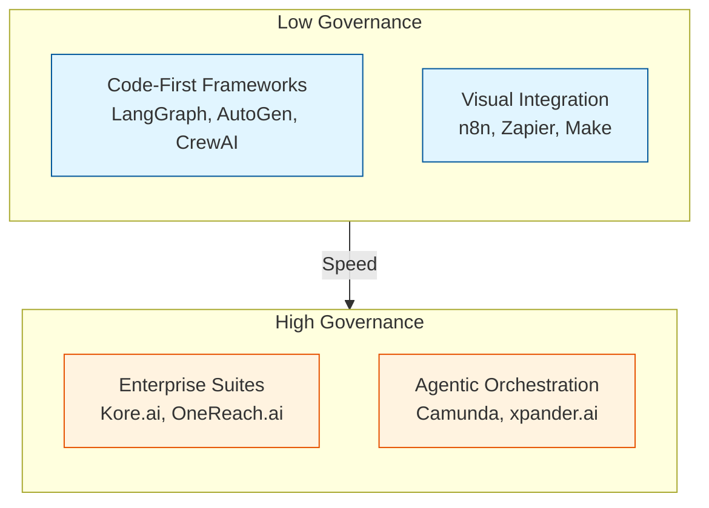
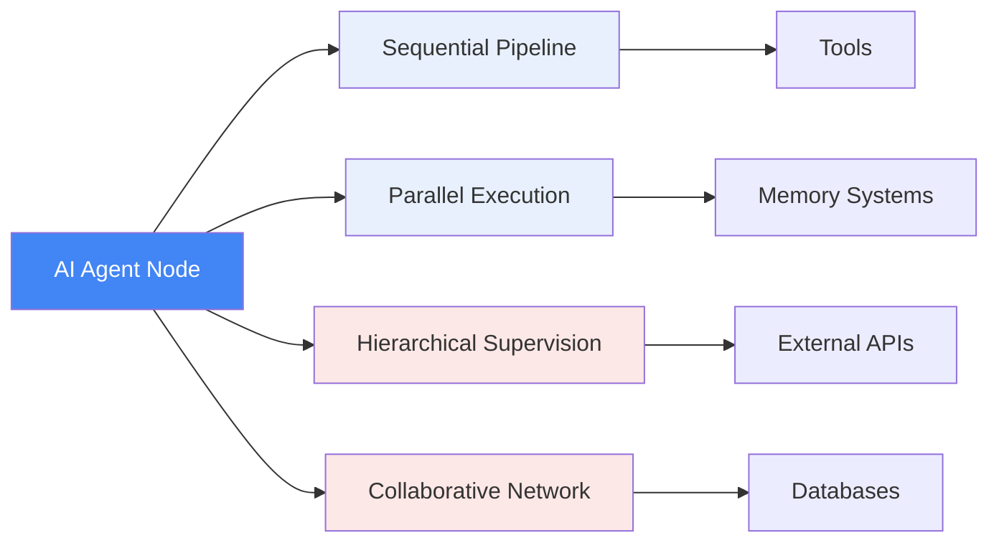

**TL;DR**

- [Multi-agent systems](/posts/2026-03-27-autonomous-finops-agents-cloud-cost-optimization/) outperform single agents by 90.2%. They also consume 15x more tokens—cost efficiency demands smart orchestration [5].
- n8n excels at integration-heavy workflows with 1000+ connectors and self-hosted deployment; Camunda provides deterministic BPMN control with agentic extensions [1][5].
- By 2028, 58% of business functions will use [AI agents](/posts/2026-03-09-mast-taxonomy-enterprise-agent-failures/) daily. Enterprise-grade orchestration will separate production systems from experiments [6].

Your AI agent works perfectly in demos. Then you deploy it. Reality hits fast.

By month three, debugging consumes your mornings. A failed tool call left customer data inconsistent—and your 'simple' workflow tool has no rollback mechanism to fix it automatically. You're manually reconciling partial transactions. Compliance asks what the agent did last Tuesday. You cannot reproduce it.

The real value of agent workflow orchestration isn't speed of deployment. It's correctness under failure—when agents hallucinate, tools timeout, or edge cases emerge that demos never touched.

This article compares three approaches: n8n for integration-heavy open-source workflows; Camunda for governed process orchestration; and emerging enterprise platforms bridging both worlds. The choice depends less on features. It depends more on the cost of failure in your domain.

## The agent orchestration market: four categories to know

The AI orchestration market in 2026 splits into four distinct categories. Each has different strengths. Each has different failure modes [1].

Code-first frameworks (LangGraph, AutoGen, CrewAI) give developers fine-grained control over agent behavior, but they lack built-in process governance primitives: no compensation flows, no durable execution history, no audit trails that compliance teams require.

Visual integration platforms (n8n, Zapier, Make) prioritize deployment speed. Connect a hundred services in an afternoon. What you often cannot do: trace exactly what happened during a failure; roll back a partially completed workflow; enforce guardrails at the agent level rather than the workflow level [1].

Enterprise suites like Kore.ai and OneReach.ai add governance layers—supervisor-based orchestration, adaptive agent networks, human-in-the-loop controls—at the cost of vendor lock-in and higher pricing [6]. Agentic orchestration platforms (Camunda, xpander.ai) occupy a middle ground: they embed AI agents as BPMN tasks within deterministic process models, enabling recovery and compensation mechanisms that lighter tools simply do not provide [1].

> [!NOTE]
> Gartner predicts 58% of business functions will have AI agents managing at least one process daily by 2028; 15% of daily business decisions will be fully automated by agents [6]. The platform you choose today determines whether those agents operate as governed production systems or expensive experiments.

## n8n: integration density for self-hosted agent workflows

n8n has become the default choice for teams building integration-heavy agent workflows. It runs in air-gapped or self-hosted environments—a requirement for regulated industries. With 1000+ native integrations and an AI Agent node functioning as a root-level orchestrator, n8n connects LLMs to external tools, memory systems, and databases without glue code [5][8].

The fair-code license distinguishes n8n from fully proprietary alternatives. Self-host without vendor lock-in; modify the codebase for internal needs; avoid per-workflow pricing that scales unpredictably with usage [8]. For teams requiring data residency, this flexibility is not a nice-to-have—it is a requirement.

n8n supports four multi-agent patterns: sequential pipelines, parallel execution, hierarchical supervision, and peer-to-peer collaborative networks [5]. The visual editor makes these patterns accessible to engineers who would otherwise write orchestration logic in Python—and that accessibility drives adoption.

Integration density creates a governance gap. Visual platforms typically lack detailed lineage tracking, agent-level guardrails, and replay capabilities needed for tightly regulated processes [1].

When an agent fails mid-workflow, you get a notification. What you may not get: automatic rollback of partial changes; compensating transactions for failed operations; or forensic-level audit trails showing exactly which agent made which decision with which context. For teams in regulated domains, that gap is not a minor inconvenience—it is a blocker.

## Camunda: when processes need deterministic control

Camunda approaches agent orchestration from the opposite direction. Instead of adding process control to agent workflows, it embeds AI agents as BPMN tasks within existing process models [4]. The result: deterministic flow control operating alongside agentic elements—LLM calls, RAG retrieval, tool integrations.

This architectural choice matters most when failure costs are high. Camunda's documentation emphasizes compensation and recovery mechanisms for handling agent failures: automatic rollbacks; saga patterns for distributed transactions; process instance migration for version updates [1]. These are not afterthought features—they are core BPMN primitives that have handled enterprise process automation for decades. Teams coming from lighter tools often underestimate this depth. When an LLM call fails partway through a multi-step financial transaction, it is the compensation handler—not the engineer on call—that determines whether the system recovers cleanly or leaves partial state scattered across services.

The enterprise technology research firm Gartner placed Camunda in the Visionary quadrant of its 2025 Magic Quadrant for Business Orchestration and Automation Technologies (BOAT), specifically citing its agentic orchestration capabilities [7]. That positioning matters not because analyst recognition validates architecture, but because it reflects where enterprise buying decisions are heading: toward AI agents operating within governed process frameworks, not as standalone black boxes.



The trade-off is complexity. Modeling compensation flows requires understanding event sub-processes, compensation handlers, and transaction boundaries that n8n hides behind simpler abstractions. For teams without BPMN expertise, initial setup takes longer. For teams already using Camunda for business process automation, adding agentic tasks is incremental—not transformational.

## Multi-agent math: why more agents means more problems

The economics are counterintuitive. Multi-agent configurations outperform single agents by 90.2% on complex tasks—yet they also consume 15x more tokens, and token usage alone explains 80% of performance differences across configurations [5]. More agents do not just cost more. They create failure modes that do not exist in single-agent systems, and those failures compound in ways that are genuinely hard to predict before you hit them in production.

Coordination overhead scales combinatorially—three agents manage three pairwise relationships, but ten agents require forty-five [5]. In practice, this manifests as increased latency, exponential token consumption, and quality drift: errors from upstream agents cascading through downstream processes in ways that become harder to debug as chain length increases.

| Agent Count | Pairwise Relationships | Failure Modes |
| --- | --- | --- |
| 3 agents | 3 relationships | Manageable with logs |
| 5 agents | 10 relationships | Requires structured tracing |
| 10 agents | 45 relationships | Formal orchestration required |

Quality drift is particularly insidious. Each agent in a chain receives outputs from previous agents—not raw inputs. If the first agent hallucinates a fact, subsequent agents may build increasingly elaborate reasoning on that false foundation. Without validation checkpoints between agents, errors compound rather than attenuate [5].


The platform choice for agent orchestration should be driven not by how quickly you can build a demo, but by how confidently you can debug a failure in production at 2 AM.


## Enterprise control planes: the emerging middle ground

Newer platforms recognize that neither pure integration tools nor pure BPMN engines fully address modern agent orchestration requirements. xpander.ai positions itself as an AI control plane with zero framework lock-in, supporting deployment in customer VPCs, on-premises environments, air-gapped networks, and multi-cloud configurations [2]. Full lifecycle governance—including rollback capabilities for agent deployments—addresses operational concerns that simpler tools leave unmet.

Kore.ai offers supervisor-based orchestration with adaptive agent networks and custom SDK patterns specifically designed for regulated industries [6]. Notably, it provides vendor-agnostic support for multiple [agent frameworks](/posts/2026-03-04-mcp-model-context-protocol/)—LangGraph, CrewAI, AutoGen, Google ADK, AWS AgentCore, and Salesforce Agentforce—allowing teams to standardize orchestration without standardizing agent implementation.

OneReach.ai GSX emphasizes cognitive orchestration with contextual memory, collaborative supervision, and human-in-the-loop controls for governed multi-agent operations [2]. The common thread across these enterprise platforms: they assume agents will fail, outputs will need validation, and humans will need to intervene—then they build infrastructure to handle these realities gracefully. That design assumption alone separates them from SMB-oriented tooling.

> [!WARNING]
> SMB-oriented tools prioritize speed over data residency and auditability. Self-hosted options including n8n and Camunda give enterprises control but shift operational burden to internal teams. There is no free lunch in agent orchestration—only different cost distributions [3].

## Decision framework: choosing your agent orchestration layer

Selecting an orchestration platform requires honest assessment of three factors: failure cost; compliance requirements; and team expertise.

| Agent Count | Pairwise Relationships | Failure Modes |
| --- | --- | --- |
| 3 agents | 3 relationships | Manageable with logs |
| 5 agents | 10 relationships | Requires structured tracing |
| 10 agents | 45 relationships | Formal orchestration required |

If a failed workflow costs you a customer record that can be manually restored, n8n's speed and integration density likely outweigh its governance limitations. If a failed workflow costs you regulatory fines or unrecoverable financial transactions, Camunda's deterministic control becomes worth the complexity premium.

Nearly 50% of surveyed vendors identify AI orchestration as their primary competitive differentiator according to Gartner's 2025 research [6]. This reflects the reality that building agents has become relatively easy; operating them reliably has not. The orchestration layer you choose will likely remain in place longer than the specific LLMs or agent frameworks you orchestrate through it.

## Practical Takeaways

1. Audit your failure modes before choosing a platform—if you cannot afford manual reconciliation of partial transactions, you need deterministic orchestration with compensation support.
2. Budget for token costs explicitly: multi-agent systems deliver 90.2% better results but consume 15x more tokens; without cost monitoring, efficiency gains disappear [5].
3. Validate checkpoint locations in multi-agent chains—errors compound, so insert validation gates between agents handling critical data [5].
4. Consider team BPMN expertise honestly—Camunda's power requires investment in process modeling skills that n8n abstracts away.
5. Plan for the orchestration layer's lifespan changing more slowly than the agents it manages—invest in governance primitives you may not need today but will regret lacking tomorrow.

## Conclusion

Agent workflow orchestration is not a technology choice—it is a risk management call dressed as infrastructure selection.

Watch the tooling gap close. As BPMN-native platforms add LLM-native authoring interfaces—and visual automation tools add compensation primitives—the hard choice between n8n and Camunda may narrow. The teams that invest in orchestration governance now will have shorter migration paths when that convergence arrives.

## Frequently Asked Questions

### Can n8n handle enterprise governance requirements?

n8n supports data residency through self-hosting and provides execution logs, but lacks built-in compensation flows, granular agent-level guardrails, and replay capabilities that regulated industries typically require [1][3]. Assess whether your existing audit infrastructure can bridge these gaps.

### Do I need BPMN expertise to use Camunda for agent orchestration?

Basic agentic tasks can be modeled with minimal BPMN knowledge, but the real power comes from formal process constructs. Implementing error handling with automatic retries, compensation flows, and process versioning requires understanding event sub-processes, boundary events, and transaction semantics. Teams already using Camunda for business processes have a head start. Teams new to BPMN should budget for training. The learning curve is real, but the governance payoff is substantial for high-stakes workflows.

### How do I decide between single-agent and multi-agent architectures?

Start simple. Add agents only when a task genuinely decomposes into distinct sub-problems—Anthropic's benchmarks show the 15x token cost is real, though production variance outside controlled benchmarks is less documented [5].

### Can I migrate between these platforms later?

Yes, but migration complexity depends on orchestration depth—see the decision framework table above to gauge where you fall. Workflows using only basic triggers and API calls port relatively easily. Workflows using platform-specific features—n8n's AI Agent node configurations, Camunda's BPMN compensation handlers, or enterprise-specific governance rules—require refactoring. Design core agent logic to be framework-agnostic where possible.

---

## Sources

| # | Publisher | Title | URL | Date | Type |
| --- | --- | --- | --- | --- | --- |
| 1 | Camunda | "Choosing AI Orchestration: A Practical Assessment Guide for Developers" | https://camunda.com/blog/2026/04/choosing-ai-orchestration/ | 2026-04 | Documentation |
| 2 | xpander.ai | "Top Agent Orchestration Vendors in 2026" | https://www.xpander.ai/blog/top-agent-orchestration-vendors/ | 2026-04 | Blog |
| 3 | Rasa | "Best Low-Code AI Agents Platforms for 2026" | https://rasa.com/blog/best-low-code-ai-agents-platforms/ | 2026 | Blog |
| 4 | Camunda | "Agentic Orchestration Documentation" | https://docs.camunda.io/docs/components/modeler/web-modeler/agentic-ai/ | 2026 | Documentation |
| 5 | n8n | "Multi-agent System: Frameworks & Step-by-Step Tutorial" | https://n8n.io/blog/multi-agent-system/ | 2026-01 | Blog |
| 6 | Kore.ai | "What is Multi-Agent Orchestration and How Does It Work?" | https://kore.ai/blog/ai-agents/what-is-multi-agent-orchestration/ | 2026 | Blog |
| 7 | Camunda | "Camunda Named a Visionary in 2025 Gartner Magic Quadrant for Business Orchestration and Automation Technologies" | https://camunda.com/blog/2025/06/gartner-magic-quadrant-2025/ | 2025-06 | News |
| 8 | n8n | "n8n Pricing" | https://n8n.io/pricing/ | 2026 | Documentation |

## Image Credits

- **Cover photo**: [Logan Voss](https://unsplash.com/@loganvoss) on [Unsplash](https://unsplash.com/photos/zMvcimtZWuU)
- **Figure 1**: AI Generated (Flux Pro)
