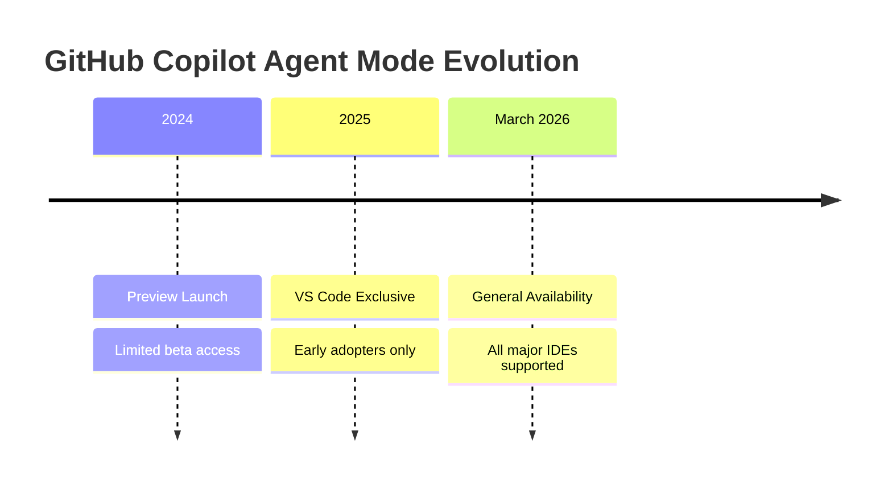

**TL;DR**

- GitHub Copilot Agent Mode GA (March 2026) hits 56% SWE-bench Verified while offering tighter GitHub integration than [Claude Code](/posts/2026-03-20-garry-tan-gstack-agent-teams-claude-code/)'s 63.7-70.3% [3].
- Cloud Coding Agent startup latency dropped 50% via pre-indexing—enabling async issue-to-PR workflows without real-time supervision [2].
- Copilot Pro+ at $39/month is the practical minimum; according to third-party analysis, each Agent Mode task consumes 3-10+ premium requests [4].

Production engineering reached an inflection point in March 2026. Autocomplete tools evolved into autonomous agents capable of planning multi-step tasks, editing files across projects, and submitting pull requests without intervention. GitHub Copilot Agent Mode reached General Availability across VS Code, JetBrains IDEs, Visual Studio, and Xcode—shifting how development teams approach code generation and repository management [1],[6].\n\nYet benchmark scores create persistent misunderstanding. Copilot scores 56% on SWE-bench Verified while Claude Code achieves 63.7-70.3% using the same underlying model [3]. Teams adopt Copilot anyway because benchmark scores miss what [actually matters](/posts/2026-03-06-benchmarking-ai-agents-production/) in production workflows [4].\n\nThis article examines when Copilot Agent Mode beats Claude Code for enterprise teams; why the Pro+ tier at $39 per month is effectively mandatory; and how that 56% benchmark score translates to measurable productivity gains in real-world development.

## What March 2026 Changed: GA Across All Major IDEs

The March 2026 GA announcement signaled production readiness beyond beta experiments. Prior versions kept Agent Mode as a VS Code exclusive while competitors like Claude Code operated in any terminal environment without these artificial constraints [4]. GitHub fixed this asymmetric IDE coverage problem decisively; the company delivered GA across Visual Studio, the full JetBrains suite including IntelliJ IDEA, PyCharm, and WebStorm, plus Xcode support [1],[6].

Two substantial technical improvements shipped alongside the GA announcement. First: pre-indexing reduced Cloud Coding Agent startup latency by 50% as of March 19, 2026 [2]. This improvement matters profoundly for async workflows.

Simply assign an issue to Copilot, step away for coffee, and return to find a pull request ready for review. It works. Slow initialization previously made these workflows unusable; the friction of waiting thirty seconds per agent invocation destroyed productivity for teams working asynchronously on complex projects.

Second: custom agents via .agent.md files now enable workspace-aware configurations with model choice and MCP ([Model Context Protocol](/posts/2026-03-04-mcp-model-context-protocol/)) connections that teams can customize for their specific needs [1],[6]. Development teams can define agents with specific skills automatically discovered from .github/skills/ directories—creating reusable instruction sets for recurring patterns such as API migrations between versions, comprehensive test generation, and logging standardization across multiple repositories [6].

> [!NOTE]
> Vim and Neovim users remain limited to completions—no Agent Mode or chat capabilities exist for these editors [1]; if senior engineers on your team live in tmux, this gap matters materially for adoption strategy.



## How Agent Mode Actually Works Under the Hood

Agent Mode operates as an LLM-backed orchestrator. It uses a clearly defined tool system: read_file, edit_file, run_in_terminal, and search_code [5]. The agent builds comprehensive task plans autonomously.

It then executes read-edit-run loops until either completion or explicit human intervention is required. This architecture fundamentally separates it from traditional inline completions; the agent actively maintains state across multiple tool invocations rather than operating in isolated suggestion bubbles.

Self-healing capabilities differentiate production-grade agents from mere script runners. When unit tests fail, Agent Mode reads error output carefully, diagnoses underlying root causes, and generates targeted fixes without requiring constant human prompting [8].

This feature eliminates the frustrating cycle where developers watch agents repeatedly fail tests while awaiting manual intervention. It matters. The specific breakpoint where many teams abandon AI coding tools entirely disappears.

GitHub offers three distinct agent modalities designed for different workflow patterns. IDE-based Agent Mode provides real-time assistance within your existing editor—collaborative, synchronous, and immediate. Cloud Coding Agent handles asynchronous workflows: create a branch, make edits, run comprehensive tests, and open a pull request after being assigned a GitHub issue [2]. CLI Agent Mode reached GA in February 2026 with advanced features including Plan mode, Autopilot mode, and parallel specialized sub-agents [1].

| Agent Type | Primary Use Case | Request Model | Best For |
| --- | --- | --- | --- |
| IDE Agent Mode | Real-time coding assistance | Synchronous | Active development sessions |
| Cloud Coding Agent | Async issue-to-PR workflows | Asynchronous | Backlog clearing; overnight tasks |
| CLI Agent Mode | Terminal-based workflows | Synchronous | Ad-hoc tasks; automation scripts |

MCP integration extends agent capabilities significantly. Agents can now query databases, call external REST APIs, or trigger CI/CD pipelines during task execution [6].

The skill architecture enables truly reusable instruction sets—define patterns once via .github/skills/ directory structure and apply them consistently across multiple repositories within your organization [6].

## 56% SWE-bench: Why the Gap Doesn't Decide Your Choice

The benchmark numbers are now well established. GitHub Copilot Agent Mode achieves 56% on SWE-bench Verified using Claude 3.7 Sonnet as the underlying model; Claude Code with the identical model hits 63.7% in standard mode and 70.3% with high-compute settings enabled [3].

On paper, this appears to represent a meaningful fourteen-point performance gap. However, this gap exists for structural reasons rather than fundamental capability deficiencies.

Copilot operates within tighter GitHub integration constraints: it must respect branch protection rules, work within repository permissions, and conform to organizational pull request workflows that rarely appear in synthetic benchmarks [4]. Claude Code operates more freely—reasoning across entire repositories without necessarily respecting GitHub abstractions that production teams depend on.

The 56% score reflects these different architectural choices, not inferior reasoning capability [3],[4]; the integration overhead that Copilot accepts is precisely what enables enterprise adoption at scale.


Choose Copilot Agent Mode when your workflow is GitHub-centric—branch protection, review requirements, and audit trails matter significantly more than a 7-14 point SWE-bench gap.


The PR workflow integration is what enables team adoption at scale rather than individual productivity experiments.

An Accenture randomized controlled trial with 450 developers provides empirical support for Copilot in enterprise settings. The study demonstrated an 8.69% increase in PRs per developer, a 15% higher merge rate, and an 84% increase in successful builds [1].

Copilot achieved 30% acceptance rates on suggestions with 88% retention of accepted suggestions [1]. The 2022 Peng et al. study measured 95 Upwork developers implementing an HTTP server in JavaScript with carefully controlled experimental conditions.

Copilot users completed tasks 55.8% faster on average—averaging 1 hour 11 minutes versus 2 hours 41 minutes for the control group [1]. Less experienced developers, older developers, and those with higher workloads benefited most.



## Pricing Reality: Why Pro+ Is the Practical Minimum

GitHub Copilot uses a premium request model. This differs fundamentally from Claude Code's flat subscription approach. According to third-party analysis, each Agent Mode session consumes 3-10+ premium requests for complex multi-file tasks that span multiple directories and require comprehensive understanding of codebase relationships [4].

Understanding consumption patterns is essential for budgeting; underestimation leads directly to surprise overage charges that destroy cost predictability for finance teams.

Clear recommendations emerge from analyzing the pricing tiers carefully.

Copilot Pro at $10 per month includes 300 premium requests—sufficient for light Agent Mode usage but likely triggering overage payments at $0.04 per request [8]. Copilot Pro+ at $39 per month includes 1,500 requests, making it the practical minimum for developers doing daily multi-file edits [7],[8].

The math is straightforward per independent estimates: a developer performing 5-10 agent tasks daily will exhaust a Pro plan's monthly quota in one to two weeks.

Enterprise plans at $39 per user per month include org-wide controls, comprehensive audit logs, and IP indemnity—features critical for legal compliance in regulated industries [8]. However, these features do not increase request quotas; Enterprise actually provides fewer requests per user than Pro+ (1,000 versus 1,500). A ten-developer team on Pro hits limits within a week of productive Agent Mode usage.

> [!WARNING]
> According to third-party analysis, GitHub announced a transition from premium requests to AI Credits (token-based billing) effective June 1, 2026 while keeping plan prices unchanged [4]; budget for Pro+ now.

## Copilot vs Claude Code: The Production Decision Matrix

The choice between Copilot Agent Mode and Claude Code depends critically on workflow patterns—not benchmark scores that dominate online discourse. Copilot offers tighter GitHub integration at significantly lower cost ($19 Business tier), but delivers less raw SWE-bench performance and less deep repository-first reasoning capability [4].

The decision hinges on where your team actually spends time, not which tool wins synthetic benchmarks.

Choose Copilot Agent Mode when: your team is GitHub-centric across mixed IDEs including VS Code, JetBrains, and Xcode; cost sensitivity matters significantly for budget-conscious organizations; audit trails and branch protection integration are non-negotiable compliance requirements; and you prefer review-first workflows where human eyes validate every agent-generated change before merge [4].

Choose Claude Code when: your task involves complex repository surgery requiring deep reasoning; deterministic outputs for critical sections are mandatory rather than merely preferred; your team works primarily in terminal environments rather than IDEs; and you can tolerate higher cost for the additional reasoning capability [4].

The hybrid approach is increasingly common and pragmatic in mature engineering organizations.

Deploy Copilot for broad developer adoption across the organization; senior engineers supplement with Claude Code for specific complex refactors. Both tools coexist effectively—Claude Code for deep architectural work; Copilot for daily throughput and PR velocity.



## Enterprise Rollout: A Three-Phase Production Playbook

Rolling out AI coding agents to production teams requires significantly more than procurement and simple license allocation. A disciplined three-phase approach minimizes risk while maximizing adoption velocity and building team confidence incrementally rather than through disruptive wholesale changes.

Phase 0: Establish policy before tools.

Define explicitly acceptable agent tasks including refactors, API migrations, test generation, and logging additions. Also define prohibited areas: security-critical algorithms, cross-repository architecture changes, and un-tested legacy codebases [6],. Configure custom agents via .agent.md files encoding team-specific patterns; set branch protection rules that apply equally to agent-initiated and human-initiated PRs.

Phase 1: Distribute chat and completions org-wide while running Agent Mode in controlled pilot mode on well-tested repositories only. Monitor acceptance rates, build success metrics, and developer satisfaction scores.

Accenture's benchmarks—30% acceptance rates and 88% retention—provide useful calibration points for expectations [1].

Phase 2: Enable Cloud Coding Agent for labeled issues—allowing async workflows where Copilot creates branches, makes edits, runs tests, and opens PRs without real-time human supervision. Maintain required review gates; the Cloud Coding Agent respects existing branch protection rules automatically without additional configuration.

Repository memory across sessions enables genuinely long-running work. The Copilot CLI includes hooks and plugin architecture for custom automation workflows [1].

Governance requires branch protection, mandatory reviews, and comprehensive audit logging—the same controls applying to human developers apply equivalently to agent-initiated changes.

```yaml
# Example .agent.md for a team-specific agent\nname: API Migration Agent\nmodel: claude-3.7-sonnet\nskills:\n  - .github/skills/api-migration.md\nmcp:\n  - openapi-validator\ninstructions: |\n  When migrating APIs:\n  1. Update endpoints in src/api/\
  2. Regenerate TypeScript types\
  3. Update dependent tests\
  4. Run full test suite before submitting PR
```

## Practical Takeaways

1. Start with Copilot Pro+ ($39/month) for daily Agent Mode usage—the 300-request Pro tier triggers overage charges within one to two weeks of productive use.
2. Define prohibited agent tasks before rollout: security-critical code, cross-repository architecture changes, and any system lacking comprehensive test coverage and existing CI/CD.
3. Claude Code's higher SWE-bench score reflects different architectural constraints—use Copilot for GitHub-centric workflows; Claude Code for deep reasoning and terminal-centric tasks.
4. Configure custom agents via .agent.md files to encode team-specific patterns and reduce repetitive prompting overhead across your organization.
5. Track the June 2026 AI Credits transition proactively—budget for token-based billing if your usage favors short, frequent agent sessions over longer ones.

## Conclusion

GitHub Copilot Agent Mode GA marks a foundational shift. The 56% SWE-bench score tells only part of the story—enterprise value flows from GitHub integration depth and predictable request economics rather than benchmark dominance. As reasoning costs fall through 2027, agent adoption will accelerate. Teams that establish governance now will capture disproportionate gains.

## Frequently Asked Questions

### Is 56% SWE-bench good enough for production environments?

Absolutely. Claude Code's higher score operates without GitHub integration constraints [3]. Production teams see measurable gains—8.69% PR throughput improvement and 84% more successful builds—because integration matters more than raw reasoning capability [1].

### How many premium requests does a typical Agent Mode session use?

According to third-party analysis, Agent Mode sessions typically require 3-10+ requests for complex multi-file tasks [4]. A developer doing 5-10 agent tasks daily exhausts Pro's 300 monthly requests in one to two weeks—making Pro+ the practical minimum for productive usage. The exact consumption varies based on codebase complexity and task duration. See the pricing comparison table in the Pricing Reality section above for detailed tier breakdowns.

### Can I use Agent Mode in JetBrains IDEs like IntelliJ?

Yes. Agent Mode became available across the entire JetBrains suite including IntelliJ IDEA, PyCharm, and WebStorm with the March 2026 GA release [1],[6].

### Should we migrate from Claude Code to Copilot Agent Mode?

This depends heavily on your specific workflow patterns and team composition. GitHub dependency and cost sensitivity generally favor Copilot; complex repository surgery requiring deep reasoning favors Claude Code; IDE flexibility needs favor Copilot. Many successful teams run both—Copilot for broad adoption and Claude Code reserved for senior engineers tackling complex cross-repository refactors. If your team values deterministic outputs and spends significant time in terminal environments, Claude Code may remain the better choice despite higher per-seat cost. We're uncertain how the tool landscape will evolve through 2027 as reasoning costs decline.

### What changed in the March 2026 GA release specifically?

March 2026 GA delivered production readiness across all major IDEs: VS Code, Visual Studio, JetBrains, and Xcode [1],[6]. Previously Agent Mode was VS Code exclusive; see the GA Across All Major IDEs section above for details on new capabilities.

---

## Sources

| # | Publisher | Title | URL | Date | Type |
| --- | --- | --- | --- | --- | --- |
| 1 | Dev.to (Carlos José Castro Galante) | "GitHub Copilot in 2026 is not what you think it is anymore" | https://dev.to/carlosjcastrog/github-copilot-in-2026-is-not-what-you-think-it-is-anymore-ij3 | 2026-03 | Blog |
| 2 | GitHub Blog Changelog | "Copilot coding agent now starts work 50% faster" | https://github.blog/changelog/2026-03-19-copilot-coding-agent-now-starts-work-50-faster/ | 2026-03 | Documentation |
| 3 | Perplexity Research (Aggregated from Anthropic, SWE-bench, Augment) | "Claude 3.7 Sonnet SWE-bench Verified Benchmark Analysis" | https://www.anthropic.com/news/claude-3-7-sonnet | 2025-04 | Blog |
| 4 | Metacto | "Comparing Claude Code and GitHub Copilot for Engineering Teams" | https://www.metacto.com/blogs/comparing-claude-code-and-github-copilot-for-engineering-teams | 2026 | Blog |
| 5 | GitHub Blog | "Agent Mode 101: All About GitHub Copilot's Powerful Mode" | https://github.blog/ai-and-ml/github-copilot/agent-mode-101-all-about-github-copilots-powerful-mode/ | 2025 | Documentation |
| 6 | GitHub Blog Changelog | "Major agentic capabilities improvements in GitHub Copilot for JetBrains IDEs" | https://github.blog/changelog/2026-03-11-major-agentic-capabilities-improvements-in-github-copilot-for-jetbrains-ides/ | 2026-03 | Documentation |
| 7 | nxcode.io | "GitHub Copilot Complete Guide 2026: Features, Pricing, and Agents" | https://www.nxcode.io/resources/news/github-copilot-complete-guide-2026-features-pricing-agents | 2026 | Blog |
| 8 | GitHub | "GitHub Copilot Plans and Pricing" | https://github.com/features/copilot/plans | 2026 | Technical |

## Image Credits

- **Cover photo**: Image generated with dalle3 (ContentForge AI illustration)
- **Figure 1**: Image generated with flux-pro-1.1 (ContentForge AI illustration)
- **Figure 2**: Image generated with flux-pro-1.1 (ContentForge AI illustration)
