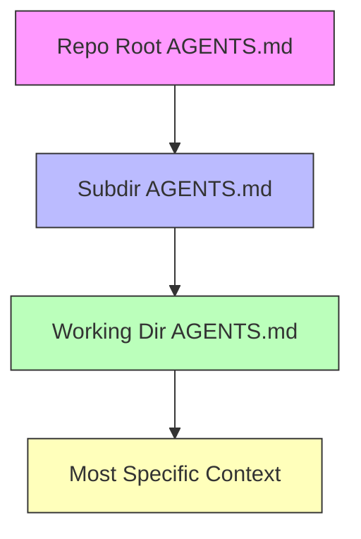

**TL;DR**

- AGENTS.md has been adopted by over 60,000 GitHub repositories as of March 2026; it's the closest thing to an agent configuration standard we have [8].
- Vercel's internal evals showed AGENTS.md with a compressed docs index hit 100% pass rate on framework tasks versus 79% for skills. Passive context beats active retrieval [3].
- AGENTS.md is instructions, not documentation. GitHub Well-Architected recommends CODEOWNERS and branch rulesets to protect it [5].

A new developer joins your team: they spend the first week reading docs, pairing with colleagues, absorbing tribal knowledge. An AI agent dropped into your repository gets none of that: no onboarding chat; no pairing session; no context at all. It guesses, and when it guesses wrong about your monorepo's build system, the cleanup can consume an afternoon. AGENTS.md changes the economics of agent-assisted development by turning your repository into something agents can read. Not a README for humans: it's an instruction set for tools. The format is now stewarded by the Agentic AI Foundation under the Linux Foundation, adopted by over 60,000 repos [8]. The real shift isn't the file format. It's the architectural decision to treat your codebase as an agent's working environment, not just a file tree.

## The Problem: Environmental Ambiguity Kills Agent Reliability

Most production repositories are hostile environments for AI agents. Build commands live in Makefiles with no explanation of why. Testing conventions exist in someone's head. The thing you never push to production on a Friday; that's a Slack thread from 2023, not a doc. Human developers navigate this ambiguity through institutional knowledge; agents don't have any [2].

The result is predictable failure modes. An agent runs the wrong test command and reports a passing suite. It generates code against a deprecated internal API because the migration notice exists only in a team channel. These aren't model failures: they're environmental failures. The model was competent; it just didn't know the rules of your house.

Before AGENTS.md, every coding tool solved this differently: Copilot had .github/copilot-instructions.md; Cursor used .cursorrules; Claude Code invented CLAUDE.md. Each file, each format, each tool. The proliferation made the problem worse, not better; teams maintaining three copies of the same build instructions in three different formats just to keep their toolchain working.

> [!NOTE]
> The fragmentation isn't just annoying; it creates silent failures. When one tool reads .cursorrules and another ignores it, agents produce different outputs from the same prompt. Your team can't debug what it can't reproduce.

## How the Configuration Hierarchy Actually Works

AGENTS.md isn't a single file. It's a hierarchy. Agents automatically read nested AGENTS.md files when operating inside those directories. Context scales from general to specific. The root AGENTS.md defines global conventions: language version, CI expectations, code review policy. A module-level file adds that module's invariants. A feature-level file captures edge cases the team discovered the hard way [2].

The mechanism is concatenation, not inheritance. A monorepo root might specify 'all services use Python 3.12 and pytest.' A services/payments/AGENTS.md adds 'this service requires Docker Compose for integration tests, and the test database uses PostGIS.' The agent sees both; the more specific instruction comes later in the prompt buffer, so it carries more weight in the model's attention.



The hierarchy forces a natural prioritization: root handles global conventions; leaves handle local invariants. If something doesn't fit at the level you're writing it, you're probably writing it at the wrong level. An agent working in src/payments/refunds/ automatically picks up root → payments → refunds instructions, in that order. Nobody has to remember to reference the right file; the filesystem position does the routing [2].

Harness describes this as a three-tier structure: root defines global conventions, module-level files define local invariants, and feature-level files encode edge-case constraints [2]. The beauty of this model is that it maps directly to how teams already organize code. You don't need to invent a new taxonomy. Your directory tree is the taxonomy.


The hierarchy is concatenation, not inheritance. Closer files override by appearing later in the prompt. Order is your only control lever.


## Why 88 AGENTS.md Files Scale Better Than One

OpenAI's own monorepo uses 88 AGENTS.md files: one at root, the rest nested inside individual packages and services [2]. That number sounds extreme until you try the alternative: maintaining a single 5,000-line file that mixes SQL migration rules, frontend linting conventions, and deployment procedures into an unreadable blob.

The hierarchical pattern maps naturally to how teams actually work. The root AGENTS.md defines global conventions. A service-level file encodes that service's invariants; a feature-level file captures edge cases the team discovered the hard way. 'The CSV parser assumes UTF-8-BOM; don't switch to plain UTF-8 without updating the importer' [2]. This is institutional memory, committed where tools can read it.

Large organizations with monorepos face the same scaling problem regardless of which AI coding tool they use. The hierarchical approach means contributors who work exclusively in one module only need to know that module's rules; the context system handles the rest automatically.

You don't curate what the agent sees; the file tree curates it for you.

## AGENTS.md Outperforms Skills by 21 Points: Here's Why

Vercel's engineering team ran a controlled evaluation comparing AGENTS.md against SKILL.md for Next.js 16 API tasks. AGENTS.md with a compressed docs index hit a 100% pass rate; skills with explicit instructions reached 79%. The gap: 21 points [3].

The root cause isn't model quality: it's retrieval reliability. Skills require a decision point: the agent must recognize a task matches a skill description, then invoke the skill. In Vercel's evaluation, 56% of cases never triggered the available skill; the agent simply didn't realize it was looking at a Next.js API task [3]. Passive context (always in the prompt, never requiring a retrieval decision) sidesteps this failure mode entirely.

Vercel's 100% vs. 79% results come from Next.js 16 API tasks specifically.

Whether the same gap holds for your framework, your evaluation criteria, and your coding assistant; nobody has published that data. The Next.js codemod team optimized their AGENTS.md for a known task distribution, which almost certainly inflates the numbers relative to a general-purpose setup.

Compression matters. Vercel's team packed a 40KB documentation index into 8KB using a pipe-delimited structure — an 80% reduction that preserved the 100% pass rate [3]. The technique matters because context windows are finite; bloated instructions compete with the actual code the agent needs to work on. The pipe-delimited format trades readability for density, and in this case, the trade paid off.

## CLAUDE.md, SKILL.md, and the Multi-Tool Reality

AGENTS.md is winning the standardization war, but it hasn't won it yet. Claude Code uses CLAUDE.md as its native configuration file; it doesn't read AGENTS.md directly, though you can symlink or reference it [6]. Different filename; different conventions; same goal.

SKILL.md occupies a different design point: where AGENTS.md is always-on, SKILL.md is on-demand (loaded only when the agent's task matches a skill description). The idea is efficiency: don't waste context window on instructions that don't apply. In practice, the trigger reliability problem makes this theoretical efficiency hard to realize [7].

| Configuration Layer | File | Load Trigger | Best For |
| --- | --- | --- | --- |
| Always-active instructions | AGENTS.md / CLAUDE.md | Every request, unconditionally | Build commands, code conventions, architectural rules |
| On-demand workflows | SKILL.md | Task-description match | Framework-specific guides, deployment runbooks |
| Tool-specific rules | .cursorrules / copilot-instructions | Tool-dependent | Tool-specific features and integrations |
| User preferences | Custom instructions | Personal workflow | Editor preferences, personal shortcuts |
| Repository context | AGENTS.md (root) | Repository-wide | Global conventions, cross-cutting rules |

The five configuration layers for AI agents in 2026, as catalogued by Agensi, are: Custom instructions (always-on context), SKILL.md skills (on-demand expertise), MCP servers (external tool access), Cursor rules (editor-specific), and AGENTS.md (repository context) [1]. Each layer addresses a different scope. Together they form a stack, but the interaction between layers is underspecified, and no tool currently validates that layer N doesn't contradict layer N-1.

## Security: When Your Repo's Instructions Become an Attack Surface

AGENTS.md is instructions, not documentation. Coding agents treat its contents as behavioral directives; they follow them. A one-line addition that says 'run tests with --coverage before committing' changes every AI-assisted commit to your repository. If someone can modify your AGENTS.md, they can control every AI agent that touches your codebase.

The governance model needs to match the threat model. GitHub Well-Architected recommends repository rulesets to protect agentic primitive files: AGENTS.md, SKILL.md, MCP configurations, and .cursorrules [5]. The pattern is straightforward: require PR review from a designated owner for any change to files in the agentic configuration surface. Branch protection rules that enforce independent review add a second layer.

> [!WARNING]
> Treat AGENTS.md as IAM-grade policy. If someone can modify it, they can control every AI agent that touches your repository. The file deserves CODEOWNERS protection and mandatory PR review, same as your CI pipeline configuration.

A reasonable precaution: scanning for suspicious patterns (curl pipes, eval calls, encoded payloads) in AGENTS.md diffs catches the obvious attacks. What it doesn't catch is subtler manipulation: instructions that bias the agent toward vulnerable code patterns, or directives that disable safety checks in specific edge cases. The most dangerous AGENTS.md compromise isn't a blatant attack; it's an instruction that looks reasonable at first glance but systematically weakens the codebase over time.

The practical implication: AGENTS.md is infrastructure, not documentation. It lives alongside your CI config, your deployment manifests, and your secrets management, and it deserves the same level of change control. If your team wouldn't accept an unreviewed change to .github/workflows/deploy.yml, they shouldn't accept one to AGENTS.md either.

## Designing an AGENTS.md That Agents Actually Follow

Both the AGENTS.md specification and Harness recommend four required sections: Overview (what this project does, in two sentences); Build/Test (exact commands, not explanations); Workflow (how work moves from idea to merged PR); and Pitfalls (what will definitely break if you do it wrong) [2] [8].

Write imperatively, not narratively: 'Run pytest with -x --ff to stop on first failure and retry failures first' beats 'Our testing strategy involves pytest, which we recommend running with flags that optimize for developer feedback loops.' Agents don't need persuasion; they need commands. Save the narrative for the README. Humans read that; agents read this.

The OpenAI Agents Python SDK provides a concrete example of what works [1]. Their AGENTS.md includes mandatory $code-change-verification, a directive that forces the agent to verify every code change against project rules before completing the task. It scopes rules to specific directories using file path patterns; it's under 300 lines, keeping the file parseable rather than exhaustive.

```markdown
# AGENTS.md minimal template

## Overview
This project is a payment processing service in Go.

## Build & Test
go build ./...
go test -race -count=1 ./...

## Workflow
1. Branch from main, prefix: feat/, fix/, chore/
2. All PRs require CHANGELOG entry

## Pitfalls
- Never call ProcessRefund() without locking the transaction row first.
- Docker Compose needs at least 4GB RAM allocated.
```

## Practical Takeaways

1. Add AGENTS.md to your repository root with at minimum build commands, test commands, and two project-specific pitfalls. Skip the prose; agents need directives.
2. Protect your AGENTS.md with CODEOWNERS and require PR review for changes to any agentic configuration file. It controls every AI agent that touches your codebase.
3. If your AGENTS.md exceeds 300 lines, decompose into hierarchical files following your directory structure rather than growing a single file.
4. Document the four required sections: Overview, Build/Test, Workflow, and Pitfalls. This structure gives agents a consistent pattern to parse.
5. For multi-tool teams: symlink CLAUDE.md → AGENTS.md for the simple case, but maintain both files if you need agent-specific instructions.

## Conclusion

Most teams still scatter their build conventions across wikis, onboarding docs, and Slack threads no tool will ever parse. The shift worth watching is small but compounding: once a repository can state its own rules where machines read them, every future agent and every new hire starts from the same page instead of guessing. The teams writing that file today are quietly removing a class of errors the rest will keep debugging.

## Frequently Asked Questions

### Can I use AGENTS.md with Claude Code?

Not directly. Claude Code reads CLAUDE.md as its native configuration file, not AGENTS.md [6]. You can symlink CLAUDE.md → AGENTS.md, and it works for simple cases. See the multi-tool comparison table above for the full breakdown of which tools read which files.

### Should I use one AGENTS.md or multiple nested files?

Start with one file at the repo root. When it exceeds 300 lines, decompose into nested files following your directory structure. The hierarchy is automatic: an agent working in src/payments/ picks up root → payments instructions in order, so modular instructions don't require the agent to know which files to load. Monorepos benefit most from hierarchical decomposition. OpenAI's repo uses 88 nested AGENTS.md files for exactly this reason [2].

### Should I put my AGENTS.md in .gitignore?

No. AGENTS.md is version-controlled infrastructure, same as your CI config. If it's not in the repo, it's not real.

### How does AGENTS.md interact with my existing .cursorrules file?

Cursor natively supports AGENTS.md, so you can migrate your .cursorrules content into it and benefit from tool-agnostic formatting. However, .cursorrules supports Cursor-specific features that AGENTS.md doesn't: chat preferences, model selection hints, inline editing behavior. The cleanest approach: move everything tool-agnostic to AGENTS.md (build commands, testing conventions, architecture rules) and keep only Cursor-specific preferences in .cursorrules. The intersection shouldn't be large. If it is, your .cursorrules is doing double duty as project documentation — exactly what AGENTS.md replaces [1].

### Does AGENTS.md work with GitHub Copilot?

Yes. GitHub Copilot reads AGENTS.md and has published its own guidance on writing effective files based on analysis of over 2,500 repositories. That guidance recommends covering six core areas: commands, testing, project structure, code style, git workflow, and boundaries [4]. Note that GitHub's guidance is specifically about Copilot's agents.md persona system (files stored in .github/agents/) which is distinct from the root-level AGENTS.md standard. The six areas are broadly applicable to any agent that reads AGENTS.md, but the deployment mechanism differs.

---

## Sources

| # | Publisher | Title | URL | Date | Type |
| --- | --- | --- | --- | --- | --- |
| 1 | Agensi | "How to Configure AI Coding Agents: SKILL.md, AGENTS.md, CLAUDE.md & .cursorrules" | https://www.agensi.io/learn/ai-agent-configuration-guide-2026 | 2026-04 | Blog |
| 2 | Harness | "Why AGENTS.MD is the New Standard" | https://www.harness.io/blog/the-agent-native-repo-why-agents-md-is-the-new-standard | 2026-01 | Blog |
| 3 | Vercel | "AGENTS.md outperforms skills in our agent evals" | https://vercel.com/blog/agents-md-outperforms-skills-in-our-agent-evals | 2026-01 | Blog |
| 4 | GitHub | "How to write a great agents.md: Lessons from over 2,500 repositories" | https://github.blog/ai-and-ml/github-copilot/how-to-write-a-great-agents-md-lessons-from-over-2500-repositories/ | 2025-11 | Blog |
| 5 | GitHub Well-Architected | "Governing agents in GitHub Enterprise" | https://wellarchitected.github.com/library/governance/recommendations/governing-agents/ | 2026-04 | Documentation |
| 6 | Manifold Markets | "Claude Code Configuration: CLAUDE.md and AGENTS.md" | https://manifold.markets/bessarabov/will-claude-code-support-agentsmd-i | 2026-05 | Blog |
| 7 | Termdock | "SKILL.md vs CLAUDE.md vs AGENTS.md: Complete Comparison" | https://www.termdock.com/blog/skill-md-vs-claude-md-vs-agents-md | 2026-05 | Blog |
| 8 | AGENTS.md Official | "AGENTS.md Specification" | https://agents.md | 2026-05 | Documentation |

## Image Credits

- **Cover photo**: Image generated with flux-pro-1.1 (Agents' Codex AI illustration)
