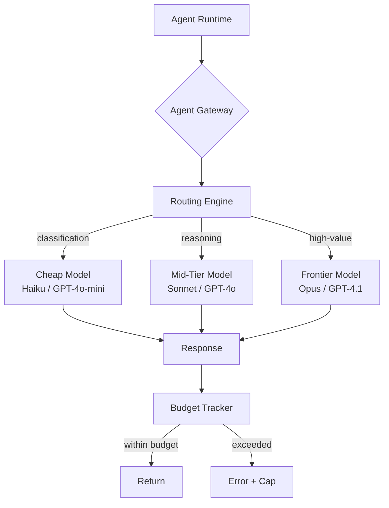
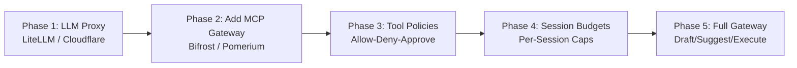

**TL;DR**

- Gartner predicts 75% of API gateway vendors will integrate MCP by end 2026; at least 50% of GenAI projects will overrun budgets through 2028 [1] [2].
- Agent gateways add three capabilities LLM gateways lack: tool call validation, multi-step budget tracking, and autonomy-level enforcement [3] [4].
- The unified gateway pattern — LLM routing, MCP tool governance, and cost control in one layer — is becoming the production standard [5].

A single user request to a production agent can cascade into dozens of LLM calls as the system plans, retrieves, validates, and retries. LLM gateways enforce per-request token limits. They cannot see that a request just triggered a 14-step tool chain consuming orders of magnitude more budget than expected. That blindness isn't a missing feature. It's a category mismatch. The agent gateway pattern fills this gap by extending the proxy layer with tool call validation, per-session budget tracking, and autonomy-level enforcement — infrastructure that separates production-ready [agent systems](/posts/2026-03-03-ai-agent-observability-production/) from expensive experiments. This article maps the full architecture, compares the platforms, and gives you a migration path from simple LLM proxy to full agent gateway.

## The Problem: Why LLM Gateways Are Blind to Agent Behavior

LLM gateways like LiteLLM, Cloudflare AI Gateway, and OpenRouter handle [model routing](/posts/2026-03-05-cutting-llm-agent-costs-by-50-a-production-engineers-playbook/) across 100+ providers, per-key budget caps, and rate limiting [6]. Their scope stops at the inference layer: they see tokens in, tokens out, and cost; nothing about which tool the agent calls next or how many steps a single request triggers.

Agentic workflows don't behave like chatbots. One user request can cascade into tens or hundreds of LLM calls as agents plan, execute tools, retry, and loop [6]. Deloitte documented a healthcare enterprise where token consumption grew 8-10% monthly, reaching 1 trillion tokens over six months and generating $6M+ in annualized unplanned cost increases [7]. An agent consuming 2M blended tokens per hour at $20/M costs ~$40/hour; at 10M tokens/hour, that's ~$1.75M/year [7] — the cost of a meaningful human team.

> [!WARNING]
> A basic chatbot generates ~9.4M tokens per subscriber per year. An advanced agent with multi-step reasoning and tools can generate up to 356M tokens — nearly 38 times more [7]. If you provisioned for the chatbot, the agent will blow through your budget; you won't see it coming from per-request metrics alone.

Gartner predicts at least 50% of GenAI projects will overrun budgets through 2028, with inference at 70%+ of lifetime model costs [2]. Meanwhile, 1,862 MCP servers were found internet-exposed with zero authentication [4]. Both failures share a root cause: governance was bolted on after deployment instead of designed into infrastructure.

## Architecture: The Three Access Patterns for Agent Tools

AWS's prescriptive guidance for agentic AI defines three tool access patterns, and choosing among them determines your governance ceiling [8].

| Pattern | Latency | Governance | Scalability | Best For |
| --- | --- | --- | --- | --- |
| In-Runtime Tools | ~1ms | None | Limited | Prototyping, PoCs |
| Direct Remote Tools | Low | Per-server (MCP auth) | Good | Small team, trusted tools |
| Tools Gateway | 11µs–5ms overhead | Per-tool, per-method, per-session | Enterprise | Production, multi-tenant, regulated |

In-runtime tools are the default: zero latency, zero governance. Direct remote tools via MCP add protocol-based interoperability and server-level authentication. The tools gateway pattern centralizes discovery, security, versioning, and per-tool policy enforcement; every tool call passes through a single control point that validates schemas, enforces allow-deny-approve rules, and tracks session spend [8].

The gateway builds on MCP (97 million monthly SDK downloads, 78% enterprise adoption [9]) without replacing it. MCP standardizes agent-to-tool communication; the gateway adds governance, observability, and cost control on that protocol layer.

<!-- ILLUSTRATOR: suggested diagram — Three tool access patterns side by side: in-runtime tools embedded in agent process, direct remote tools connecting via MCP protocol, and centralized tools gateway pattern with policy enforcement layer -->

## Model Routing and Cost Optimization at the Gateway Layer

Model routing becomes more powerful inside a gateway with agent-aware context. LiteLLM demonstrated per-key budgets, rate limits, and fallback routing across 100+ providers [6]. An agent gateway adds: which agent made the request, what workflow step it's on, and cumulative session spend so far.

This enables smarter decisions. A classification step routes to a cheap model like Claude Haiku. Multi-hop reasoning gets a mid-tier model. A high-value judgment gets the frontier model. The routing engine considers prompt difficulty, the agent's role, remaining session budget, and downstream risk of error.



Semantic caching at the gateway delivers 20-73% cost reduction with dual-layer exact hash plus vector similarity matching [10]. The range is workload-dependent: repetitive support workflows hit the upper end. Creative generation hits the lower end. Bifrost's Code Mode claims up to 92% token reduction by pre-computing deterministic paths before reaching an LLM [9].

The cached response arrives in milliseconds — sub-5ms in Bifrost benchmarks [3]. Budget management adds a hierarchy: per-virtual-key caps for individual agents, per-team budgets for departments, per-customer hard caps for multi-tenant platforms — with soft-cap alerts before hard cuts [6] [5]. Combined with session-level tracking, gateways enforce spend-per-outcome: requests that exceed the task's economic value are rejected before execution.


Model routing inside a gateway isn't about saving cents per request. When cumulative session spend is visible to the routing engine, the system trades accuracy against cost in real time based on remaining budget — making each agent session economically viable rather than a unit-cost optimization.


## Tool Call Validation and Authorization

Tool call validation most sharply distinguishes agent gateways from LLM gateways. An LLM proxy sees only the raw text stream. An agent gateway sits between the agent runtime and every tool server, inspecting each invocation for authorization, schema validity, and parameter safety [3].

The permission model moves from server-level to method-level. Instead of "access to customer database," the gateway enforces: allow customer.fetch, deny customer.delete. Pomerium implements this with session-aware policies where each tool method has distinct allow-deny rules [4].

AWS Bedrock AgentCore layers Cedar policy with Lambda interceptors. Cedar evaluates agent identity, tool method, and request context against deterministic access rules; Lambda interceptors execute custom logic for context-dependent decisions like data residency checks [11]. Response sanitization closes the loop: the gateway validates tool outputs for [prompt injection](/posts/2026-04-03-owasp-top-10-agentic-apps-security-guardrails/) payloads and PII before returning them to the agent. Portkey captures full traces across agent runs including MCP calls, with 40+ metrics out of the box [12].

<!-- ILLUSTRATOR: suggested screenshot — Gateway tool call validation dashboard showing policy engine intercepting agent requests, schema validation checking parameters, and allow-deny-approve decision log with agent identity and timestamps -->

## Multi-Step Budget and Autonomy Enforcement

The defining cost-control challenge for agents is cumulative session spend. One research query triggers planning, search, retrieval, synthesis, formatting — a dozen LLM invocations before the user sees a response [6]. A per-request budget of $0.50 would approve each call individually while the session burns through $6.00.

Agent gateways solve this with session-scoped budget counters that accumulate across all steps, blocking execution when the cap is reached [4] [6]. Escalation rules fire at 50%, 80%, and 95% thresholds for intervention before the hard cap triggers.

Atomic enforcement under concurrency is hard: 20 agents sharing a $100 daily budget, ten trying to spend $20 simultaneously — naïve checking can allow $200 through. Production gateways use atomic decrement operations (deduct before execution, refund unused) analogous to two-phase commit [6]. Not every gateway gets this right.

Autonomy enforcement adds tiered execution: draft mode (read-only), suggest mode (proposals requiring approval), execute mode (autonomous within guardrails) [4] [8]. A developer agent might create PRs on staging in execute mode but require approval for merging to main. The gateway enforces this uniformly across all frameworks; no framework-level guard can match that reach.

## Identity and Credential Management for Agents

Agents should never hold long-lived credentials. Agent gateways address this with short-lived credential injection: the agent authenticates to the gateway with its own identity, the gateway handles upstream OAuth 2.1 flows, and short-lived tokens are injected into each tool call [4]. The agent never sees the upstream credentials.

Pomerium implements this with an X-Pomerium-Assertion header carrying signed, short-lived assertions of the agent's identity and permissions [4]. The identity model is per-agent, not per-user: an agent authenticated as code-review-bot has specific tool permissions independent of which user triggered it. This least-privilege model means a prompt-injection attack that tries destructive operations gets blocked at the gateway — code-review-bot simply lacks those permissions [4] [8].

Enterprise IdP integration (Okta, Entra ID, any OIDC provider) enables SSO for agent platforms and federated authentication across organizational boundaries [4].

## Platform Comparison: Choosing Your Agent Gateway

The agent gateway market is forming. No independent benchmarks compare options head-to-head. The table below organizes the landscape — treat it as a decision framework.

| Platform | Deployment | LLM Routing | Tool Validation | Budget Tracking | Best Fit |
| --- | --- | --- | --- | --- | --- |
| Bifrost (Maxim AI) | Self-hosted Go binary | 100+ providers, semantic cache | Native MCP, allow-deny per tool | Hierarchical virtual keys, per-session | Unified LLM+MCP+agent [9] |
| LiteLLM | Self-hosted Python proxy | 100+ providers, 2500+ models | None — LLM proxy only | Per-key/team caps [6] | LLM cost governance [6] |
| Portkey Agent Gateway | Self-hosted, cloud | Provider routing | Agent Registry, RBAC | 40+ metrics, full traces [12] | Observability + governance [12] |
| Cloudflare AI Gateway | Hosted edge | Multi-provider, edge caching | Workers binding | Per-agent attribution [13] | Cloudflare ecosystem [13] |
| Pomerium | Self-hosted Go binary | N/A — MCP focus | Tool-level auth, OAuth 2.1 | Session policy enforcement [4] | Zero-trust MCP [4] |
| AWS Bedrock AgentCore | Managed (AWS) | Bedrock routing | Cedar policy + Lambda | Per-session, Cedar-enforced [11] | AWS-native, regulated [11] |
| Kong AI Gateway | Self-hosted, cloud | Provider routing | MCP OAuth plugin (Feb 2026) | Enterprise rate limiting | Existing Kong investment [9] |

Bifrost and Portkey both claim the category — Portkey launched its Agent Gateway in April 2026; Bifrost positions its MCP gateway with Code Mode as the unified option. No independent benchmarks validate either claim [9] [12]. Pomerium takes a narrower, deeper approach on tool-level auth and zero-trust [4]. LiteLLM sits just outside the category: solid LLM cost governance, no tool-layer controls [6].

Self-hosted options (Bifrost, Pomerium, LiteLLM) give control but require ops investment. Managed options (Cloudflare, AWS) reduce burden but lock you into an ecosystem. Kong bridges both worlds with enterprise support contracts.

## Implementation Guide: From LLM Proxy to Agent Gateway

The migration from LLM proxy to full agent gateway is incremental. Each phase delivers independent value.



Phase 1 is where most teams are: routing model calls with per-key budgets. Phase 2 puts an MCP gateway in front of tool servers for discovery and basic authentication.

Phase 3 adds tool-level policies — mapping each method to allow, deny, or require-approval per agent identity. Phase 4 layers session-scoped budget enforcement.

```yaml
# Bifrost / Pomerium tool-level policy
agents:
  - id: support-agent
    scopes: [customer:read, ticket:read, ticket:create]
  - id: admin-agent
    scopes: [customer:read, customer:write, ticket:*]
    require_approval: [customer:delete, ticket:bulk_update]

budgets:
  - scope: support-agent
    daily: 50.00
    per_session: 5.00
    escalation_thresholds: [0.5, 0.8, 0.95]
```

Phase 5 activates autonomy tiers: draft for read-only, suggest for approval-required, execute for trusted autonomous operation. TrueFoundry warns: start with governance before agents multiply — agent sprawl is the next SaaS sprawl [2] [5]. Build observability from Phase 2: Prometheus metrics for per-tool latency and cost, OpenTelemetry traces stitching model calls, tool invocations, and policy decisions into a single session trace [12] [9] [4].

<!-- ILLUSTRATOR: suggested flow — Five-phase migration roadmap from LLM proxy to full agent gateway, showing incremental capability gains at each phase with example tools and latency impact -->

## The Convergence: Gateways, MCP, and the Agent Infrastructure Stack

Gartner predicts 75% of API gateway vendors will integrate MCP by end 2026 — structural convergence in the infrastructure stack [1]. API gateways managed REST for two decades. Agent gateways manage tool endpoints, model endpoints, and the interaction patterns between them. Retrofitting an API gateway with MCP isn't the same as building one designed for agent workloads.

The MCP roadmap names enterprise auth, audit trails, and gateway patterns as priority work [9]. With 97 million monthly SDK downloads and 78% enterprise adoption, the protocol layer and gateway layer are co-evolving [9]. Gateways benefit from a standard protocol. MCP benefits from gateways solving governance problems the spec leaves open.

Which gateway you choose depends on maturity. Basic chatbot teams start with LiteLLM and add MCP later; multi-step [agent teams](/posts/2026-03-20-garry-tan-gstack-agent-teams-claude-code/) need tool-level authorization from day one — Pomerium or Bifrost. Multi-tenant platforms should evaluate managed options like AWS Bedrock AgentCore or invest in self-hosted unified gateways. The next frontier: gateway-to-gateway protocols for cross-organizational agent interoperation. Gartner's prediction that at least 50% of GenAI projects will overrun budgets through 2028 [2] is a signal: infrastructure decisions made in 2026 determine who ships in 2028.

## Practical Takeaways

1. Deploy an MCP gateway (Bifrost or Pomerium) in front of your tool servers before adding more agents — tool-level authorization is the highest-impact first step beyond LLM proxies.
2. Configure session-scoped budget caps even if per-key limits feel generous; a single agent session can silently consume orders of magnitude more tokens than expected.
3. Adopt the phased migration (LLM proxy → MCP gateway → tool policies → session budgets → autonomy tiers) and build observability from Phase 2 with Prometheus and OpenTelemetry.

## Conclusion

The teams investing in centralized governance infrastructure today are the ones who will still be shipping when the 2028 budget overrun predictions become retrospective analysis. Bifrost, Portkey, and Pomerium have defined the categories; AWS and Cloudflare have built managed versions. MCP adoption at 97 million SDK downloads per month means the protocol layer is ready. Start with Phase 1 today: put an MCP gateway in front of your tool servers. The rest of the migration pays for itself.

## Frequently Asked Questions

### Do I need an agent gateway if I already use LiteLLM for cost control?

LiteLLM controls LLM spend. It cannot see or control tool actions. If your agents interact with databases, APIs, or external services, add tool-level governance on top of model-level cost control. See the implementation migration phases above.

### What is the latency cost of routing through an agent gateway?

Bifrost claims 11 microseconds per request at 5,000 RPS [9]. Set against LLM inference times of 500ms to 30s, that overhead is noise. Even with full policy evaluation and validation, a well-implemented gateway adds single-digit milliseconds. For regulated workloads where audit trails are mandatory, the latency trade-off isn't a trade-off — it's the cost of compliance.

### Should I self-host or use a managed agent gateway?

It depends on your infrastructure capacity and regulatory requirements. Managed options (Cloudflare AI Gateway, AWS Bedrock AgentCore) reduce operational burden but couple you to a cloud vendor. Self-hosted options (Bifrost, Pomerium) give you control over data residency and policy logic. We don't have clean comparative TCO data between approaches at production scale yet. For regulated industries where data locality matters, self-hosted is the safer starting point. For teams without dedicated infrastructure capacity, managed options let you skip the operational learning curve while still getting tool-level governance.

### Can I enforce autonomy tiers without an agent gateway?

No. Frameworks catch only their own agents. The gateway catches all of them regardless of framework, runtime, or language — that's the architecture's core value proposition.

### How do agent gateways handle the MCP protocol specifically?

Agent gateways act as MCP intermediaries: the agent connects to the gateway via MCP, the gateway authenticates and authorizes the request, then forwards it to the actual tool server. This lets the gateway inspect every tool call without requiring changes to MCP servers or agent runtimes. Anthropic, OpenAI, Microsoft, and Google have all adopted MCP as the agent-to-tool communication standard.

---

## Sources

| # | Publisher | Title | URL | Date | Type |
| --- | --- | --- | --- | --- | --- |
| 1 | Zuplo | "Gartner Says 75% of API Gateways Will Have MCP Features by 2026" | https://zuplo.com/blog/gartner-75-percent-api-gateways-mcp | 2026-02 | Blog |
| 2 | TrueFoundry | "The Real Cost of Generative AI" | https://www.truefoundry.com/blog/the-real-cost-of-generative-ai | 2026-03 | Blog |
| 3 | Maxim AI (GetMaxim.ai) | "Top 5 AI Gateways for Optimizing LLM Cost in 2026" | https://www.getmaxim.ai/articles/top-5-ai-gateways-for-optimizing-llm-cost-in-2026/ | 2026-02 | Blog |
| 4 | Pomerium | "Top 5 Agentic Gateways for Securing MCP Tool Calls in 2026" | https://www.pomerium.com/blog/top-5-agentic-gateways-for-securing-mcp-tool-calls-in-2026 | 2026-05 | Blog |
| 5 | TrueFoundry | "The Agent Sprawl Problem: Why Enterprises Need Control Before Autonomy" | https://www.truefoundry.com/blog/the-agent-sprawl-problem-why-enterprises-need-control-before-autonomy | 2026-05 | Blog |
| 6 | RunCycles | "AI Agent Cost Control in 2026: A Landscape Guide" | https://runcycles.io/blog/ai-agent-cost-control-2026-litellm-helicone-openrouter-runtime-authority | 2026-04-06 | Blog |
| 7 | LinkedIn (Charles Skamser) | "The Real Cost of AI Agents, Token Economics, and the New Enterprise AI P&L Financial Paradigm" | https://www.linkedin.com/pulse/real-cost-ai-agents-token-economics-new-enterprise-pl-charles-skamser-2e5nf | 2026-04 | Blog |
| 8 | Amazon Web Services (Prescriptive Guidance) | "Core services: tools — Govern and architect agentic AI" | https://docs.aws.amazon.com/prescriptive-guidance/latest/govern-architect-agentic-ai/tools-layer.md | 2026-05 | Documentation |
| 9 | Maxim AI (GetMaxim.ai) | "Top 5 MCP Gateways for AI Engineers in 2026" | https://www.getmaxim.ai/articles/top-5-mcp-gateways-for-ai-engineers-in-2026/ | 2026-05 | Blog |
| 10 | Maxim AI (GetMaxim.ai) | "Semantic Caching for LLMs: Cut AI Costs and Latency with an Enterprise AI Gateway" | https://www.getmaxim.ai/articles/semantic-caching-for-llms-cut-ai-costs-and-latency-with-an-enterprise-ai-gateway/ | 2026-02 | Blog |
| 11 | Amazon Web Services | "Secure AI agents with Policy and Lambda interceptors in Amazon Bedrock AgentCore gateway" | https://aws.amazon.com/blogs/machine-learning/secure-ai-agents-with-policy-and-lambda-interceptors-in-amazon-bedrock-agentcore-gateway/ | 2026-05 | Blog |
| 12 | Portkey | "Introducing the Agent Gateway" | https://portkey.ai/blog/agent-gateway/ | 2026-04 | Blog |
| 13 | Cloudflare | "AI Gateway: Inference Layer for Agents (Agents Week 2026)" | https://developers.cloudflare.com/ai-gateway/ | 2026-05 | Documentation |

## Image Credits

- **Cover photo**: Image generated with flux-pro-1.1 (Agents' Codex AI illustration)
