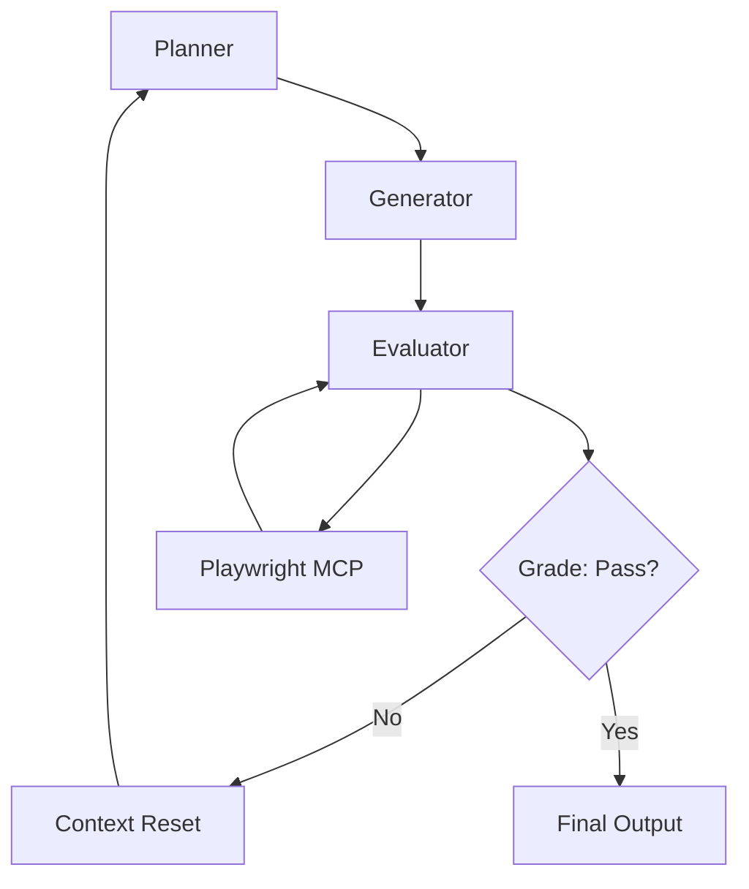
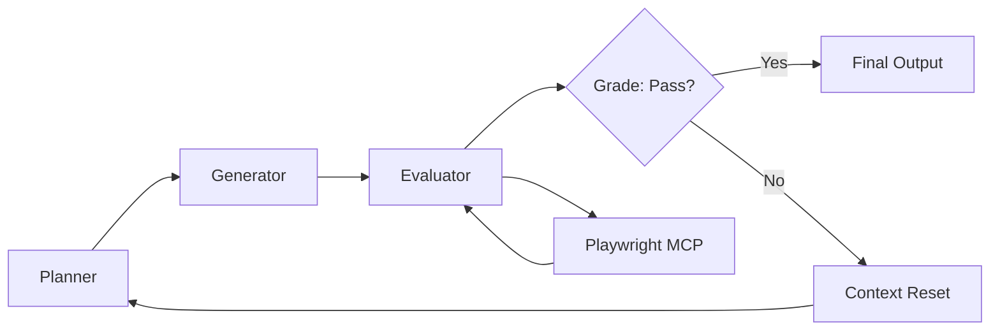

**TL;DR**

- LangChain reported that harness-only tuning lifted a coding agent from Top 30 to Top 5 on Terminal Bench 2.0. The same Claude Opus 4.6 model scores anywhere from 66.9% to 79.8% depending on which harness wraps it [3][4][5].
- Four loop patterns cover the deployment spectrum: Ralph loop for simple autonomy, two-agent harness for structured projects, generator-evaluator for subjective quality, and parallel loops for massive codebases.
- Context management is the bottleneck. LangGraph Delta Channels compress checkpoint storage 41x, and Anthropic context resets beat compaction for models with context anxiety [2][10].

LangChain tuned only the harness around a coding agent (same model, same tools) and moved it from Top 30 to Top 5 on Terminal Bench 2.0 [5]. The same Claude Opus 4.6 model scores anywhere from 66.9% to 79.8% on the same benchmark, depending entirely on which harness wraps it. That's a 12.9-point swing [3]. That gap is larger than what most model version upgrades deliver. Harness engineering is not an implementation detail; it is the primary lever separating toy agents from systems that ship real software.

## What Harness Engineering Actually Is, and Why the Benchmark Gap Should Scare You

LangChain's definition has become the standard: Agent = Model + Harness [4]. The harness is everything that isn't the model: system prompts, tool interfaces (including MCP servers), sandboxes, orchestration logic, and memory systems.

Martin Fowler's framework splits controls into three categories: maintainability harnesses for tests and linters; architecture fitness harnesses for performance and observability; and behavior harnesses combining functional specs with AI-generated test suites [17].

The benchmark data is stark. On CodeSOTA's Terminal-Bench 2 leaderboard, Claude Opus 4.6 scores 79.8% under the ForgeCode harness but drops to 66.9% under Crux. That's a 12.9-point gap, driven entirely by scaffolding differences [3]. The model didn't change. The harness did.

We question how much of the 79.8% figure reflects genuine capability versus harness-model co-optimization. The CodeSOTA leaderboard doesn't disclose harness internals, making it hard to separate scaffolding quality from scaffolding-model fit.

> [!IMPORTANT]
> The co-evaluation trap: models can overfit to the harness used during training. A model fine-tuned on one scaffolding pattern may degrade when dropped into a different harness, even if both are sound. Harness modularity is a test-time concern, not just a deployment convenience [4].

## How the Ralph Loop Delivers Weeks of Autonomy with a Bash One-Liner

The Ralph loop is the simplest pattern that works at production scale: an infinite bash loop piping the same prompt into an agent repeatedly, each iteration in a fresh context with state persisted to the filesystem [6][7].

```bash
# The Ralph loop — simplest viable harness
# Each iteration: fresh context, filesystem memory
while true; do
  cat PROMPT.md | agent
  git add -A && git commit -m "ralph: $(date +%s)"
done
```

Huntley's core insight: 'sit on the loop, not in it' [6]. The human never interacts with the agent mid-execution; they design the prompt, configure backpressure, and let the loop grind. Each iteration reads state from the filesystem — git diffs, test results, logs — then writes new state for the next cycle; the agent never accumulates context.

Backpressure prevents the loop from becoming a destruction vector. Pre-commit hooks block broken code; test suites run on every commit; file-level constraints, such as limiting the agent to specific directories and enforcing maximum diff size, prevent runaway changes [6].

OpenAI used essentially this pattern to build a production product: ~1M lines of code, 1,500 PRs, 3 to 7 engineers, zero manually-written lines [8]. Codex agents ran in a Ralph loop with agent-to-agent review.

## Anthropic's Two-Agent Harness: Why a Separate Initializer Solves the Biggest Failure Mode

Anthropic's harness splits the problem into two agents: an initializer scaffolds the environment once; a coding agent runs repeatedly making incremental progress [1]. This separation solves four failure modes that plague single-agent setups.

The initializer produces a JSON feature-list file, covering 200 features for their claude.ai clone, with every entry tagged "passes": false [1]. This file becomes the persistent progress ledger. On each loop iteration, the coding agent follows a structured startup ritual: confirm working directory; read git logs and progress files; read the feature list; test basic functionality; then pick the highest-priority uncompleted feature [1]. Features flip to "passes": true only after self-verification via Puppeteer MCP browser automation [1].

The harness solves four failure modes. Premature declaration of completion: only the agent flips passes to true after browser-based verification. Undocumented side-effects: automated test suites per iteration block feature completion. Incomplete features marked as tested: the startup ritual reads the feature list before selecting the next task. Wasted time learning to run the app: the initializer handles setup once upfront [1].

The code is open-source in Anthropic's claude-quickstarts repository [16]. The coding loop handles one feature per session with clean artifacts and git-committed state between iterations.


A JSON file with boolean flags is a more reliable memory than any context window. Separate the agent that defines the work from the agent that does it.


## The GAN-Inspired Generator-Evaluator Loop: When Subjective Quality Needs a Separate Judge

Anthropic Labs built a three-agent GAN-inspired architecture: a planner decomposes requirements, a generator implements subtasks, and an evaluator grades output using Playwright MCP to click through the live application like a human user [2]. The evaluator tests UI features, API endpoints, and database states before assigning a grade to each sprint [2].

The key finding (and the one most teams miss): separating the agent doing the work from the agent judging it was stronger than asking a single agent to self-evaluate [2]. Agents are bad at critiquing their own output. The same blind spots that produced the error tend to miss it. A separate evaluator with a different system prompt and access to the live running application catches issues self-review misses.

Context anxiety emerged as a real problem: Sonnet 4.5 wraps up prematurely as the context window fills, declaring features done when they aren't [2]. Context resets, which clear the entire window at structured handoff points, solved this. Opus 4.5 and later largely removed the behavior [2]; typical cycles ran 5 to 15 evaluation rounds per component, with total runtime up to 4 hours for complex frontend work [2].



The pattern produced creative leaps that single-pass generation never achieved. A Dutch art museum website with CSS 3D perspective transforms emerged because the evaluator demanded experiential quality beyond functional completeness [2].

## Multi-Agent Parallel Loops: From C Compilers to 35,000 Incident Responses

Nicholas Carlini pushed the Ralph loop to its extreme: 16 parallel Claude agents, ~2,000 sessions, $20,000 in API costs, producing a 100,000-line Rust C compiler that builds Linux 6.9 for x86, ARM, and RISC-V [13]. The architecture is simple: git-based task locking with each agent picking an unlocked task.

Three lessons emerged. Write extremely high-quality tests: agent-produced code is only as trustworthy as the test suite that validates it. Design harness output for LLM consumption: pre-computed aggregates and concise logs. Use an oracle compiler: GCC served as a reference to parallelize debugging across 16 agents [13].

Meta's REA automates multi-day ML pipeline experiments with hibernate-and-wake checkpointing for interrupted 6-hour tasks [14]. Microsoft's Azure SRE Agent handled 35,000+ production incidents autonomously, reducing time-to-mitigation from 40.5 hours to 3 minutes [15].

## Context Management: Why 100K Tokens Can Drop Accuracy by 50%

Every loop pattern shares one bottleneck: context degradation. Chroma's 2025 study tested 18 frontier models and found systematic performance degrades as input length increases [9]. Long-running agents push context toward this danger zone continuously. The patterns work because they reset the window periodically, but how you manage state between resets determines progress. Get this wrong, and you regress.

LangChain's Delta Channels in LangGraph 1.2 address storage: for a 200-turn coding agent, full-state checkpointing consumed 5.3 GB. Delta Channels store only per-step diffs with periodic full snapshots, reducing footprint to 129 MB; that's a ~41x reduction [10].

On context delivery, OpenAI learned a hard lesson: a monolithic AGENTS.md fails because context is a scarce resource [8]. Their solution: AGENTS.md as a table of contents pointing to discrete files, with agents loading only relevant sections. LangChain adopted progressive disclosure via skills loaded on demand; the agent sees only what the current step needs [4].

> [!WARNING]
> Context resets and structured handoffs are survival mechanisms, not optional optimizations. If your agent's quality degrades after the first few iterations, check whether you're resetting context or just accumulating it; Sonnet 4.5's context anxiety is a real failure mode at production scale [2].

| Technique | What It Does | Best For | Limitation |
| --- | --- | --- | --- |
| Context Reset [2] | Clear entire window at handoff, pass summary | Context anxiety (Sonnet 4.5) | Loses conversational state |
| Compaction [4] | Condense history in-place | Continuous sessions (Opus 4.5+) | Lossy. Details can be compressed away |
| Delta Channels [10] | Per-step diffs with periodic snapshots | Checkpoint-heavy loop systems | Storage-only. Doesn't address context window |
| Structured Docs [8] | AGENTS.md as TOC, load on demand | Large codebases with docs | Needs disciplined doc structure |

## Claude Code /goal, /loop, and /batch: Loop Patterns as Product Commands

Anthropic productized these patterns as autonomous slash commands. /goal and /loop shipped before v2.1.139; /background was introduced in v2.1.139 [11][12]. /goal defines a completion condition and iterates until met, essentially a Ralph loop with a termination condition. /loop provides time-based recurring execution for periodic checks. /batch launches 5 to 30 parallel workers with automatic /simplify review, a productized version of Carlini's 16-agent pattern [12].

The mapping is direct. /goal maps to the Ralph loop; the two-agent harness maps to a planning /goal followed by feature-by-feature execution; /batch maps to parallel worker loops; the generator-evaluator maps to chained /goal commands fed to a separate evaluation agent. These aren't new capabilities; they're hardened, documented implementations of patterns the community has been building for a year.

## How to Choose the Right Loop Pattern for Your Workload

The patterns form a complexity ladder. Start with what your task demands and your infrastructure supports; move up when the simpler pattern breaks.

| Pattern | Task Complexity | Session Duration | Human Oversight | Infrastructure |
| --- | --- | --- | --- | --- |
| Ralph Loop [6][7] | Single-file or single-task | Hours to days | Prompt design only | Bash + agent CLI |
| Two-Agent [1][16] | Multi-feature projects | Days to weeks | Feature list review | Git + JSON progress + browser |
| Generator-Evaluator [2] | Subjective quality, UIs | Hours per component | Review grades periodically | Playwright MCP + live app |
| Parallel Loops [13][14] | Massive codebases | Days to weeks | Architecture and tests upfront | Git locking + oracle + checkpointing |

The practitioners who built these systems agree: start with the Ralph loop [6]. When tasks become interdependent, add the two-agent pattern's JSON progress file. For visual quality work, the generator-evaluator's separate judge becomes essential. Parallel loops make sense only with independent workstreams and an oracle to arbitrate conflicts [13].



## Practical Takeaways

1. Start with a Ralph loop. a bash one-liner is cheaper to debug than a custom orchestrator.
2. Replace context accumulation with context resets. The filesystem and git serve as your persistence layer.
3. Add a JSON progress file with boolean completion flags. It prevents losing track of what's done.
4. Set up backpressure before running unattended: pre-commit hooks, tests, and CI gates.
5. Use Delta Channels for frequent checkpoints. The 41x storage reduction pays for itself [10].

## Conclusion

The same system scores anywhere from 67 to 80 percent depending on scaffolding alone; that gap is larger than what most version upgrades deliver. No committee has standardized agent infrastructure yet; the teams shipping their own today are deciding what the standard becomes. Start simple and add complexity only when it breaks.

## Frequently Asked Questions

### Can we use the Ralph loop for a multi-file project with interdependent changes?

Yes, but structure the prompt carefully. Each iteration should target one atomic change and rely on git for continuity. For tightly coupled features, the two-agent harness with a JSON feature list gives structured progress tracking. See the table in How to Choose the Right Loop Pattern for Your Workload for a side-by-side comparison. The Ralph loop works at OpenAI scale for a roughly 1M line codebase, but they had agent-to-agent review and strong backpressure. Without those, stick to simpler task granularity [8].

### How do we know when to switch from a Ralph loop to a more complex harness?

Three signals. The agent repeats completed work, declares completion without verifying, or you need parallel execution. Each maps to a harness primitive. Don't jump to 16 parallel agents.

### Context resets vs. compaction. When should we use each?

Context resets for models with context anxiety (Sonnet 4.5); compaction for Opus 4.5+ sessions [2]. When in doubt, reset — lost conversational state beats lost details.

### How much does it cost to run long-running agents in loops?

It varies dramatically by scope. Carlini's 16-agent C compiler consumed roughly $20K across approximately 2,000 sessions for a 100,000-line production-grade compiler [13]. Most teams report costs in the hundreds of dollars per project. The primary cost driver is context size per iteration: smaller, focused contexts cost dramatically less. A single agent in a well-designed Ralph loop can run for days on under $100. We don't have clean production cost data outside these few public case studies, so treat these figures as directional.

### Do we need a framework to implement these patterns?

You don't need a framework for the simpler patterns. The Ralph loop is a bash one-liner, and the two-agent harness has reference code in Anthropic's claude-quickstarts repository but is framework-agnostic [6][16]. LangGraph's Delta Channels provide a 41x checkpoint reduction that's hard to replicate without framework support; use a framework when you need production checkpointing, observability, and multi-tenant scheduling [10].

---

## Sources

| # | Publisher | Title | URL | Date | Type |
| --- | --- | --- | --- | --- | --- |
| 1 | Anthropic | "Effective Harnesses for Long-Running Agents" | https://www.anthropic.com/engineering/effective-harnesses-for-long-running-agents | 2026-05-22 | Blog |
| 2 | Anthropic | "Harness Design for Long-Running Application Development" | https://www.anthropic.com/engineering/harness-design-long-running-apps | 2026-05-28 | Blog |
| 3 | CodeSOTA | "Terminal-Bench 2 Leaderboard" | https://www.codesota.com/benchmark/terminal-bench-2 | 2026-06 | Documentation |
| 4 | LangChain | "The Anatomy of an Agent Harness" | https://www.langchain.com/blog/the-anatomy-of-an-agent-harness | 2026-05-09 | Blog |
| 5 | X (Twitter) / LangChain | "LangChain on Terminal Bench 2.0 harness tuning: Top 30 to Top 5" | https://x.com/Vtrivedy10/status/2023805578561060992 | 2026-05 | Blog |
| 6 | LinearB / Geoffrey Huntley | "Ralph Loop, Agentic Engineering and Geoffrey Huntley" | https://linearb.io/blog/ralph-loop-agentic-engineering-geoffrey-huntley | 2026-03 | Blog |
| 7 | Geoffrey Huntley | "Ralph: The Loop That Keeps on Coding" | https://ghuntley.com/ralph/ | 2026-02 | Blog |
| 8 | OpenAI | "Harness Engineering: Leveraging Codex in an Agent-First World" | https://openai.com/index/harness-engineering/ | 2026-02-10 | Blog |
| 9 | Chroma | "Context Rot: Systematic LLM Performance Degradation at Long Inputs" | https://research.trychroma.com/context-rot | 2025-07 | Blog |
| 10 | LangChain | "Delta Channels: How We're Evolving our Runtime for Long-Running Agents" | https://www.langchain.com/blog/delta-channels-evolving-agent-runtime | 2026-05-21 | Blog |
| 11 | Towards AI / Richard Hightower | "Claude Code: The Autonomous Commands That Finish Work While You Sleep (/goal, /loop, /batch, etc.)" | https://medium.com/@richardhightower/claude-code-the-autonomous-commands-that-finish-work-while-you-sleep-goal-loop-batch-etc-7acb82bf46b1 | 2026-05-27 | Blog |
| 12 | Dev.to / Jessy T. | "Claude Code Stops Pausing Every Turn: /goal, /loop, /batch, /background" | https://dev.to/jessyt/claude-code-stops-pausing-every-turn-goal-loop-batch-background-24nb | 2026-05 | Blog |
| 13 | Anthropic | "Building a C Compiler with a Team of Parallel Claudes" | https://www.anthropic.com/engineering/building-c-compiler | 2026-04-15 | Blog |
| 14 | Meta Engineering | "Ranking Engineer Agent (REA): Meta's Autonomous AI System for Ads Ranking" | https://engineering.fb.com/2026/03/17/developer-tools/ranking-engineer-agent-rea-autonomous-ai-system-accelerating-meta-ads-ranking-innovation/ | 2026-03-17 | Blog |
| 15 | Microsoft Tech Community | "How We Build Azure SRE Agent with Agentic Workflows" | https://techcommunity.microsoft.com/blog/appsonazureblog/how-we-build-azure-sre-agent-with-agentic-workflows/4508753 | 2026-03 | Blog |
| 16 | Anthropic (GitHub) | "Claude Quickstarts: Autonomous Coding" | https://github.com/anthropics/claude-quickstarts/tree/main/autonomous-coding | 2026-05 | Documentation |
| 17 | Martin Fowler (ThoughtWorks) | "Harness Engineering for Coding Agent Users" | https://martinfowler.com/articles/harness-engineering.html | 2026-05 | Blog |

## Image Credits

- **Cover photo**: Image generated with flux-pro-1.1 (Agents' Codex AI illustration)
