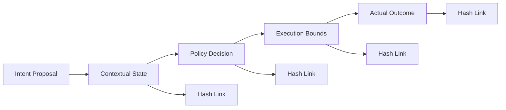
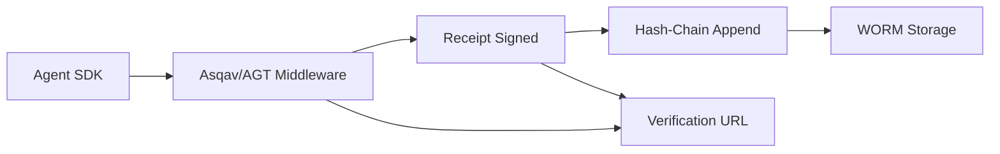

**TL;DR**

- EU AI Act Article 12 enforcement hits August 2, 2026: penalties up to €15 million or 3% of global turnover for high-risk systems without tamper-evident event logs [1].
- A hash-chained receipt with ML-DSA-65 post-quantum signatures makes every agent action independently verifiable, even against an adversarial operator who controls the runtime.
- Three enforcement tiers let you match cryptographic rigor to your actual threat model: Strong (non-bypassable proxy), Bounded (gate + close), and Detectable (post-hoc).

On August 2, 2026, EU AI Act Article 12 becomes enforceable. High-risk AI systems must maintain tamper-evident event logs, or face penalties up to €15 million [1]. A 2026 survey found 68% of organizations cannot distinguish AI agent actions from human actions; 33% lack evidence-quality audit trails [8]. Standard logs are mutable, self-attested, and blind to agent identity. Standard logging is theater for compliance auditors. A hash-chained cryptographic audit trail is not, and it holds up even when the operator is the threat.

## What Article 12 Actually Requires (and What It Doesn't)

Article 12(1) requires high-risk AI systems to "technically allow for the automatic recording of events (logs) over the lifetime of the system" [1]. Article 12(2): logs must identify risk situations, facilitate post-market monitoring, and enable operator monitoring [1].

Article 12(3) mandates minimum fields: period of use, reference database, matching input data, and identification of natural persons in verification [1]. Article 19 sets a 6-month retention floor, extendable to 5+ years for financial services [2], [9].

> [!WARNING]
> The EU Digital Omnibus proposal may extend the deadline to December 2027. As of June 2026, this is under negotiation, not law. Plan for August 2, 2026. Penalties: €15 million or 3% (high-risk) [1] vs €35 million or 7% (prohibited practices) [4].

The common misinterpretation: conflating "keep logs" with "produce tamper-evident records." A JSON log file in CloudWatch can be deleted or edited by anyone with IAM write access. DeepInspect frames the distinction clearly: every decision must produce a signed, tamper-evident audit record committed before the model response returns [2].

| Article 12 Requirement | What Standard Logging Provides | What an Audit Trail Must Do |
| --- | --- | --- |
| Automatic recording | Application-level logging (opt-in) | Middleware-enforced, non-bypassable capture |
| Event traceability | Mutable timestamps, no linkage | Hash-chained sequence with cryptographic proof |
| Tamper evidence | None (log files editable/deletable) | Chain integrity verification detects any modification |
| Personnel identification | Shared service account (ambiguous) | Per-agent cryptographic identity + token attribution |
| Retention (6+ months to 5+ years) | Log rotation deletes data on schedule | WORM storage with compliance-mode immutability |

## The Industry Evidence Gap: 97% Expect an Incident, 3% Are Ready

A 2026 CSA/RSAC survey of 900+ security leaders found 68% cannot distinguish AI agent actions from human actions [8]. Thirty-three percent lack evidence-quality audit trails. Sixty-one percent run fragmented infrastructure that cannot produce forensic evidence.

The incident data is worse. Eighty-eight percent report confirmed or suspected AI agent incidents. Ninety-seven percent expect a major incident within 12 months. Only 3% have automated controls at machine speed [8]. When the incident happens, the team without an audit trail cannot answer which agent did what, under whose authorization, and whether the outcome was within policy bounds.


The compliance deadline gives you a date. The incident statistics give you a reason. Both point to the same architectural requirement: a verifiable chain of evidence connecting every agent action to its authorization context.


## The Hash-Chain Receipt: A Cryptographic Audit Trail for Every Action

The agentpatterns.ai Cryptographic Governance Audit Trail defines a three-phase middleware design [3]. Phase 1: Policy Validation checks allowed tools, rate limits, and data access rules. Phase 2: Tool Execution runs the call unmodified. Phase 3: Receipt Signing signs the action record with ML-DSA-65 and appends it to the hash chain.

```python
# Asqav decorator pattern: three-phase middleware
import asqav

@asqav.sign(policy_id="prod-agent-v2")
async def call_financial_api(payload):
    # Phase 1-2: policy validates, tool executes unchanged
    result = await api_client.execute(payload)
    # Phase 3: receipt is auto-signed and hash-chained
    return result

with asqav.session(agent_id="payment-agent-01"):
    await call_financial_api({"amount": 1500})
    await call_financial_api({"amount": 2300})
```

Each receipt carries: signature_id, agent_id, action, algorithm (ML-DSA-65), timestamp, chain_hash (SHA-256 of previous receipt), and prev_hash [3], [7]. Modify any entry and chain verification fails. Three enforcement tiers exist [3]:

| Enforcement Tier | Mechanism | When to Use | Attack Resistance |
| --- | --- | --- | --- |
| Strong | Non-bypassable MCP proxy signs before and after each call | High-risk agents (finance, healthcare, legal) | Prevents execution without a signed bilateral receipt |
| Bounded | Pre-execution gate (gate_action) + post-execution close (complete_action) | Performance-sensitive workflows, batch processing | Approval is cryptographically linked to outcome; omission detectable |
| Detectable | Post-hoc signing with chain verification | Legacy systems, incremental rollout, low-risk automation | Tampering or omission is detected on verification, not prevented |

A payment agent needs Strong-tier. A notification agent can work with Detectable-tier during rollout. Upgrade tier by tier without changing the schema.

### Why ML-DSA-65 and Not ECDSA?

ML-DSA-65 (FIPS 204) targets AES-192 equivalent security [3], [7]. Audit trails retained 5+ years outlast pre-quantum cryptography. Pragmatic path: ECDSA now (IETF AAT baseline [5]), ML-DSA-65 when retention exceeds 5 years [7].

## Agent Decision Record Schema: What Goes in the Receipt

The mandatory fields form a minimal forensic record: agent identity, policy ID, authorization token identifier (JWT jti claim), action type (IETF AAT classification), input/output hashes (SHA-256), timestamp, and chain linkage [3], [5], [12]. Missing any of these, the auditor cannot reconstruct who did what under what authority.

| Field | Category | Purpose |
| --- | --- | --- |
| signature_id | Mandatory | Unique per-action identifier for verification URL lookup |
| agent_id | Mandatory | Cryptographic identity of the acting agent instance |
| policy_id | Mandatory | Active governance policy version at execution time |
| auth_token_id | Mandatory | JWT/OAuth token jti claim: links to identity assertion |
| action_type | Mandatory | IETF AAT classification: tool_call, tool_response, decision, delegation, escalation, error, lifecycle |
| input_hash | Mandatory | SHA-256 of action input: enables replay verification |
| chain_hash | Mandatory | SHA-256 of previous receipt: the tamper-evident link |
| prompt_fingerprint | Optional | Hash of system prompt, model version, and tool set |
| data_classification | Optional | Sensitivity level of data accessed during execution |
| human_reviewer_id | Optional | Identity of approving human when HITL is active |

The IETF AAT draft defines seven action classifications: tool_call, tool_response, decision, delegation, escalation, error, and lifecycle [5]. Adopting these early ensures interoperability with any tooling implementing the emerging standard.

PII redaction requires upfront design. Three strategies: hashed-with-salt for deduplication, mask-in-place for structural context, and vault-reference for separate access control [12]. GDPR Article 17 right-to-erasure interacts with Article 19 retention minimums — design the redaction layer before your first audit.

## Immutable Storage: S3 Object Lock and WORM Patterns That Survive Root Compromise

A signed hash chain proves tamper-evidence within records. But if an attacker deletes the entire chain, evidence is gone. AWS S3 Object Lock provides WORM (write-once-read-many) storage. Compliance mode prevents any user, including the root account, from overwriting or deleting object versions during the retention period [13].

Cohasset Associates assessed S3 Object Lock for SEC 17a-4, CFTC, and FINRA compliance [13]. Object Lock must be enabled at bucket creation with versioning; once on, it cannot be disabled.

| Storage Tier | Retention Window | Mutability | Query Latency | Purpose |
| --- | --- | --- | --- | --- |
| Hot: INSERT-only DB | 0–30 days | Append-only (role-gated, no UPDATE or DELETE grants) | Sub-second | Real-time agent decision audit, on-call investigation |
| Warm: S3 Standard (versioned) | 30–90 days | Versioned, not locked (overwrite creates new version) | Seconds to minutes | Forensic queries, SIEM ingestion, trend analysis |
| Cold: S3 Object Lock (compliance mode) | 90 days to 7+ years | WORM: no overwrite, no delete, even by root | Minutes to hours | Regulatory retention, external audit, legal hold |

The Digital Applied framework recommends this three-tier pattern: hot for daily engineering queries, warm for security investigations, cold for regulators years later [12]. Run periodic chain verification. A broken chain discovered at audit time is an incident. A broken chain discovered by monitoring is a ticket.

> [!TIP]
> Legal hold is independent of the retention period. Apply legal hold to any object version and WORM protection extends indefinitely; the object cannot be deleted or overwritten until the hold is explicitly removed. When an agent incident triggers litigation, you can lock the relevant audit segment without locking your entire cold tier.

## Identity: Every Agent Instance Gets Its Own Cryptographic Identity

Most production agent deployments use shared service accounts. One IAM role shared across dozens of agent instances. Every audit log entry says "payment-service executed transfer" — not which agent, under which policy, with which token. Vector Labs identifies this as the root cause of unintelligible audit trails [10].

Each agent instance needs its own cryptographic identity in a non-human identity (NHI) framework [10]. Short-lived JWT or OAuth 2.0 tokens — expiry in minutes, not days — bound to specific roles in a central registry. A 5–15 minute token limits blast radius. The token's azp/appid field carries the agent identity into every downstream log.

Enterprise identity platforms support this through workload identity primitives. Microsoft's Agent Governance Toolkit demonstrates the pattern: the agent-governance-python repo assigns per-agent identities tracked through the hash-chain audit log, with the AgentBehaviorMonitor quarantining agents exceeding behavioral thresholds [11].

ABAC enables task-scoped tokens. A read-only agent receives a token lacking write permissions; transitioning to writing requires a new bounded token. Per-agent behavior baselining detects deviations — a payment agent calling a user-deletion API is a compromise. The identity layer enables automatic revocation.

## When the Operator Is the Threat: OpenKedge and Intent-to-Execution Evidence Chains

The hash-chain assumes trusted middleware. But if the operator deploying the runtime is the adversary, a compromised runtime can suppress actions and signatures simultaneously.

OpenKedge (arXiv:2604.08601) addresses this with Intent-to-Execution Evidence Chains (IEEC) [6]. Agents submit Declarative Intent Proposals evaluated against system state, temporal signals, and policy constraints before any API call executes. Approved intents compile into Execution Contracts — bounded, ephemeral identities that expire if boundaries are exceeded.

The IEEC links five elements: intent proposal, contextual state, policy decision, execution bounds, and actual outcome [6]. Unlike passive logs, the IEEC creates a deterministically reconstructable lineage.

Evaluated in multi-agent conflicts and cloud infrastructure mutations, the protocol demonstrates deterministic arbitration of competing intents while caging unsafe execution [6]. Separating intent from execution contract from evidence chain means no single compromised component can forge the complete trail.



## OWASP Agentic Top 10: Audit Trails as Cross-Cutting Control

The OWASP Top 10 for Agentic Applications elevates audit trails to a cross-cutting control. Microsoft's Agent Governance Toolkit (AGT) provides the reference architecture [11].

The AGT middleware produces a hash-chain log where each entry contains the SHA-256 of the previous entry. Its AgentBehaviorMonitor tracks tool call rate, failure rate, and privilege escalation, quarantining agents that exceed thresholds [11].

Audit trails mitigate: ASI02 (Tool Misuse) via parameter recording; ASI03 (Privilege Abuse) via identity-policy linkage; ASI09 (Trust Exploitation) via forensic replay; ASI10 (Rogue Agents) via behavioral baselining and quarantine [11]. OWASP minimum fields map onto the receipt schema described earlier.

An audit trail built solely for compliance is undersold. The same hash chain that satisfies an auditor also powers security automation: drift detection, privilege escalation alerts, and quarantine triggers. Build it once, use it for both objectives.

## Production Patterns: From SDK to Deployment

Integration: 3–5 days for a single-team agent [12]. Cost: ~50ms per-call for ML-DSA-65 in Strong-tier [3]. Under 10 calls per interaction, negligible. High-frequency agents: Detectable tier, batch-sign.

Asqav SDK (MIT license) provides ML-DSA-65 signing with decorator-pattern integration across LangChain, CrewAI, LiteLLM, Haystack, and OpenAI Agents SDK [7]. Each receipt includes a verification URL auditors query directly. The session API groups multi-step workflows into ordered chains [7].

Microsoft AGT uses policy YAML, governance middleware, and hash-chain audit logs [11]. The agent-governance-python repo includes blocked-pattern detection via regex on inbound messages before they reach the LLM.



| Implementation | Approach | Signature Algorithm | Key Strength | License |
| --- | --- | --- | --- | --- |
| Asqav SDK | Decorator-pattern middleware, five framework integrations | ML-DSA-65 (FIPS 204) | Drop-in, verification URLs, EU AI Act alignment | MIT |
| Microsoft AGT | Policy YAML + governance middleware + hash-chain log | SHA-256 chaining | OWASP-aligned reference architecture, quarantine | Open source (GitHub) |
| DeepInspect | External stateless proxy at AI request boundary | Proprietary (tamper-evident record) | Model-agnostic, pre-response commit guarantee | Closed source |
| OpenKedge | Intent-to-Execution Evidence Chain, ephemeral identities | Cryptographic IEEC linkage | Survives adversarial-operator scenario, deterministic arbitration | Research protocol (paper) |

## IETF Standards for Agent Audit Trails: AAT, SCITT, and JSONL

Building to emerging standards means audit trail interoperability without proprietary exporters. Three IETF efforts shape this space.

The Agent Audit Trail (AAT) draft (draft-sharif-agent-audit-trail-00) specifies a JSON-based record format with mandatory fields for agent identity, action classification, outcome tracking, and trust level [5]. Records use tamper-evident SHA-256 hash chaining per RFC 8785, with optional ECDSA signatures.

The IETF SCITT working group defines how statements register with a Transparency Service issuing receipts as cryptographic proof [3]. The agentpatterns.ai architecture explicitly aligns with SCITT for compliance interoperability.

JSONL (one object per line with chain_hash) is the recommended export format. It is human-readable, SIEM-ingestible. Syslog RFC 5424 and CSV also preserve chain integrity.

## Practical Takeaways

1. Start with the hash chain, not the storage tier. SHA-256 chained receipts come first. Add ML-DSA-65 signatures, WORM storage, and OpenKedge-style evidence chains incrementally as your threat model evolves.
2. Audit your agent identity architecture now. Shared service accounts destroy audit trail value. You need per-instance cryptographic identities with short-lived tokens before your logging layer can produce auditable records.
3. Run chain verification continuously. A broken hash chain caught by monitoring is a ticket. Caught by an auditor is an incident.

## Conclusion

The gap between logging and audit trails has a deadline, but the real shift is not regulatory. IETF AAT standardization means audit trail portability between platforms will determine which frameworks survive enterprise procurement. Teams adopting the AAT schema and SHA-256 chaining now keep their records readable when frameworks change. Start with a hash chain and per-agent identity. Watch what happens when SCITT transparency services mature: enterprises will require cryptographic proof of compliance from AI vendors before signing contracts. The audit trail you build for Article 12 becomes a competitive advantage in procurement decisions.

## Frequently Asked Questions

### Do I need post-quantum signatures (ML-DSA-65) immediately, or can I start with ECDSA?

Start with ECDSA. The IETF AAT draft uses it as baseline [5]. Switch to ML-DSA-65 when retention exceeds 5 years. Asqav SDK supports both [7]. Financial services with mandatory 5+ year retention should plan for ML-DSA-65 from the start.

### How do I handle audit trails for agents calling other agents?

Each agent signs its own receipt with prev_hash pointing to the caller's receipt. An auditor follows the chain across agent boundaries.

### What is the performance impact of signing every action?

Approximately 50ms per-call in Strong-tier [3]. For agents making under 10 tool calls per interaction, negligible. For high-frequency agents, drop to Detectable tier. See the enforcement tier table above.

### Can I implement this without Python or LangChain?

Yes. The middleware pattern is language-agnostic: implement as API gateway plugin, sidecar proxy, or policy enforcement point. DeepInspect demonstrates model-agnostic deployments [2]. The IETF AAT is a JSON spec any language can produce. Asqav SDK is Python-only; for other languages, implement the receipt schema and SHA-256 chaining directly.

### How do I convince leadership this is urgent?

Lead with operational data: 88% of organizations report confirmed or suspected AI agent incidents, 97% expect a major incident within 12 months, and only 3% have automated control coverage [8]. Frame it as: we will have an incident; the cost of not being able to explain it dwarfs the implementation effort. One CISO we spoke with put it bluntly: "If my board asks which agent approved a $500K transaction and I cannot answer, I am done." The regulation gives a deadline. The data gives a reason. The scenario you cannot afford is an incident without an evidence trail.

---

## Sources

| # | Publisher | Title | URL | Date | Type |
| --- | --- | --- | --- | --- | --- |
| 1 | EU AI Act (artificialintelligenceact.eu) | "Article 12: Record-Keeping EU Artificial Intelligence Act" | https://artificialintelligenceact.eu/article/12/ | 2024-08-01 | Documentation |
| 2 | DeepInspect | "EU AI Act Article 12: What the Logging Mandate Requires from Your AI Architecture" | https://www.deepinspect.ai/blog/what-eu-ai-act-article-12-logging-requires-from-your-ai-architecture | 2026-05-15 | Blog |
| 3 | agentpatterns.ai | "Cryptographic Governance Audit Trail for AI Agents" | https://agentpatterns.ai/security/cryptographic-governance-audit-trail/ | 2026-04-06 | Blog |
| 4 | Dev.to / Igor Goranapolsky | "Your Compliance Team Will Ask for an AI Agent Audit Trail Before August 2" | https://dev.to/igorganapolsky/your-compliance-team-will-ask-for-an-ai-agent-audit-trail-before-august-2-heres-the-part-most-h2n | 2026-06-01 | Blog |
| 5 | IETF | "Agent Audit Trail: A Standard Logging Format for Autonomous AI Systems (draft-sharif-agent-audit-trail-00)" | https://datatracker.ietf.org/doc/draft-sharif-agent-audit-trail/ | 2026-03-29 | Documentation |
| 6 | arXiv / Jun He et al. | "OpenKedge: Governing Agentic Mutation with Execution-Bound Safety and Evidence Chains" | https://arxiv.org/abs/2604.08601 | 2026-04-07 | Paper |
| 7 | HelpNetSecurity / Asqav | "Asqav: Open-Source SDK for Cryptographic Audit Trails for AI Agents" | https://www.helpnetsecurity.com/2026/04/09/asqav-ai-agent-audit-trail/ | 2026-04-09 | Blog |
| 8 | TierZero.ai | "Your AI Agents Are Changing State. There Is No Audit Trail." | https://www.tierzero.ai/blog/ai-agent-audit-trail/ | 2026-05-01 | Blog |
| 9 | EU AI Act (artificialintelligenceact.eu) | "Article 19: Retention of Logs EU Artificial Intelligence Act" | https://artificialintelligenceact.eu/article/19/ | 2024-08-01 | Documentation |
| 10 | Vector Labs | "AI Agents Need Identity, Permissions, and Audit Trails" | https://vector-labs.ai/insights/ai-agents-need-identity-permissions-and-audit-trails-the-engineering-architecture-most-teams-are-missing | 2026-03-01 | Blog |
| 11 | Microsoft (Agent Governance Toolkit) | "OWASP Agentic Security Initiative Reference Architecture (AGT)" | https://microsoft.github.io/agent-governance-toolkit/compliance/owasp-agentic-top10-architecture/ | 2026-03-01 | Documentation |
| 12 | Digital Applied | "Agent Audit Trail Design: 7 Best Practices for 2026" | https://www.digitalapplied.com/blog/agent-audit-trail-design-7-best-practices-2026 | 2026-05-09 | Blog |
| 13 | AWS Documentation | "Locking Objects with S3 Object Lock" | https://docs.aws.amazon.com/AmazonS3/latest/userguide/object-lock.html | 2026-06-01 | Documentation |

## Image Credits

- **Cover photo**: Image generated with flux-pro-1.1 (Agents' Codex AI illustration)
