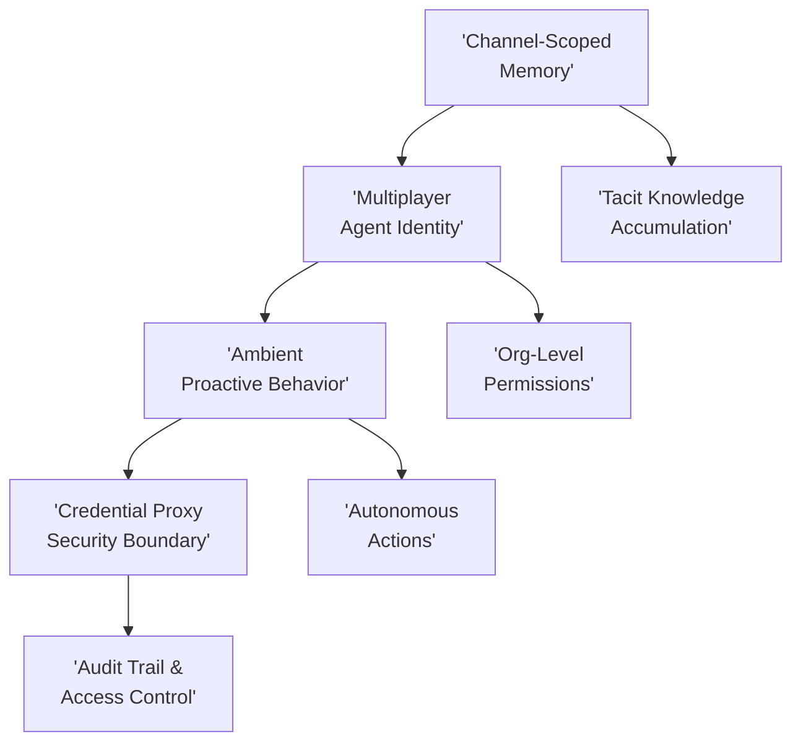

**TL;DR**

- Claude Tag and Glean AI Coworker launched mid-2026 sharing four architectural primitives: channel-scoped memory, multiplayer agent identity, ambient proactive behavior, and credential proxy governance.
- Anthropic now generates 65% of its product code through Claude Tag. Engineers delegate tasks, work on other priorities, and return to PRs ready for review.
- The old Claude in Slack integration retires August 3, 2026: a hard migration from reactive chatbots to autonomous organizational teammates.

65% of Anthropic's product code now comes from an AI teammate embedded in Slack: not a personal coding assistant, not a chatbot you DM, but an autonomous organizational identity that operates across channels with its own permissions, memory, and schedule [1]. Mid-2026 marks the arrival of workspace agents: persistent, multiplayer AI systems that live inside collaboration tools as first-class organizational members. Anthropic's Claude Tag and Glean's AI Coworker are the category-defining implementations. The real innovation isn't better chat; it's an architectural shift from per-user, synchronous, reactive AI to channel-scoped, asynchronous, proactive agents that share state across a team and act under their own credentials.

## The Four Architectural Primitives That Define Workspace Agents

Workspace agents aren't chatbots with a Slack integration. They're built on four architectural primitives that distinguish them from every previous AI-in-collaboration-tools attempt. Understanding these primitives is the difference between evaluating a feature and evaluating a platform decision.

| Primitive | Old Model (Chatbot) | Workspace Agent Model |
| --- | --- | --- |
| Memory | Per-session, lost on disconnect | Channel-scoped persistent store, accumulates tacit knowledge [1][2] |
| Identity | Per-user, acts on behalf of the asker | Shared agent identity with org-level permissions [3] |
| Behavior | Reactive — waits to be tagged or DMed | Ambient — monitors, flags, follows up autonomously [1][2] |
| Credentials | User's own tokens in prompt context | Injected at network boundary, per-channel audit trail [3] |

Each primitive solved a genuine bottleneck. Per-session memory meant every Monday morning started with re-explaining context. Per-user identity meant the AI could only access what the individual asker could see, making it useless for cross-team coordination. Reactive-only behavior meant someone had to notice a problem before the AI could help. Putting user credentials into [model context](/posts/2026-03-04-mcp-model-context-protocol/) was a security risk enterprise compliance teams couldn't accept.

> [!IMPORTANT]
> The agent-in-channel-as-working-surface pattern reduces context-switching by letting teams interact with AI in the same place they discuss work. No tab switching, no separate app, no copy-paste workflows.

## Claude Tag: How Anthropic Deployed a Multiplayer Agent to 65% Code Generation

Claude Tag launched June 23, 2026 in beta for Claude Enterprise and Team plans, but Anthropic didn't wait for general availability [1]. The product team now generates 65% of its code through Claude Tag; engineers delegate tasks, work on other priorities, and return to PRs ready for review [1][6]. This isn't copilot-style inline completion. It's asynchronous task execution where Claude pursues projects over hours or days without constant supervision.

The architectural bet is the agent identity model. Claude acts under its own organizational account, not on behalf of individual users [3]. Each private channel gets a distinct Claude identity with scoped memory and access boundaries; public channels share a workspace-level identity. When you tag @Claude, you're requesting work from a teammate who has its own permissions, its own context, and its own ability to coordinate across the organization.

One caveat worth noting: the 65% figure is self-reported by Anthropic and hasn't been independently verified by a third party. It's a compelling number, but it comes from the same company building and selling the product. Internally, Anthropic uses Claude Tag to monitor A/B tests: tracking target metrics and guardrails, alerting when metrics shift, noting mid-run corrections, and preparing rollout PRs automatically once results cross statistical significance thresholds [6]. The stacked prompts pattern lets Claude wait on days-long blocking dependencies rather than requiring a human to check back. Engineers describe the workflow as 'delegating to many Claudes in parallel' [1].

> [!TIP]
> The migration deadline is hard: Anthropic's old Claude in Slack integration retires August 3, 2026. Teams have a 30-day window, requiring Owner-level Slack permissions and admin configuration [6].

### Channel-Scoped Memory and Tacit Knowledge

Claude Tag creates distinct identities per private channel, with memory that respects channel boundaries [3]. If granted admin permission, Claude can learn from other channels and data sources, building what Anthropic calls 'tacit knowledge' over time without re-explanation [1]. A team member joining a channel weeks into a project finds Claude already aware of the discussion history, decisions, and open items.

## Glean AI Coworker: The Permission-Aware Knowledge Graph Alternative

Glean takes a different approach to the same problem. Instead of accumulating context by overhearing conversations, Glean builds a unified knowledge graph at index time across 100+ connected systems: Salesforce, Jira, Confluence, Google Drive, and more [2]. The AI coworker 'walks into the channel already holding the organization's knowledge' rather than learning it incrementally [2].

The architectural distinction matters for governance. Glean enforces real document permissions at index time. Answers are grounded only in knowledge the organization has explicitly shared, not in what any individual asker can access [2]. If a document is restricted to the legal team, Glean's AI coworker won't surface it to someone in engineering; the asker's identity doesn't override document-level access controls. This eliminates the data-leak risk that haunts per-user-identity models.

Glean's governed actions approach handles writes with equal rigor. The AI coworker can close the loop autonomously: opening pull requests, filing tickets, editing records, and running workflows. Every action runs under enforced permissions with sensitive writes pre-checked and a full audit trail behind them [2]. The query 'How's the ACME renewal tracking?' pulls from Salesforce opportunities, meeting call notes, Google Drive deal rooms, and Jira blockers in a single answer [2].



## How Agent Identity Changes Enterprise Security Architecture

The shift from per-user ACLs to agent identity is the most consequential security change in workspace AI. The question becomes 'what can this agent do in this compartment?' rather than 'what can this user do?' [3]. Each channel gets a distinct agent identity; credentials are stored independently, mapped to that identity, and injected at the network boundary at request time, never in model context [3].

Outbound traffic to any host not explicitly allowed by admins is blocked outright [3]. Every routine, memory write, and network call made with agent credentials is recorded. The audit model spans both the agent's own trail and the connected system's logs: when Claude Tag creates a Jira ticket, the action appears in both Claude's activity log and Jira's audit history, attributed to the agent identity rather than any individual user [3].

Anthropic has also implemented role-based access control for who can invoke Claude, with channel-level and org-level token spend controls for cost predictability [6]. DM mode preserves personal identity for sensitive individual work; channel mode uses shared identity for team collaboration [3]. Tool scoping follows a broad-to-narrow pattern: teams start with broad cross-system access, then pare back based on admin preference and observed usage [6].


Agent identity decouples the AI's access from any individual's access. This means the AI can have broader visibility than any single team member while simultaneously being more auditable, because its actions are attributed to a service account rather than buried in a person's activity stream.


## Ambient Behavior: When AI Teammates Stop Waiting to Be Asked

The reactive model is the chatbot pattern ported to Slack: user tags the agent, agent responds synchronously. The ambient model is a different category entirely. With ambient behavior enabled, Claude Tag proactively monitors channels, flags relevant information, follows up on stalled threads, and surfaces issues without being explicitly tagged [1]. Glean's AI coworker 'doesn't wait to be asked; it knows when to chime in' and can 'speak up on its own' to flag blockers before anyone asks [2].

This creates a trade-off every team deploying workspace agents will face. More ambient behavior means more value: the agent catches things humans miss, especially across time zones and parallel workstreams. But it also means more autonomous decisions and more unsolicited messages. Anthropic's internal A/B test monitoring is instructive here, though worth noting the claim comes from a single source (BuildFastWithAI) [6]. Claude watches metrics, alerts on guardrail movement, and prepares PRs autonomously, but humans still make the final rollout decision [6].

Andrej Karpathy characterized this as 'the third redesign of how we work with language models': first a website, then an app, now 'a self-contained, persistent, asynchronous entity with org-wide tools and context' [2]. A critical observation: ambient agents don't just respond faster. They operate on a different timescale, pursuing work over hours and days while humans focus elsewhere.

## How the Competitive Field Breaks Down in Mid-2026

Claude Tag and Glean AI Coworker aren't the only players, but they're the only ones implementing the full set of workspace agent primitives. Understanding what the alternatives don't do clarifies what 'workspace agent' actually means.

| Solution | Memory Model | Identity Model | Proactive? | Best For |
| --- | --- | --- | --- | --- |
| Claude Tag | Channel-scoped persistent [1] | Agent identity (own account) [3] | Yes (ambient mode) [1] | Engineering teams, async workflows |
| Glean AI Coworker | Knowledge graph at index time [2] | Org-level, permission-aware [2] | Yes [2] | Cross-system knowledge, governed actions |
| ChatGPT for Slack | Per-thread, no team memory [4] | Per-user | No (reactive only) | In-thread drafting |
| Junior AI | Persistent team memory [4] | Per-user, approval-gated [4] | Partial (scheduled tasks) | 3000+ tool integrations, approval workflows |
| Zapier | None (stateless) | Per-user connection | No (deterministic triggers) | Deterministic if-this-then-that automation |

ChatGPT for Slack remains in-thread drafting with no team memory or autonomy [4]. Zapier offers deterministic automation with no AI judgment layer. Junior AI takes an interesting middle path: pitched as an 'AI employee' with access to 3,000+ tools through approval-gated actions, but still operating under a per-user identity model [4].

## What Engineering Leaders Need to Decide Before Deploying Workspace Agents

Deploying a workspace agent isn't like adding a Slack integration. It's closer to onboarding a team member who has read everything your company has ever written and can act autonomously 24/7. The decisions you make at deployment shape what the agent becomes.

| Decision | Option A | Option B | Guidance |
| --- | --- | --- | --- |
| Memory scope | Channel-only (tight isolation) | Cross-channel learning (broader context) | Start channel-only; expand when trust is established [3] |
| Behavior mode | Reactive (tag to invoke) | Ambient (autonomous monitoring) | Begin reactive in high-stakes channels; enable ambient for monitoring/ops [1][6] |
| Tool access | Narrow (pre-approved tools only) | Broad (cross-system, pare back later) | Start broad on read actions; pre-approve all write paths [6] |
| Identity mode | DM (personal agent) | Channel (shared teammate) | Use DM for sensitive individual work; channel mode for team collaboration [3] |
| Spend controls | Org-level cap only | Per-channel granular caps | Per-channel controls enable team-level experimentation without org-wide cost risk [6] |

Claude Tag's deployment requires Owner-level Slack permissions for initial setup, and Anthropic provides a 30-day migration window [6]. The model running under the hood is Opus 4.8. [Claude Code](/posts/2026-03-20-garry-tan-gstack-agent-teams-claude-code/), Anthropic's separate coding product, is already generating $2.5 billion in annualized revenue. The agent platform is their strategic bet, not an experiment [6].

Most teams underestimate how much organizational process design goes into ambient agent deployment. The technical setup takes hours. Deciding which channels get ambient mode and what autonomy boundaries to set takes weeks. Treat this as a change management project, not a software install.

### The Road Ahead: Just-in-Time Credentials and Beyond

Anthropic's roadmap points toward just-in-time credential grants: Claude requests user approval for single sensitive actions rather than holding broad standing permissions [3]. This could unlock enterprise adoption in regulated industries where standing agent credentials are a non-starter. Identity-aware overlays for complex clearance structures are also in development, along with expansion beyond Slack to other collaboration surfaces [3][5]. The convergence path points toward workspace agents becoming the orchestration layer for [enterprise AI](/posts/2026-03-09-mast-taxonomy-enterprise-agent-failures/): the primary interface through which teams coordinate with AI systems across their entire toolchain.

## Practical Takeaways

1. Evaluate workspace agents against the four primitives: memory architecture, identity model, behavior mode, and credential handling. If a vendor can't explain all four, they're selling a chatbot, not a workspace agent.
2. Start with channel-scoped memory and reactive mode. Expand to cross-channel learning and ambient behavior only after your team has established trust with the agent's judgment in daily use.
3. Treat agent identity as a new access control surface. Each channel-identity pair needs the same RBAC review you'd give a new service account, because that's what it is.
4. Use Glean's permission-at-index-time model as a reference when evaluating data governance. If your agent answers based on 'what the asker can see,' it will leak information at scale.
5. Budget 2–3 weeks for organizational design (which channels, what autonomy boundaries, how to communicate changes) before your technical deployment date.

## Conclusion

Most products launching in the next 12 months will be chatbots with better marketing. The real shift happens when every team has an autonomous system that reads Slack, writes PRs, and schedules its own work around the clock. Pick one channel, deploy next week, run the experiment for 30 days. The teams that treat this as an organizational design choice rather than a feature adoption will be the ones that get real value from it.

## Frequently Asked Questions

### What's the difference between a Slack chatbot and a workspace agent?

A Slack chatbot responds when tagged, forgets everything between sessions, and acts on behalf of whoever invoked it. A workspace agent has persistent channel-scoped memory, its own organizational identity with independent permissions, can proactively monitor and act without being tagged, and authenticates through a credential proxy rather than by using your tokens. If it disappears when you close the tab, it's a chatbot. If it files a PR while you're asleep, it's a workspace agent.

### Do I need to choose between Claude Tag and Glean AI Coworker?

No. They solve different problems; see the competitive comparison table above for the breakdown.

### What security risks should I watch for with ambient agents?

Information leakage across permission boundaries is the primary concern. Claude Tag mitigates this through channel-scoped identities where private channel memory stays private [3]. Glean prevents it through index-time permission enforcement [2]. For autonomous actions, enforce pre-approved write paths, use spend controls, and audit every action in both the agent's logs and the target system's logs. The credential proxy pattern means you can revoke the agent's access in one place rather than hunting through individual user accounts.

### Is the August 3, 2026 Claude in Slack migration deadline firm?

Yes, Anthropic has confirmed the retirement date [6]. The migration requires Slack Owner-level permissions for initial setup and admin configuration. If you're on Claude Enterprise or Team plans, start the migration now rather than waiting for the deadline. The old integration was a per-user chatbot; Claude Tag is a different deployment model, and the configuration decisions take time to get right.

### How should I measure whether a workspace agent deployment is working?

We don't have cross-organization benchmark data yet; this category is weeks old, and Anthropic's internal metric is concrete: 65% of product code generated through Claude Tag [1][6]. For your deployment, track three dimensions: task throughput (are things getting done without human bottlenecking?), context retention (does the agent remember decisions and context across days?), and trust velocity (how long until the team starts delegating without double-checking?). The last one is the hardest to measure and the most important.

---

## Sources

| # | Publisher | Title | URL | Date | Type |
| --- | --- | --- | --- | --- | --- |
| 1 | Anthropic | "Introducing Claude Tag" | https://www.anthropic.com/news/introducing-claude-tag | 2026-06-23 | Blog |
| 2 | Glean | "Your AI coworker in Slack with context across every system" | https://www.glean.com/blog/glean-in-slack-coworker | 2026-07-04 | Blog |
| 3 | Anthropic | "Agent identity in Claude Tag: a new access model for autonomous, team-wide AI" | https://claude.com/blog/agent-identity-access-model | 2026-06-24 | Blog |
| 4 | Junior (Junior.so) | "Best AI agents for Slack in 2026" | https://junior.so/blog/best-ai-agents-for-slack-in-2026 | 2026-06-26 | Blog |
| 5 | Latent Space | "Claude Tag: Multiplayer, Proactive, Persistent Agents in Slack" | https://latent.space/p/ainews-claude-tag-multiplayer-proactive | 2026-06-24 | Blog |
| 6 | BuildFastWithAI | "Claude Tag Review: Anthropic's AI Teammate Inside Slack" | https://www.buildfastwithai.com/blogs/anthropic-claude-tag-slack-review | 2026-06-24 | Blog |

## Image Credits

- **Cover photo**: Image generated with flux-pro-1.1 (Agents' Codex AI illustration)
- **Figure 1**: Image generated with flux-pro-1.1 (Agents' Codex AI illustration)
