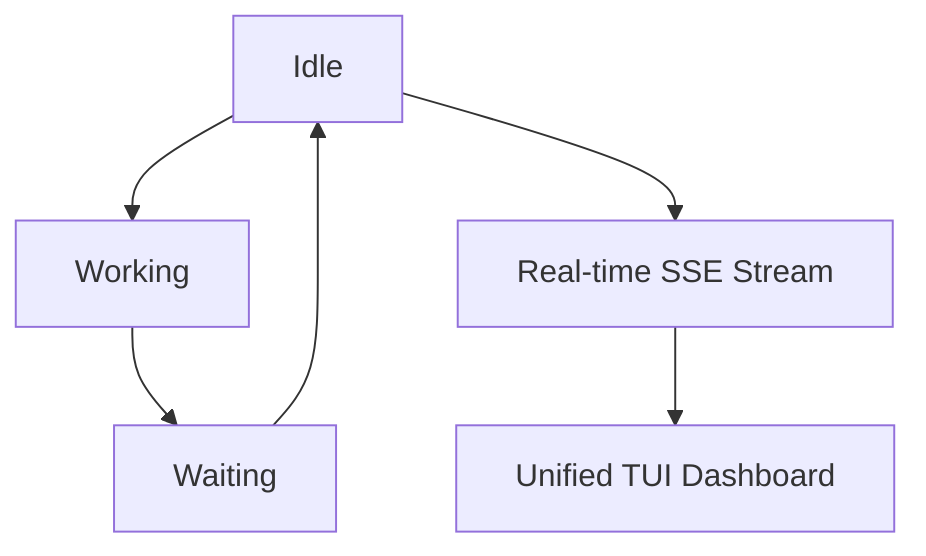
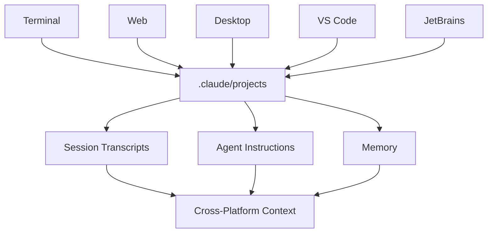

**TL;DR**

- Multi-agent workspaces require unified state tracking across heterogeneous tools — ccmux demonstrates this by merging three detection signals into one session state machine.
- Cursor's side chats, conversation search, and Team MCP distribution reveal a shift where agent interactions become persistent artifacts, not ephemeral chats.
- The agent workspace demands new infrastructure: cross-platform context persistence, hook-based agent detection, and UI primitives built for parallel [agent orchestration](/posts/2026-04-15-agent-workflow-orchestration-n8n-vs-camunda/).

Most developers now run at least one AI agent IDE tool: Claude Code in a terminal pane, Copilot in VS Code, or Cursor's [agent mode](/posts/2026-05-15-github-copilot-agent-mode-production/). In our experience, development teams running three or more agents lose measurable time each day to manual pane polling—checking which terminal pane holds the agent that needs attention. Agent-native workspaces are not an incremental IDE improvement. They are a category shift: the development environment becomes a coordination surface, not a code editor. Then they open a second agent. Then a third handles background tasks. At this point, the IDE stops being an editor with a plugin and becomes an orchestration problem. The gap between one agent and five requires new abstractions: state tracking, context sharing, and agent-to-agent handoffs. We examined three implementations at the frontier.

## Why Your AI Agent IDE Breaks at Multi-Agent Scale

A single coding agent is straightforward. You open a terminal or a chat panel, write a prompt, and wait for output. The agent lives in its own pane; you interact with it in a linear thread. This model works for one agent. It falls apart the moment you have three.

The friction is immediate and concrete: which agent is currently working, and which one is blocked waiting for your approval? Is the Claude Code instance in pane 3 still processing, or did it silently crash? Did Cursor's agent finish the refactor and start waiting for review five minutes ago while you were focused on another terminal? These are not theoretical questions. They are the daily reality of developers running multiple [coding agents](/posts/2026-07-10-persistent-state-attacks-coding-agents/) simultaneously. Without workspace-level awareness, the developer becomes a manual context-switcher, polling each pane to reconstruct agent state from memory.

The tools that exist to solve this: ccmux, Cursor's agent window, Claude Code's session management. They share a common architectural insight: the workspace must track agent state as a first-class primitive, not as an afterthought bolted onto a text editor. This is a category shift, not a feature update.

> [!IMPORTANT]
> The agent-native workspace treats agent states (idle, working, waiting) as first-class UI primitives. Traditional IDEs treat every open file and terminal the same way. Agent workspaces need differentiated states because a pane running an AI agent behaves differently from a pane running a build watcher.

### From One Agent to Seven: The State Explosion

ccmux, an open-source terminal-native multi-agent workspace manager, supports simultaneous tracking of Claude Code, Codex, Cursor, OpenCode, Pi, Antigravity, and Gemini CLI, plus custom agent definitions [1]. That is seven distinct coding agents running in parallel tmux panes, including OpenAI Codex [4], each with its own session lifecycle, permission model, and output format. The tool's architecture reveals why the one-agent-per-IDE model cannot scale: without a unified state machine, the developer is the only component that knows which agent is doing what.

The consequence is lost productivity through context-switching overhead. When you manually poll five terminal panes to find which agent needs attention, you are performing a task that software should handle. ccmux's daemon streams agent state changes over SSE on port 2269, making this information reactive rather than poll-based [1].

## How Multi-Agent State Machines Replace Manual Context-Switching

The core abstraction that makes multi-agent workspaces tractable is a unified state machine that classifies every agent into one of three canonical states: idle, working, or waiting [1]. This classification replaces the developer's mental model of "pane 3 looks like it might be done" with a queryable, real-time view across all running agents.

| State | Meaning | Detection Method |
| --- | --- | --- |
| idle | Waiting for user input | idle_prompt JSON entry, terminal pattern matching |
| working | Processing — thinking, running tools, spawning subagents | Tool execution markers, process state |
| waiting | Needs attention — permission request, plan approval, question | permission_prompt JSON entry, hook notification |

The state machine must handle edge cases that simpler models miss. Agents can change state mid-response when a tool call completes and the next begins; subagents can outlive their parent sessions, leaving orphaned marker files. Crashed sessions need detection even when the agent produces no clean shutdown signal. ccmux addresses these by tracking pending tool IDs for parallel tool calls and checking process liveness independently of log output [1].

This state machine is not academic. The ccmux TUI renders live session state as colored indicators; the developer can see at a glance that agent 1 is idle, agent 2 is working, and agent 3 is waiting for permission approval. Pressing Tab jumps directly to the agent that needs attention [1]. This is the pattern that agent-native IDEs must replicate: state visibility plus one-keystroke navigation.



## How Three-Signal Detection Eliminates Manual Agent Polling

If you build a multi-agent workspace, you face an integration problem: not all coding agents expose their state the same way. Some write structured JSONL transcripts. Others only produce terminal output. Some expose hooks. Others don't. A workspace that can only track agents that follow a specific protocol is not a workspace; it is a walled garden.

ccmux solves this with a three-signal detection strategy [1]. First: JSONL log parsing for agents that produce structured transcripts (Claude Code and Codex write JSONL entries with idle_prompt, permission_prompt, and tool execution markers). Second: terminal pattern matching for agents without structured logs. Third: filesystem watching on PID marker files from hook adapters, providing authoritative session-to-pane binding.

A background daemon merges these signals into a unified state stream. Agents run as standard processes in tmux panes; hook adapters write marker files when sessions start, end, or request permissions [1]. The daemon monitors all three signals, maintains the state machine, and exposes results over a local HTTP API with SSE streaming. The TUI and CLI consume this API, making agent state queryable across all seven supported agents.

```text
Agent Layer:  tmux panes → hook adapters → PID marker files
Daemon Layer:  JSONL parser + terminal matcher + filesystem watcher → state machine
Client Layer:  TUI + CLI → HTTP/SSE on port 2269 → real-time state visualization
```


Reliable multi-agent workspace management requires merging multiple detection signals. No single protocol (JSONL, terminal patterns, or hooks) alone covers all the coding agents developers actually use.




## The UI Primitives That Cut Multi-Agent Context-Switching Time

Cursor's changelog from July 2026 reveals a systematic effort to build UI primitives for multi-agent workflows [3]. The features are not scattered additions; they form a coherent design language for agent-native interfaces. Side Chats allow parallel agent conversations via /side or /btw commands, inheriting context from the main chat without interrupting it. This means a developer can ask one agent to refactor a function while another reviews the test suite, both understanding the same codebase context.

Conversation search treats agent interactions as persistent, searchable artifacts [3]. Local indexing of thousands of agent transcripts with Cmd+K palette integration makes every past agent conversation retrievable. This is a departure from how most developers treat AI chat: an ephemeral thread you close and forget. When agent conversations become durable workspace objects, they function as a secondary codebase memory; you can search for "why did we choose that SQLAlchemy pattern?" and find the conversation where an agent proposed it three weeks ago.

Cursor's Agent Window serves as a command center for agent orchestration, while Remote Control lets developers take local agent sessions mobile with continuous operation [3]. Cloud Agents run in isolated VMs with Live Activities and push notifications, creating a hybrid local/cloud execution model. These UI primitives share a common design principle: the agent is not a chat widget bolted onto the IDE; it is a persistent entity with state, history, and parallel execution capability that the interface must reflect.

> [!TIP]
> Treat agent conversation transcripts as searchable artifacts. A conversation where an agent explained a design decision three weeks ago is often more useful than a code comment. It captures the reasoning chain that led to the decision, not just the outcome.

## How AI Agent IDE Workspaces Handle Cross-Platform Context Persistence

Claude Code runs across five deployment platforms: terminal, web, desktop, VS Code, and JetBrains [2]. This forces a hard question: where does its context live? The answer is a unified persistence layer through the .claude directory: a single source of truth for session transcripts, agent instructions, and memory that transcends any individual interface.

This is the problem every multi-agent workspace inherits. Agents launched from different platforms (web, CLI, IDE) need shared workspace state, memory, and conversation history. Claude Code addresses this through /projects for session transcripts (default ~/.claude/projects) and configuration merging for multiple Claude config directories [2]. The 200,000-token context window with prompt caching makes this persistence practically usable rather than just architecturally sound; large context windows mean agents can carry substantial conversation history across sessions without losing coherence.

The plugin system and Agent SDK suggest extensibility for multi-agent coordination. External tools can participate in agent context, and agents can discover capabilities across skill registries [2]. A workspace that supports this must persist not just agent conversations but the relationships between agents: which agent spawned which subagent, what context was shared, and what outcome resulted.



### The Enterprise Angle: Team-Wide Agent Governance

When multi-agent workspaces scale from individual developers to teams, new requirements emerge. Cursor's Team MCP distribution, introduced June 30, 2026, lets administrators configure MCP servers once and distribute them across cloud agents, the agents window, IDE, and CLI [5]. The feature supports organization groups and SCIM directory groups; agent provisioning becomes identity-aware.

This signals that enterprise multi-agent deployment requires centralized governance of which agents can access which tools and how agent activity is auditable across the organization [5]. For teams evaluating agent-native IDEs, the governance layer determines whether the tool is a productivity aid or a compliance liability.

## Terminal vs. IDE-Native: Two Approaches, One Architectural Consensus

ccmux and Cursor represent two opposing philosophies for the agent workspace: terminal-first versus IDE-native. ccmux builds on tmux, the developer's existing terminal multiplexer, adding a state-tracking layer without replacing the terminal environment [1]. Cursor builds agent capabilities into a purpose-built IDE with dedicated UI surfaces for agent management [3]. Yet beneath these different surfaces, the architectural consensus is striking.

Both approaches converge on the same requirements: real-time agent state visibility, parallel agent execution with independent context, persistent session history, and tool integration that works across agents. The difference is in trade-offs. ccmux's terminal-native approach allows scripting and automation. Agents can be invoked, monitored, and orchestrated through shell commands, making it composable for CI/CD pipelines and automated workflows. Cursor's IDE-native approach enables richer visualization; the agent window, conversation search, and context-at-mention features benefit from graphical UI surfaces that terminals cannot match.

| Dimension | Terminal-Native (ccmux) | IDE-Native (Cursor) |
| --- | --- | --- |
| Agent support | 7+ agents, custom definitions [1] | Built-in agent mode, cloud agents [3] |
| State visibility | TUI with live SSE indicators [1] | Agent window, side chats [3] |
| Automation | CLI + shell scripting, ccmux invoke [1] | Limited — UI-driven workflows |
| Team governance | Open-source, no built-in controls | Team MCPs, org groups, SCIM [5] |
| Session persistence | tmux session management | Conversation search, cloud continuity |

The terminal-native approach has one structural advantage that IDEs rarely match: custom agent definitions. ccmux supports process matching, terminal rules, and session patterns for agents not in its built-in registry [1]. A team using a custom agent or an experimental tool can integrate it into the workspace without waiting for vendor support. For organizations with heterogeneous toolchains, this extensibility is not a nice-to-have; it is the difference between a workspace that adapts to your tools and one that forces you to standardize on a vendor's approved list.

## Practical Takeaways

1. Audit your current multi-agent workflow: count how many agents you run simultaneously and measure how often you manually poll panes for state. We have found that if the answer is more than two, you have an orchestration gap worth closing.
2. Adopt a state-tracking layer before your agent count grows further. ccmux provides this for terminal users; Cursor's agent window provides it for IDE users. Either approach beats manual context-switching.
3. Treat agent conversation transcripts as searchable artifacts, not ephemeral chats. When agent discussions become part of your project's institutional memory, design decisions gain a retrievable reasoning trail; that trail matters more than the code comments you never wrote.
4. Evaluate the governance gap before deploying agent workspaces at team scale. Centralized MCP distribution and identity-aware agent provisioning matter more than feature count once multiple developers share [agent infrastructure](/posts/2026-06-05-agent-gateway-centralized-routing-cost-control/).

## Conclusion

Teams building on these patterns now are laying the foundation for workflows where multiple [AI agents](/posts/2026-06-26-cryptographic-audit-trails-verifiable-action-logs-ai-agents/) run in parallel as a matter of course. Start with one question: can you answer "which agent is waiting for me right now?" without polling terminal panes?

## Frequently Asked Questions

### Do I need a dedicated multi-agent workspace tool, or can I just run multiple terminals?

Yes, if you run only one or two agents. Beyond three, the cognitive overhead of manually polling panes exceeds the setup cost of a state-tracking layer like ccmux.

### What's the difference between ccmux and Cursor's multi-agent features?

ccmux is terminal-native. It layers on top of tmux and works with any agent that runs in a terminal. Cursor is IDE-native; multi-agent features are built into the editor itself. The choice depends on your workflow: if you live in the terminal and value composability (scripting, CI integration), ccmux fits. If you prefer a graphical IDE and value richer UI for agent state, Cursor is the natural choice. The comparison table in the Terminal vs. IDE-Native section breaks this down across five dimensions.

### Can I add custom agents that aren't in ccmux's built-in support list?

Yes. ccmux supports custom agent definitions through process matching, terminal rules, and session patterns. You can define how your agent exposes state even if it is not one of the seven pre-supported tools. This is one of ccmux's structural advantages over IDE-native approaches that typically support a fixed agent roster.

### How does agent context persistence work across different platforms?

Claude Code demonstrates the pattern: a shared persistence directory (~/.claude/projects by default) stores session transcripts. Configuration merging supports multiple config directories, and the same context store is read regardless of whether you launch from a terminal, VS Code, or the web. The broader multi-agent workspace problem is unsolved; there is not yet a universal persistence layer that works across agents from different vendors. Until one emerges, each agent platform maintains its own context silo, and the developer bridges the gap manually.

### Is multi-agent workspace infrastructure ready for enterprise deployment?

Partially. Cursor's Team MCP distribution with organization groups and SCIM directory support shows enterprise governance patterns exist in IDE-native tools. ccmux, as an open-source project, lacks built-in enterprise controls but provides the state-tracking foundation on which governance could be layered. The gap is not technology. The architectures exist. The gap is standardization: no common protocol exists for how agents report state, share context, or authenticate across tools from different vendors.

---

## Sources

| # | Publisher | Title | URL | Date | Type |
| --- | --- | --- | --- | --- | --- |
| 1 | epilande (GitHub) | "ccmux repository" | https://github.com/epilande/ccmux | 2026-07-16 | Documentation |
| 2 | Anthropic | "Claude Code Overview" | https://docs.anthropic.com/en/docs/claude-code/overview | 2026 | Documentation |
| 3 | Anysphere | "Cursor Changelog 3.11" | https://cursor.com/changelog | 2026-07-10 | Blog |
| 4 | OpenAI (GitHub) | "OpenAI Codex Repository" | https://github.com/openai/codex | 2026 | Documentation |
| 5 | Anysphere | "Cursor Team Marketplace Updates" | https://cursor.com/changelog/team-marketplace-updates | 2026-06-30 | Blog |

## Image Credits

- **Cover photo**: Image generated with gemini-3-pro-image (Agents' Codex AI illustration)
- **Figure 1**: Image generated with gpt-5.4-image-2 (Agents' Codex AI illustration)
