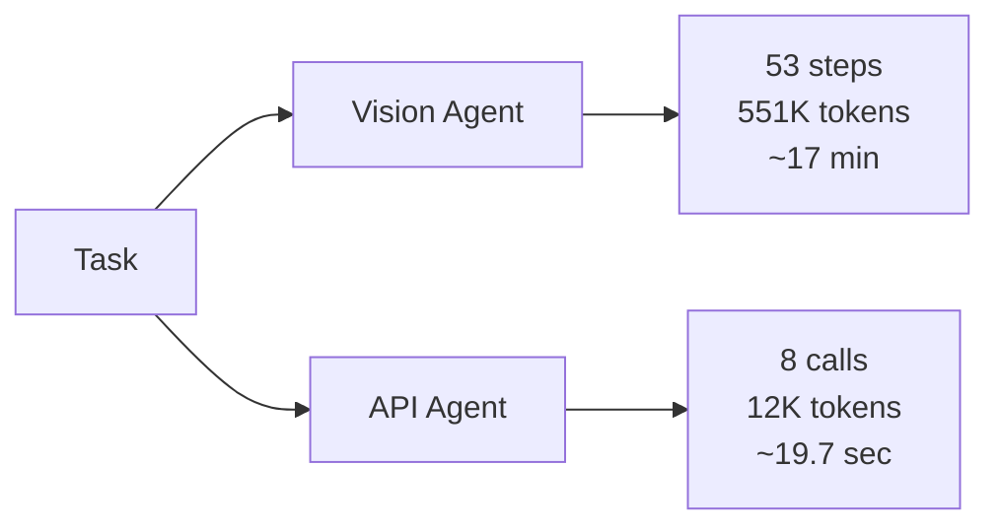
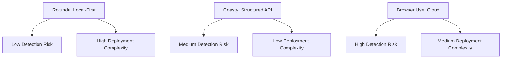

**TL;DR**

- Vision agents need 53 steps and 551K tokens for tasks an API agent completes in 8 calls using 12K tokens, a 46× cost multiplier that makes pure screenshot-based automation unsustainable at scale [1].
- Rotunda patches Firefox 150 to run Juggler (not CDP) in an isolated JS context, replacing deterministic input with an autoregressive RNN that simulates human typing, typos and curved mouse paths included [2].
- Coasty's unlimited $99/month computer-use plan and Browser Use's 106K GitHub stars confirm the market is consolidating around agent-native infrastructure, not better vision models [4] [7].

A vision agent that navigates a browser by looking at screenshots burns roughly 551,000 tokens per task. A structured API call completes the same work in 12,000 tokens [1]. That 46× gap is not a rounding error; it is a verdict. Forcing [AI agents](/posts/2026-07-17-ai-agent-ides-multi-agent-workspace-rebuild/) to navigate web pages designed for human eyes is the costliest architectural mistake in [browser automation](/posts/2026-03-13-browser-automation-agents-openai-cua-gui-ai/) right now. The fix is not a better vision model; it is giving agents the interface they actually need: an agent-native browser with structured access, honest hardware fingerprints, and human-like input simulation. Rotunda, a Firefox fork released in May 2026, is the clearest signal yet that this inversion is underway.

## What Changed in 2026 That Made Agent-Native Browsers Inevitable

Three things converged. First, LLM inference costs dropped far enough that running an agent on your laptop became viable; Rotunda ships as a local CLI, not a cloud service [2]. Second, anti-bot detection evolved past simple fingerprint checks: Cloudflare and hCaptcha now run statistical models that flag unnatural input timing, deterministic mouse trajectories, and CDP-leaked browser flags [3]. Third, the open-source community's appetite for [agent infrastructure](/posts/2026-06-05-agent-gateway-centralized-routing-cost-control/) exploded. Browser Use crossed 106,480 GitHub stars [7], proving that practitioners want programmable browsers, not just wrappers around Selenium.

The old model of spinning up a headless Chromium instance, driving it via CDP, scraping screenshots, and feeding them to a vision model was always a stopgap. It treated the browser as a black box — in 2026, that approach stopped being cheap enough to ignore its flaws.

> [!IMPORTANT]
> Rotunda's author explicitly rejects the stealth-browser approach of adding noise to canvas and audio pipelines. Instead, Rotunda inherits the host's real GPU and IP reputation while only permuting high-entropy controllable attributes like browser extensions, font subsets, and screen size [2]. This is not spoofing; it is selective fibbing.

## How Rotunda Simulates a Real Human Behind the Keyboard

Rotunda's signature feature is an autoregressive RNN trained on days of the author's own keyboard and mouse data [2]. Keystrokes and mouse deltas share a single quantized token stream. At inference, the model generates realistic (Δx, Δy, Δt) mouse hops with overshoots, curved trajectories, and micro-corrections. It also produces (key, Δt) typing sequences, including typos, backspaces, and natural pause variance. A structured decoding layer guaranteeing the final field value is correct regardless of how many intermediate corrections the RNN inserts.

Why does this matter? Anti-bot classifiers train on the difference between deterministic programmatic input and human motor noise. A Selenium script types each character at exactly 12ms intervals. A human types "the" in one burst, hesitates before the next word, and fat-fingers a key every few dozen strokes. Rotunda's RNN reproduces that variance. It does not claim to be human; it claims to be biologically plausible, which is a bar statistical detectors struggle to clear consistently.

```bash
uvx rotunda agent --task "search for flights to Tokyo" --profile personal
```

The CLI interface is deliberate. The author argues that bash is more composable and more familiar to LLMs than MCP's walled-garden JSON schemas. MCP tool descriptions bloat context windows with redundant definitions [2]. A single-line invocation carries less overhead.


Rotunda is the first open-source browser to replace deterministic programmatic input with biologically plausible human-like interaction. It does not spoof a fingerprint; it produces one that looks real because the underlying generation process is stochastic.


## Why Firefox and Juggler Instead of Chromium and CDP

Most browser automation tools route commands through the Chrome DevTools Protocol (CDP). Playwright, Puppeteer, and Selenium with ChromeDriver all depend on it. But CDP leaks state into the page context: the navigator.webdriver flag gets set, and window.chrome injects objects that client-side detection scripts can probe. In the author's own words, "CDP simply leaks too much state" for anti-detection purposes [2].

Rotunda patches Firefox 150 and uses Juggler, Firefox's automation API that predates CDP. Juggler runs in a fully isolated JavaScript context [2]. No navigator.webdriver. No window.chrome. No protocol-level signals that a remote controller is attached. The trade-off: Rotunda forks Firefox aggressively; v0.3.5 shipped July 21, 2026 under MPL-2.0, so it must track upstream Firefox releases to stay current [9].

| Property | Chromium + CDP | Firefox + Juggler (Rotunda) |
| --- | --- | --- |
| navigator.webdriver | Set to true | Not set |
| window.chrome injection | Present, detectable | Not injected |
| Automation API context | Shared with page JS | Fully isolated |
| Canvas/WebGL fingerprint | Emulated (detectable) | Inherits real GPU |
| IP reputation | Datacenter (flagged) | Home IP (clean) |

The local-first execution model provides another advantage: Rotunda runs on your machine with your GPU and your home IP reputation. Cloud-hosted stealth browsers must spoof these signals because they actually run in datacenters with recognizable IP ranges. Rotunda inherits the host's genuine hardware fingerprint; it only permutes the software attributes that users normally configure anyway [2].

## Vision Agents Burn 46× More Tokens Than Structured APIs

In April 2026, Reflex.dev published a head-to-head comparison on an internal admin-panel task. A vision agent using the browser-use/computer-use pattern required a mean of 53 steps (±13), consumed approximately 551,000 tokens (±179,000), and took roughly 17 minutes (1,003s ± 254s). It also failed on an abstract task variant without a 14-step UI walkthrough [1]. An API agent using structured calls against the tool's internal endpoints completed the identical task in a mean of 8 calls (±0), using 12,000 tokens (±27), in 19.7 seconds (±2.8s) [1].

Based on mean values from the source, the gap comes to roughly 46× more tokens and 51× more time [1]. But the subtler finding is about failure modes. The vision agent's reliability varied widely: wall-clock time ranged from 853s to 1,296s, and token consumption ranged from 407,000 to 751,000. The API agent's reliability clustered tightly because the structured endpoint always returns the same JSON schema [1]. The HN discussion drew little direct engagement but confirmed practitioner sentiment that per-token economics make screenshot-based agents unsustainable [10].



This is not a theoretical problem.

The practical implication: if a workflow runs more than a few times, codifying it into an API call pays back the token savings immediately. Three vision-agent runs on this task would cost approximately 1.65 million tokens. Three API-agent runs: 36,000 tokens. The gap widens linearly with repetition [1].

## Fingerprint Fibbing: The Anti-Detection Strategy That Actually Works

Anti-detection is an arms race, and the weapon of choice matters.

There is a philosophical split in the anti-detection community. Stealth browsers try to spoof everything — they add noise to canvas renderings, lie about GPU specs, fake audio driver fingerprints, and route through residential proxies. A deep-pocketed detector like Cloudflare can model the joint distribution of thousands of fingerprint signals and flag machines whose composite fingerprint sits in an empty region of the statistical space [2].

Rotunda takes the opposite approach. It inherits the host's real GPU, real IP address, real audio stack, and real canvas rendering pipeline. It only permutes high-entropy attributes that humans routinely change: installed browser extensions, system font subsets, screen dimensions, and timezone. These are features a legitimate user modifies organically, so permuting them does not produce a statistical anomaly. The author calls this "fingerprint fibbing" and contrasts it with "fingerprint forgery," which fabricates a complete synthetic identity [2].

> [!TIP]
> Run Rotunda on your own machine with your own IP, and you are presenting a fingerprint built on genuine hardware. The detector sees only that your font list or extension set differs slightly from yesterday. That is exactly what happens when a real user installs a new plugin. That is a harder signal to classify than a datacenter IP with a spoofed consumer GPU string.

## Coasty Bets $99/Month Unlimited on Structured Computer-Use APIs

Coasty entered the market with a pricing model designed to make pure vision agents look extravagant; its /v1/predict API is priced at $0.05 base per prediction, with published surcharges [6]. The Unlimited plan runs $99 per month flat with two machines, ten schedules, and five concurrent agents [6]. For comparison, Devin Team costs $500 per seat plus usage fees, OpenAI Operator is $200 with rate limits, and Genspark Pro caps credits at $249. All are substantially pricier than a flat-rate computer-use subscription.

Behind the pricing is a structured-output architecture. Instead of returning screenshots for a vision model to parse, Coasty's predict endpoint returns structured JSON representations of UI elements. This eliminates the vision-reasoning loop for tasks representable as DOM queries and action plans [5]. Coasty publishes its OpenAPI 3.1 schema, ships a 26-tool MCP server, offers free sandbox keys, and integrates 1,000+ OAuth-secured native apps callable in every chat [5].

The company claims an 85.60% OSWorld benchmark score [5]. Independent third-party verification was not available at research time; treat it as vendor-reported. But the pricing alone signals the market direction: a flat $99/month buying unlimited structured computer-use makes per-token vision agents uneconomic for any team running more than a handful of daily tasks.

| Product | Pricing Model | Monthly Floor | Key Limitation |
| --- | --- | --- | --- |
| Coasty Unlimited | $99/month flat | $99 | 2 machines, 5 concurrent agents |
| Devin Team | Per-seat + usage | $500 + ACU | Enterprise-scale pricing |
| OpenAI Operator | Rate-limited subscription | $200 | Rate limits, no unlimited tier |
| Genspark Pro | Credit-capped | $249 | Credit cap, overage costs |

## Browser Use: The Open-Source Giant with 106K Stars

Browser Use is the dominant open-source player with 106,480 GitHub stars and Fortune 500 adoption [7]. Its cloud offering provides stealth browsers at $0.02 per hour and fully hosted web agents at $0.006 per step [8]. The project's community weight makes it the default answer for teams asking what to use for web automation.

The broader ecosystem is expanding rapidly, but it fragments along the same fault line that Rotunda exposes: tools that treat the browser as a pixel grid versus tools that treat it as programmable infrastructure. Browser Use sits somewhere in between; its open-source library gives developers structured access to the DOM and page state. Its cloud offering falls back to stealth browsers and screenshot-based interaction when structured access is not enough. This hybrid approach explains much of its traction.



## Local-First vs. Cloud-First: Where Should Your Agent's Browser Live

Rotunda is aggressively local. It runs on your device, inherits your home IP, and uses your GPU's real WebGL fingerprint. Browser Use Cloud offers the opposite: browsers in datacenters with residential proxy pools and CAPTCHA-solving services. Which you choose depends on what you are optimizing for.

Rotunda's local model wins on detection evasion: no datacenter IP ranges, no spoofed hardware signals, no statistical anomalies for Cloudflare to latch onto. But it scales poorly. You get one browser per machine, and the human-like input simulation means tasks take human-scale time. That is by design: the author optimized for "good bots" like personal account automation, form filling, and authenticated sessions, and made the browser structurally poor for ticket scalping or high-volume abuse [2].

Cloud browsers win on throughput and simplicity. You run dozens of browser instances in parallel with sub-second cold starts. But the trade-off is detection surface: datacenter IPs are flagged by default, and every spoofed fingerprint signal bets against a detector that updates its model faster than you patch your spoofing layer. For sensitive tasks such as bank logins, government portals, and payment flows, Rotunda's honest-hardware approach may be the only viable option [2].



## Practical Takeaways

1. Evaluate whether your automation task can work with structured APIs before reaching for a vision agent. The Reflex benchmark shows a 46× token gap that compounds with every run [1].
2. If anti-detection is critical for authenticated sessions, payment flows, or government portals, prefer a local-first browser like Rotunda that inherits real hardware fingerprints over a cloud browser that must spoof them.
3. For high-throughput scraping and data extraction, Browser Use Cloud at $0.02/hour provides the parallelism you need; just budget for CAPTCHA-solving and proxy costs.
4. Watch Coasty's $99/month unlimited pricing as a signal: if structured computer-use settles at a flat monthly rate, per-token screenshot-based agents become unsustainable for teams running more than a handful of daily workflows.
5. Avoid Chromium-based automation for tasks where detection matters. CDP leaks navigator.webdriver flags and window.chrome objects into the page context that modern anti-bot classifiers check first.

## Conclusion

The browser automation stack is splitting into two lanes. One lane keeps treating browsers as black boxes that agents must squint at, burning tokens to interpret pixels meant for human eyes. The other lane treats the browser as programmable infrastructure with structured access, honest fingerprints, and biologically plausible input simulation. The lingering unknown: if monthly subscriptions displace per-token pricing for web task execution, does screenshot-driven orchestration shrink to a specialist corner? We will know the answer within a year.

## Frequently Asked Questions

### Does Rotunda work with Playwright scripts written for Chromium?

Rotunda provides a Playwright-compatible API. Scripts that depend on Chromium CDP features need adjustment; see the CDP-vs-Juggler comparison table above for specifics.

### How does Rotunda's RNN input simulation compare to simple randomized delays in Selenium scripts?

Randomized delays are trivially detectable: anti-bot classifiers look for timing distributions, not just delay values. An RNN trained on real human input data produces biologically plausible inter-key intervals, curved mouse trajectories with overshoots, and realistic typo-and-correct patterns that randomized scripts cannot replicate. The difference is between adding noise from a uniform distribution and generating from a learned model of human motor behavior. That is a much harder signal to flag.

### When should I use vision agents instead of structured APIs?

Vision agents still make sense when the target website has no structured API and its DOM changes too frequently for maintainable selectors. Think one-off research on unfamiliar sites. For anything running more than a few times, the economics tilt decisively toward structured APIs.

### Can Coasty handle tasks that require logging into authenticated services?

Yes. Coasty integrates 1,000+ OAuth-secured native apps including Gmail, Slack, Notion, Salesforce, and HubSpot [5]. For services without OAuth support, its structured-output approach can navigate login flows, though reliability depends on the specific service's anti-bot posture.

### What is the biggest risk of building on agent-native browser infrastructure today?

The field is very young. Rotunda v0.3.5 shipped in July 2026 and must track upstream Firefox releases closely; the MPL-2.0 license provides code freedom, but maintaining a forked browser takes real work. Coasty's benchmark claims are vendor-reported; no third-party OSWorld leaderboard confirmation is public yet. The anti-detection arms race means today's fingerprint fibbing strategy may need to evolve as detectors improve. We do not yet have clean production data on how this approach ages against daily detector model updates.

---

## Sources

| # | Publisher | Title | URL | Date | Type |
| --- | --- | --- | --- | --- | --- |
| 1 | Reflex.dev | "Vision agents vs. structured APIs on the same internal tool task" | https://reflex.dev/blog/vision-agents-vs-api-calls/ | 2026-04-30 | Blog |
| 2 | Pierce Freeman | "A browser for agents" | https://pierce.dev/notes/a-browser-for-agents | 2026-05-11 | Blog |
| 3 | Rotunda | "Rotunda.sh Landing Page" | https://www.rotunda.sh/ | 2026-07-24 | Documentation |
| 4 | Coasty | "Coasty Homepage" | https://coasty.ai/ | 2026-07-24 | Documentation |
| 5 | Coasty | "Coasty Docs" | https://coasty.ai/docs | 2026-07-24 | Documentation |
| 6 | Coasty | "Coasty Pricing Page" | https://coasty.ai/pricing | 2026-07-24 | Documentation |
| 7 | GitHub / browser-use | "Browser Use GitHub" | https://github.com/browser-use/browser-use | 2026-07-24 | Documentation |
| 8 | Browser Use | "Browser Use Homepage" | https://browser-use.com/ | 2026-07-24 | Documentation |
| 9 | GitHub / monkeysee-ai | "Rotunda GitHub Repository" | https://github.com/monkeysee-ai/rotunda | 2026-07-21 | Documentation |
| 10 | Hacker News | "HN Discussion: Vision agents vs. structured APIs on the same internal tool task" | https://news.ycombinator.com/item?id=47965066 | 2026-04-30 | News |
