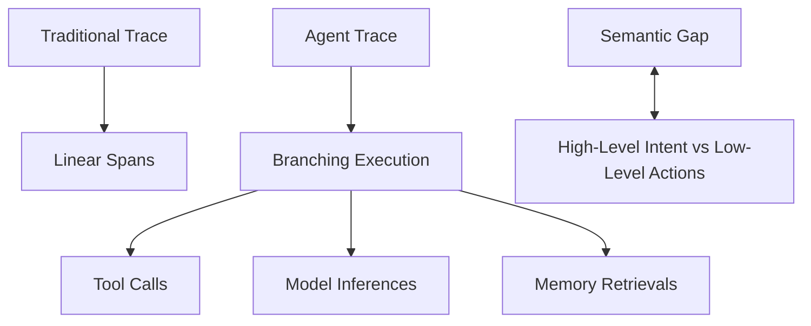
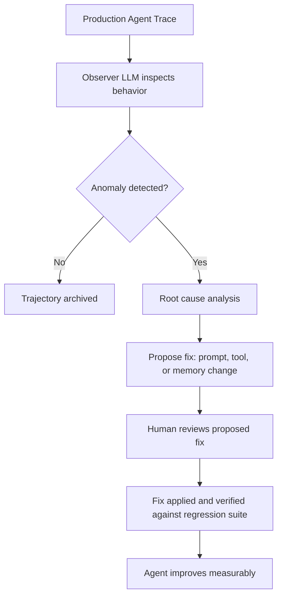

**TL;DR**

- Agent failures are different from deterministic software bugs: non-deterministic execution, compounding error across multi-step trajectories, and temporal drift mean Application Performance Monitoring (APM) dashboards cannot diagnose root cause.
- Emerging tools like Lucidic, Arize Signal, and Trainly introduce time-travel debugging, trajectory clustering, and automated issue detection; capabilities traditional observability platforms were never designed to provide.
- Teams that instrument complete trajectories, version every decision input, and define behavioral contracts significantly reduce debugging time. The shift from passive logging to active agent introspection is already happening.

Your AI agent just charged a customer $500 instead of $50. The logs show every API call, every tool invocation, every span: all green. Nothing failed; yet the outcome is wrong. This is the agent debugging problem in a nutshell. Traditional observability tells you what happened, but not why a model chose a particular reasoning path. When five sequential decisions each succeed 95% of the time, the full trajectory works correctly only about 77% of the time [1]. The answer is not better logs — it is active introspection: agents that inspect their own reasoning, and tools that let you replay decisions from any point in time.

## Why Traditional Observability Leaves Agents in a Black Box

Microservice observability rests on a comfortable assumption: the same input produces the same output. OpenTelemetry traces, structured logs, and metrics dashboards all presume deterministic execution paths. Agents violate this premise at every turn; the same request can trigger different tool selections, reasoning chains, and final outputs, not because of a bug but because probabilistic reasoning is the feature [1].

This creates what researchers call the semantic gap: the disconnect between an agent's high-level natural language intent and the low-level system actions that result [2]. Your traces show the agent called a database and returned a result. They do not show why it chose that specific query, or whether the retrieved context contaminated the reasoning chain. Current tools observe either high-level intent via framework instrumentation or low-level system calls; neither bridges both worlds alone [2].

> [!WARNING]
> The semantic gap is not a monitoring gap — it is a reasoning gap. Adding more spans will not close it. You need tools that understand agent decision logic, not just the mechanics of function calls.

Compounding error makes this gap dangerous in production. An agent chaining five tool calls; each with 95% individual success; has only about 77% probability of completing the trajectory correctly. Extend to ten steps, and success drops below 60% [1]. Each additional tool hop, model call, or retrieval step multiplies the failure surface. Traditional monitoring was never architected to reason about compound probability across non-deterministic steps.



## The Four Failure Modes That Only Agents Exhibit

Debugging agents means understanding failure categories that do not exist in deterministic software. Four characteristics define the challenge; each demands a different diagnostic approach [1].

| Failure Mode | What It Looks Like | Why Traditional Tools Miss It |
| --- | --- | --- |
| Non-deterministic execution | Same prompt produces different plans, tools, or responses on each run | APMs assume replay produces identical traces; agents do not |
| Compounding error | Each model, tool, and memory hop multiplies failure probability | Spans show individual successes but hide aggregate risk |
| Temporal drift | Memory updates and context shifts alter behavior without code changes | No deployment event to correlate; behavior silently changes |
| Signal collapse at scale | Critical failures vanish inside millions of normal traces | Threshold alerting cannot separate rare semantic errors from normal variance |

Non-deterministic execution jars engineers coming from microservices most. Replaying the exact same request can produce different plans, tool calls, and responses; all without any code change [1]. The bug is not in the code; it lives in the probabilistic decision space between code paths.

Temporal drift is equally insidious. Memory updates, retrieval indices, and surrounding context shift over time without any deployment [1]. Your agent worked fine on Tuesday; by Wednesday, it hallucinates prices. No code was deployed. The root cause might be context contamination introduced days earlier during a seemingly successful interaction.



## Trace-Based Diagnosis: The Foundation for Agent Debugging

Before you can debug agents, you need to capture them completely. A production-grade trace must record routing decisions, tool selections, memory retrievals, model inferences, and final outcomes as a connected trajectory; not just spans and latency data [8].

Phoenix from Arize and Langfuse build on OpenTelemetry and the OpenInference specification to provide this foundation [7] [8]. Unlike traditional APM instrumentation capturing system-level events, these tools instrument at the framework level; capturing prompt templates, model parameters, retrieval results, and chain-of-thought reasoning alongside standard spans.

A span versus a trajectory is like a screenshot versus a video. Spans give isolated moments; trajectories show the full decision arc [1]. Which LLM call led to which tool invocation? What context was retrieved, and how did it influence subsequent reasoning? Trajectory-level capture is the prerequisite for every advanced debugging technique that follows.

```python
# A complete agent trace captures more than isolated spans.
# It links decisions, tool calls, and context together.

from phoenix.otel import register

# Instrument your agent framework
register(
    project_name="production-checkout-agent",
    auto_instrument=True,  # captures LLM calls, retrievals, tools
)

# Every decision becomes part of a connected trajectory,
# not just isolated spans in a distributed trace.
```

A case study from Arize shows the value. An ADHD screener agent reduced latency by 56% and cost by 44% after tracing revealed redundant model calls — but a completeness evaluator caught that optimized answers were skipping required diagnostic fields [6]. Without trajectory-level visibility, the team would have shipped a faster agent producing incomplete assessments. Tracing surfaced the performance win and the quality regression simultaneously. (Note: these gains come from a single vendor-published self-experiment; your mileage will vary.)

## Replay Debugging Brings Time-Travel to Agent Development

The most transformative capability in agent debugging is time-travel: freeze execution at any point, modify state (prompts, tool outputs, memory, context), and re-simulate from that exact moment [3] [9]. This collapses debugging from 'guess, redeploy, wait ten minutes, check logs' to 'modify, re-simulate in seconds, compare.'

Lucidic (YC W25) built their time-travel debugger out of frustration. Their e-commerce agent kept failing at checkout; every one-line prompt change required a 10-minute full rerun [3]. Their solution runs 30 to 40 parallel simulations from any checkpoint, letting developers test prompt variations, tool output modifications, and memory edits without replaying the entire trajectory.

> [!TIP]
> Time-travel debugging is most powerful for testing edge cases found in production. When a customer reports 'the agent ordered the wrong item,' you do not need to reproduce the bug: replay the exact trajectory, modify the ambiguous step, and verify the fix before deploying.

Helicone's session replay takes a complementary angle, replaying LLM sessions to benchmark prompt changes against historical interactions [9]. This evaluates whether a prompt optimization that improves one scenario degrades others; the regression testing problem deterministic software solved with unit tests, but that agents need replay-based datasets to address.



## Finding Rare Failures With Trajectory Clustering and Anomaly Detection

Complete trajectories are only half the battle. At production scale, individual trace inspection does not work; agents generate millions. The answer: unsupervised machine learning applied to agent trajectories themselves [3] [5].

Trajectory clustering groups execution paths by embedding similarity. Lucidic transforms OpenTelemetry logs into interactive graph visualizations clustering semantically similar states — surfacing edge cases invisible in individual traces [3]. Trainly offers free 72-hour heuristic audits on up to 10,000 production traces; the paid product adds HDBSCAN unsupervised semantic anomaly detection [5].

AgentSight demonstrated boundary tracing using eBPF with only 2.9% average runtime overhead [2]. In one case study, it detected a prompt injection attack where an agent was tricked into exfiltrating /etc/passwd via a malicious URL in a README. The system reduced 521 raw events to 37 semantically correlated events; flagging the logically inconsistent behavior (agent reads a README, then accesses system files) as anomalous [2]. Span-based monitoring cannot detect this cross-layer anomaly.


Clustering and anomaly detection on trajectories; not metrics; is the most scalable way to find rare agent failures in production. A threshold on latency or error rate will never catch the agent that charged $500 instead of $50.


## The Agent Debugging Tools Shaping Production Practice

A new generation of agent-native observability tools coalesces around four capabilities: complete trajectory capture, replay debugging, pattern detection, and automated issue resolution.

| Tool | Key Capability | Differentiator | Pricing |
| --- | --- | --- | --- |
| Lucidic (YC W25) | Time-travel debugging, trajectory clustering, rubric-based evals | Investigator agent evaluates criteria more reliably than LLM-as-judge; auto-transforms OTel logs into interactive graphs [3] | Commercial |
| Arize Signal | Automated trace review, issue ranking, PR generation | Optimization agent proposes code fixes; reduced agent skill latency 56% and cost 44% [4] [6] | Commercial + free OSS |
| Trainly | Unsupervised semantic anomaly detection via HDBSCAN | Free 72-hour audit on up to 10,000 traces with zero integration overhead [5] [10] | Free tier + commercial |
| Phoenix OSS | Open-source tracing, evals, experiments, playground | OpenInference-based instrumentation; full trajectory capture for LangChain and custom agents [7] | Open source |
| Langfuse | LLM observability, application tracing, prompt management | Open-source core with managed cloud; strong LangChain and Vercel AI SDK integration [8] | Open source + cloud |
| Braintrust | Active observability with evals and experiments | Evaluation-driven development; ties tracing directly to eval scoring [12] | Commercial |

Arize Signal stands out: it continuously reviews production traces, ranks issues, and can propose pull requests for fixes; moving from 'notify a human' to 'suggest the fix' [4]. A long-running optimization agent iterated eight times to improve an agent skill while tracking latency, cost, and completeness simultaneously [6].

Lucidic addresses a subtle evaluation problem. Traditional LLM-as-judge evaluators produce inconsistent scores; the same trajectory gets different ratings on repeated runs. Lucidic replaces this with a rubric-based investigator agent producing more auditable results [3]. For teams needing trustworthy evaluation to gate production deployments, this matters. It is a subtle difference.

For teams not ready for a commercial platform, the open-source stack. Phoenix plus Langfuse plus your existing pipeline; provides a solid foundation [7] [8]. LangSmith by LangChain offers another option with comprehensive tracing and evaluation for LangChain-based applications [11]. The key insight: instrumenting for complete trajectories is valuable regardless of which analysis tool you choose. The payoff is immediate.

## Building Your Agent Debugging Playbook

Tools alone do not create a debugging culture. Teams that succeed in production follow a playbook starting before the first deployment.

First, instrument for complete trajectory capture from day one: every model call with its prompt template, every tool invocation with inputs and outputs, every memory retrieval with retrieved context, and the final outcome [6]. Version every decision input; prompts, tool schemas, memory configurations; so you can correlate behavior changes to specific input changes, not just code deployments [1].

Second, define behavioral contracts before production. An eval suite testing correctness, completeness, and safety should gate every deployment. Turn every production failure into a regression test: a captured trajectory that failed, now replayed to verify the fix stays working [4]. This builds a living evaluation dataset that grows more valuable with every incident.

```yaml
# Behavioral contract: evals gate production deployment.
# Each production failure becomes a regression test.

evals:
  - name: "checkout-price-correctness"
    description: "Agent must not hallucinate prices"
    dataset: production-failures/checkout-pricing
    threshold: 0.98  # 98% of test cases must pass
    
  - name: "diagnostic-completeness"
    description: "Medical agent must include all required fields"
    dataset: production-failures/incomplete-diagnostics
    threshold: 1.0   # zero tolerance for incomplete output
```

Third, move from human-operated debugging to systematic improvement. Arize Signal's automated issue detection, ranking, and fix proposal represents where the industry is heading [4]. Even without full automation, teams can use trajectory clustering to identify failure patterns, test fixes against historical trajectories, and tighten the feedback loop with every iteration.

## The Future: When Agents Debug Themselves

The most provocative idea in agent debugging is not a new tool. It is the architectural shift to agents that inspect their own behavior. AgentSight's observer LLM points toward this future: a separate AI model watching agent behavior at the system level, flagging anomalies without framework modifications [2].

Arize's long-running optimization agent takes this further, iterating autonomously on eval scores to improve agent skills while tracking latency, cost, and accuracy [6]. The agent ran eight iterations; each proposing a modification and evaluating against all three metrics. This is not a dashboard alerting a human; it is an agent systematically improving another agent's performance.

The natural endpoint is self-debugging agents: AI systems that investigate their own traces, identify root causes, propose fixes, and verify those fixes against regression datasets. Human review boundaries will be essential; nobody is proposing autonomous production modifications. But the ratio of human effort to agent self-correction will shift dramatically [4]. Teams building this feedback infrastructure now will see their agents improve at compound rates while others chase individual failure tickets.



## Practical Takeaways

1. Instrument for complete trajectories from day one, not basic logging: capture every model call, tool invocation, memory retrieval, and final outcome.
2. Define behavioral contracts as eval suites that gate production deployments and turn every production failure into a regression test case.
3. Version every decision input; prompts, tool schemas, and memory configurations; so you can correlate behavior changes to specific input changes.
4. Use trajectory clustering or free audit tools to find rare failures hiding in production trace volume. Threshold alerting will not catch the agent that charged $500 instead of $50.
5. Build toward automated issue detection and fix suggestion: Arize Signal's continuous trace review and PR generation shows where the industry is heading.

## Conclusion

The question is not whether agent debugging tools will mature — they already have. The open question is how fast teams will adopt behavioral contracts and trajectory-level instrumentation as standard practice, not afterthoughts. The gap between what tools can do and what most teams actually instrument remains wide. The organizations that close it first will ship reliable agents while competitors are still reading raw logs.

## Frequently Asked Questions

### Can I debug agents with existing APM tools like Datadog or New Relic?

No. They capture spans and metrics but cannot bridge the gap between agent intent and action; they show a function was called, not why the model chose it.

### What is the minimum instrumentation before deploying agents to production?

Capture every model call with prompt template and parameters, every tool invocation with inputs and outputs, every memory retrieval, and the final outcome; all linked as a single trajectory. Open-source tools like Phoenix or Langfuse provide framework-level auto-instrumentation. The cost of retrofitting later is far higher than building it in from day one.

### How do trajectory clustering and anomaly detection work?

Trajectory clustering converts agent execution paths into embeddings, then applies algorithms like HDBSCAN to group similar reasoning patterns. This surfaces rare edge cases that individual trace inspection would miss; for example, the 0.01% of sessions where checkout pricing diverges. Lucidic and Trainly automate this process. The AgentSight research project proved it works at the system level with only 2.9% overhead using eBPF. For more detail, see our section on trajectory clustering and anomaly detection.

### Is time-travel debugging practical for production agents?

Yes. Lucidic runs 30 to 40 parallel re-simulations from any execution checkpoint, letting teams test prompt changes and state modifications in seconds rather than re-running full trajectories. The prerequisite is complete trajectory capture: you must have frozen all state; prompts, tool outputs, memory, and context; at each step. Helicone offers a complementary approach focused on replaying LLM sessions to benchmark prompt changes against historical interactions. The interaction between trajectory length and simulation accuracy is still an open research question; most published work focuses on single-turn or short-horizon scenarios.

---

## Sources

| # | Publisher | Title | URL | Date | Type |
| --- | --- | --- | --- | --- | --- |
| 1 | Arize AI | "AI agent observability: Why production systems need a reasoning layer" | https://arize.com/blog/ai-agent-observability-why-production-systems-need-a-reasoning-layer/ | 2026-08-06 | Blog |
| 2 | University of California Santa Cruz / AlphaXiv | "AgentSight: System-Level Observability for AI Agents Using eBPF" | https://arxiv.org/abs/2508.02736 | 2025-08 | Paper |
| 3 | Lucidic AI (YC W25) | "Launch HN: Lucidic (YC W25) – Debug, test, and evaluate AI agents in production" | https://news.ycombinator.com/item?id=44735843 | 2025-07-30 | Blog |
| 4 | Arize AI | "How to debug production AI agents with Signal in Arize AX" | https://arize.com/blog/debug-production-ai-agents-with-signal-tutorial/ | 2026-08-04 | Blog |
| 5 | Trainly | "Show HN: Trainly – Free 72-hour audit of your AI agent's production traces" | https://news.ycombinator.com/item?id=47867157 | 2026-04-22 | Blog |
| 6 | Arize AI | "How to improve agent skills with tracing and evals" | https://arize.com/blog/how-to-evaluate-and-optimize-agent-skills-with-tracing-and-evals/ | 2026-07-28 | Blog |
| 7 | Arize AI | "Phoenix: AI Observability & Evaluation Platform (GitHub)" | https://github.com/Arize-ai/phoenix | 2026-07 | Documentation |
| 8 | Langfuse | "LLM Observability & Application Tracing (Open Source)" | https://langfuse.com/docs/tracing | 2026-07-30 | Documentation |
| 9 | Helicone | "Optimizing AI Agents: How Replaying LLM Sessions Enhances Performance" | https://helicone.ai/blog/replaying-llm-sessions | 2024-09-26 | Blog |
| 10 | Trainly | "Trainly - AI Agent Observability Platform" | https://www.trainlyai.com/ | 2026-04 | Documentation |
| 11 | LangSmith by LangChain | "LangSmith Observability Documentation" | https://docs.smith.langchain.com/observability | 2026-07 | Documentation |
| 12 | Braintrust | "Get started with Braintrust - Active Observability Platform" | https://www.braintrust.dev/docs | 2026-07 | Documentation |

## Image Credits

- **Cover photo**: Image generated with gemini-3-pro-image (Agents' Codex AI illustration)
- **Figure 1**: Image generated with gpt-5.4-image-2 (Agents' Codex AI illustration)
- **Figure 2**: Image generated with gemini-3-pro-image (Agents' Codex AI illustration)
