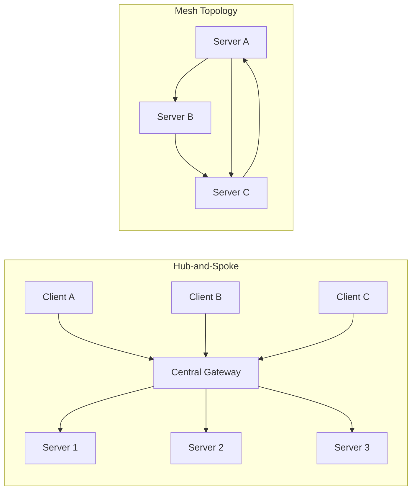

**TL;DR**

- Federated MCP shifts tool access from a hub-and-spoke client-server model to a mesh where servers delegate to each other across trust boundaries.
- Stateless protocol changes (SEP-2575, SEP-2567) are what make cross-boundary, load-balanced MCP deployments practical.
- Capability attestation (proving a downstream invocation is authorized) remains the unsolved problem in the ecosystem.

Every MCP deployment you have seen so far fits the same shape: a host process opens one client per server, and each client talks to exactly one server [1]. That model worked when tools lived inside your own org. It breaks the moment an agent must call a tool in a partner's environment, or delegate across three teams running separate infrastructure. Federated MCP is the emerging answer, but the plumbing is not the hard part. The real value is trust: deciding who can invoke what, across a boundary no single party controls. Most teams reach for a central gateway to solve this and quietly rebuild the exact single point of failure they were trying to escape. The better path is a mesh of servers that attest to each other and scope invocation statelessly. This article maps that path.

## Why Session-Coupled MCP Breaks at the Federation Boundary

The original MCP design is explicitly client-host-server. A host manages multiple clients; each client holds a one-to-one relationship with a single server [1]. Sessions are the glue. Every connection carries state that the server must remember across calls; that is exactly the property that makes federation painful; state lives on the wrong side of the boundary.

Two spec changes unwind that coupling. SEP-2575 removes the mandatory initialization handshake; each request is self-contained; it carries its protocol version in an HTTP header [2]. SEP-2567 goes further and deletes the Mcp-Session-Id header entirely, replacing session-scoped state with explicit, server-minted handles that the model carries through subsequent calls [3].

The practical payoff is horizontal scaling without sticky sessions. A stateless server can sit behind a standard load balancer; list endpoints (tools/list, resources/list, prompts/list) become session-independent; they are cacheable across boundaries [3].

> [!NOTE]
> Session-scoped state wasn't an accident; it was a shortcut. Real-world clients already diverged on it; ChatGPT creates a fresh session per tool call, Claude.ai moved to process-scoped sessions, and most desktop and IDE clients keep one session per application launch [3]. The spec is now catching up to a mess already in production.

The Python SDK v2.0 now supports every protocol revision since 2024-11-05, five total [4]. That breadth matters for federation: a mesh spans servers on different versions. A client that speaks all five can reach outdated internal servers without a coordinating upgrade.

## Capability Negotiation Without a Central Registry

A meshed system needs a way for two servers to agree on what each can do without a shared directory. MCP's answer is an extension framework, defined in SEP-2133 [5]. Extensions are optional, composable additions: layers of federation features on the core protocol that never break it.

Each extension carries a unique identifier in vendor-prefix form; for example, io.modelcontextprotocol/oauth-client-credentials [5]. The framework defines two official extensions today: ext-apps and ext-auth [5]. Everything else is a vendor's own namespace; that is how the protocol stays extensible with no central authority handing out names.

The negotiation model is graceful. A client advertises the extensions it supports; a server that doesn't recognize one simply ignores it. You stay compatible with servers that never heard of your federation features; incremental adoption across a boundary, not an all-or-nothing migration.

| Layer | What it governs | Status |
| --- | --- | --- |
| Core protocol | Client-host-server, tools, resources, prompts | Stable |
| Extensions (SEP-2133) | Optional composable capabilities, vendor-prefixed IDs | Final |
| Stateless requests (SEP-2575) | Self-contained requests, version in HTTP header | Final |
| Sessionless state (SEP-2567) | Explicit state handles, no Mcp-Session-Id | Final |
| OAuth client credentials (SEP-1046) | Machine-to-machine authorization | Final |
| Header standardization (SEP-2243) | Intermediary-friendly HTTP routing | Final |

Five SEPs sit at Final status as of 2026-07-28 [2][5]. Notice how much of the federation surface arrived through extension and statelessness work rather than a dedicated federation spec. The community built the pieces first; naming them came later: a healthy order.

## The Attestation Problem Nobody Has Fully Solved

Here is the gap nobody likes to point at. The SEPs specify authentication, which answers how a caller proves its identity. They do not specify authorization across trust domains: the rule for whether a downstream server verifies that an upstream caller holds the right to invoke a tool on a user's behalf [6].

That missing piece is capability attestation; it is the genuine unsolved problem in federated MCP. When server A delegates to server B on a user's behalf, B has to trust that A actually holds that permission; that it was not spoofed; that it was not over-reaching. Authentication gets you an identity; it does not get you a decision.

This is a hard problem with no canonical answer yet.

> [!WARNING]
> Treat this absence as the real technical risk: not a footnote. Our strongest signal on the gap is a Hacker News discussion [6]; a conversation, not a normative document. If you build cross-boundary tool access today, you are designing this layer yourself.

The spec offers one building block. SEP-1046 adds the OAuth client credentials flow for machine-to-machine scenarios where no end-user is available for interactive authorization [7]; it recommends asymmetric methods (JWT assertions per RFC 7523) while still allowing client secrets for backward compatibility [7].

Preferring JWT assertions over shared secrets is the correct instinct for a mesh. A client secret is a long-lived bearer credential; a signed assertion can be scoped, expiring, and bound to a specific downstream audience; three properties a secret simply lacks. Across organizational boundaries, secrets leak and get reused. Assertions at least give you a revocation story.

Identity, in short, is table stakes.

## Federated MCP as a Mesh: Killing the Single Point of Failure

The topological shift is the whole point. Hub-and-spoke centralizes every request through one gateway. A mesh lets a server call another server, which calls a third, forming delegation chains with no mandatory hub [6].

The diagram below contrasts the two patterns. On the left, every client routes through a single choke point; on the right, servers hand work off laterally; the failure of any one node does not cut off the rest.

Delegation chains only work if a network intermediary can route MCP traffic without parsing the payload. SEP-2243 standardizes HTTP headers so load balancers, proxies, and observability tools can direct traffic without deep packet inspection [8]. It is a small, unglamorous change; the consequence is that your existing infrastructure participates without learning MCP internals; no MCP-aware proxy is required.

That last point is bigger than it looks.

Demand for this pattern predates the formal spec. Community proxies — sparfenyuk/mcp-proxy, open-webui/mcpo — already bridge between transports; a GitHub search for mcp proxy surfaces a growing ecosystem of them [9]. People were hacking federation together before the SEPs ratified it; the specs chased the practice.

## What Production Gateways Reveal About Federation Maturity

Two implementations show how far the pattern has already come. IBM's ContextForge is an open-source gateway that federates MCP, A2A, and REST/gRPC APIs with centralized governance, discovery, and observability; it runs over HTTP, JSON-RPC, WebSocket, SSE, and stdio [10].

MindsDB uses MCP as a unified data gateway; one query spans multiple federated data sources with auditability and no data movement [11]. Both are real, running systems: not architecture diagrams. That is the strongest evidence federated MCP has moved from concept to production.

Read them critically, though.

ContextForge is a vendor's gateway product; its GitHub page describes an implementation, not a general recipe for building your own federation [10]. MindsDB's write-up is a product announcement with limited technical depth on cross-organizational patterns [11]. Neither tells you how to solve the attestation gap we described. They prove the plumbing is solveable; they leave the trust question to you.


Infrastructure is no longer the blocker. IBM and MindsDB prove you can federate MCP at production scale today; the unsolved cost is trust (capability attestation across boundaries), and no gateway product hands you that part.


## Building for the Federated MCP Future

Start by separating what is stable from what you still have to design. The stateless and sessionless SEPs are Final; treating MCP as load-balanceable and cacheable is now safe [2][3]. OAuth client credentials are Final too; machine-to-machine authentication has a spec to lean on [7]. What remains yours to build is authorization; the policy that decides, per downstream call, whether an assertion maps to a permitted action.

Adopt federation where delegation actually crosses a boundary; stay hub-and-spoke while it doesn't. A mesh adds attestation surface area and debugging complexity: both are real costs. If every server lives inside one team's VPC and calls only each other, a central gateway is simpler and rarely the bottleneck. Reach for the mesh when a partner, a separate business unit, or a customer environment enters the picture [6].

Prefer short-lived scoped assertions over shared secrets for cross-boundary calls [7]. Design tools to be explicit about their authority requirements so a downstream server can make an allow-or-deny decision without guessing; and accept that graceful degradation via the extension framework is your friend: a server that ignores your federation extension degrades cleanly instead of failing the whole chain [5].

## Practical Takeaways

1. Adopt stateless MCP now; the SEPs backing SEP-2575 and SEP-2567 are Final, so you can put servers behind standard load balancers without sticky sessions.
2. Use short-lived JWT assertions (RFC 7523) over shared client secrets for any cross-boundary machine-to-machine call, per SEP-1046.
3. Treat each hop in a delegation chain as a fresh authorization decision, not a pass-through, and build your own attestation policy since no spec covers it yet.
4. Stay hub-and-spoke while all servers live inside one trust domain, and switch to a mesh only when a partner, business unit, or customer environment crosses the boundary.
5. Lean on the extension framework's graceful degradation so servers that don't support federation still work.

## Conclusion

The stateless protocol, extension framework, and machine-to-machine auth are all Final today, and two vendors already run them for real workloads. The open question is whether cross-boundary authorization ever gets a standard, because that is the line between a demo and a system you can actually operate. Watch where the community routes identity-to-permission mapping next; the answer decides whether your gateway stays proprietary or becomes interchangeable plumbing. The teams that win will treat that gray area as a first-class engineering discipline rather than a feature bolted on after the fact. Sketch your delegation chain on a whiteboard this week and mark every hop where a human still has to make the call.

## Frequently Asked Questions

### Is MCP stateless today, or do I still need sessions?

The stateless path is Final via SEP-2575 and SEP-2567, so you can run servers behind standard load balancers without sticky sessions. Older servers still speak the sessioned model, and Python SDK v2.0 supports all five protocol revisions, so a mixed estate works. Here is the honest caveat: we do not yet have clean production data on how a partially stateless mesh degrades when one node fails mid-chain, so treat cross-boundary resilience claims as design intent rather than measured fact.

### What actually distinguishes federated MCP from a normal MCP gateway?

A gateway centralizes; a federation distributes. See the mesh-versus-hub diagram in “Federated MCP as a Mesh” above.

### How do I authenticate machine-to-machine tool calls when no user is present?

Use the OAuth client credentials flow from SEP-1046, and prefer JWT assertions per RFC 7523 over shared client secrets. Assertions can be scoped, expiring, and audience-bound, which gives you a revocation story across boundaries that a plain secret cannot provide.

### What is the biggest unsolved problem in federated MCP?

Capability attestation. The specs define authentication and identity, but there is no standard for how a downstream server verifies that an upstream caller is authorized to act on a user's behalf. This is not a small gap: it is the difference between proving who you are and proving you are allowed to do the thing. The strongest public signal we have is a Hacker News discussion thread, not a normative spec, and production gateway vendors do not hand you a general answer. Realistically, every team crossing an organizational boundary today builds this authorization policy itself, from scratch. That fragmentation is exactly what a future SEP needs to close, and until it lands, the trust logic remains the part you own.

---

## Sources

| # | Publisher | Title | URL | Date | Type |
| --- | --- | --- | --- | --- | --- |
| 1 | Model Context Protocol Specification | "MCP Architecture - Client-Host-Server Model (2025-03-26)" | https://github.com/modelcontextprotocol/modelcontextprotocol/blob/main/docs/specification/2025-03-26/architecture/index.mdx | 2025-03-26 | Documentation |
| 2 | Model Context Protocol Specification | "SEP-2575: Make MCP Stateless" | https://github.com/modelcontextprotocol/specification/blob/main/seps/2575-stateless-mcp.md | 2025-06-18 | Documentation |
| 3 | Model Context Protocol Specification | "SEP-2567: Sessionless MCP via Explicit State Handles" | https://github.com/modelcontextprotocol/specification/blob/main/seps/2567-sessionless-mcp.md | 2026-03-11 | Documentation |
| 4 | Model Context Protocol (Python SDK) | "Python SDK v2.0 Documentation" | https://github.com/modelcontextprotocol/python-sdk | 2026-07-28 | Documentation |
| 5 | Model Context Protocol Specification | "SEP-2133: Extensions Framework" | https://github.com/modelcontextprotocol/specification/blob/main/seps/2133-extensions.md | 2025-01-21 | Documentation |
| 6 | Hacker News | "Federated Data Access for MCP (Model Context Protocol) Discussion" | https://news.ycombinator.com/item?id=43613741 | 2025-04-07 | Blog |
| 7 | Model Context Protocol Specification | "SEP-1046: Support OAuth Client Credentials Flow in Authorization" | https://github.com/modelcontextprotocol/specification/blob/main/seps/1046-support-oauth-client-credentials-flow-in-authoriza.md | 2025-07-23 | Documentation |
| 8 | Model Context Protocol Specification | "SEP-2243: HTTP Header Standardization for Streamable HTTP Transport" | https://github.com/modelcontextprotocol/specification/blob/main/seps/2243-http-standardization.md | 2026-02-04 | Documentation |
| 9 | GitHub | "MCP Proxy Implementations (search results)" | https://github.com/search?q=mcp+proxy&type=repositories | 2026-08-14 | Documentation |
| 10 | IBM | "ContextForge: Open Source MCP/A2A/REST Registry and Proxy" | https://github.com/IBM/mcp-context-forge | 2026 | Documentation |
| 11 | MindsDB | "MindsDB Now Supports Model Context Protocol: The Unified AI Data Hub" | https://mindsdb.com/blog/mindsdb-now-supports-model-context-protocol-the-unified-ai-data-hub-your-enterprise-needs | 2025-03-31 | Blog |

## Image Credits

- **Cover photo**: Image generated with gemini-3-pro-image (Agents' Codex AI illustration)
