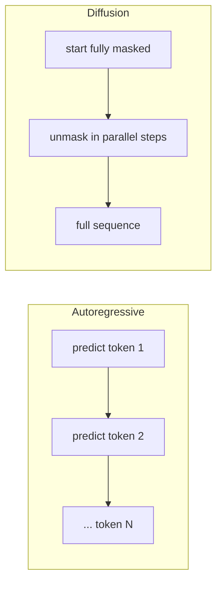

**TL;DR**

- Diffusion LLMs generate whole sequences in parallel through iterative denoising, sidestepping the serial token bottleneck of autoregressive models [1].
- Mercury Coder Mini hits 1,109 tokens per second on an H100, and Mercury 2 sustains over 1,009 tokens per second on Blackwell with a price ladder that undercuts speed premiums [1][4].
- The catch is fixed-length output, a real friction for variable-length agent steps, but AR-to-diffusion fine-tuning keeps the adoption cost low [2][7].

Autoregressive models generate a single token at a time, and every token sits on the critical path; an agent that chains ten tool calls inherits that serial latency ten times over. Diffusion language models (dLLMs) attack the problem at the root. They start from a fully masked sequence and unmask every token in parallel through iterative denoising, using bidirectional attention instead of left-to-right prediction [1]. Inception Labs' Mercury Coder Mini already sustains 1,109 tokens per second on an H100 [1]. The thesis is specific: for latency-sensitive agent workloads, diffusion LLMs are closer to production-ready than the benchmark headlines suggest — but only if you understand the fixed-length output tradeoff. Most teams do not.

## Why Sequential Decoding Cripples Agent Loops

An autoregressive model can only write the next token after it has written every previous one; that is a hard architectural ceiling, not an engineering choice. When an agent chains a tool call, a retry, and a synthesis step into a single task, the serial latency of each decoded token adds a floor that no batch size can lift [1].

Speculative decoding was the industry's main workaround. You draft several tokens with a cheap model, verify them in parallel, then accept the correct prefix; it helps, but it adds a second model to operate and tune; the benefit depends on how often the draft and target agree.

A subtler ceiling hides in how diffusion models worked before recent fixes: bidirectional attention broke the causal-cache assumption that lets autoregressive models skip recomputation (the very thing that makes them fast). Open-source diffusion models had to recompute the full sequence every denoising step [5]; on paper, that is exactly the cost you would expect a fast architecture to avoid.

Diffusion models sidestep the serial bottleneck entirely.

## How Diffusion LLMs Generate Whole Sequences in Parallel

A diffusion language model learns to reverse a noise process over text. During training it masks random tokens; at inference it starts from an entirely masked sequence and, over a fixed number of denoising steps, predicts which masked slots to reveal [2]. The decisive move is bidirectional attention. With no causal mask, every token can attend to every other token at once; an autoregressive model cannot do by construction [2].

Masked diffusion language models formalize text generation as denoising rather than next-token prediction [3]; that single change collapses a sequence's serial dependency into one parallel step, which is where the throughput gains come from.

The tradeoff is that length becomes an input: you tell the model how many tokens to produce up front, and it fills that budget, because there is no natural early-stop signal when the answer happens to finish early [2].

## What 1,000+ Tokens per Second Actually Buys You

The raw numbers are real. Mercury Coder Mini sustains 1,109 tokens per second on an H100; Mercury Coder Small hits 737; and Inception Labs reports up to 10x faster generation than speed-optimized autoregressive models on average [1]. Mercury 2 raises the bar on newer silicon: over 1,009 tokens per second on NVIDIA Blackwell, priced at $0.25 per million input tokens and $0.75 per million output tokens, with time-to-first-token under 300 milliseconds under high concurrency [4].

Latency, not raw throughput, is what agent developers actually feel. On GitHub's Copilot Arena, Mercury Coder Mini returned a median response in 250 milliseconds against GPT-4o Mini, about four times faster, while ranking tied-for-second on quality [1]; four times faster at competitive quality changes what you are willing to call a loop.

Treat the 10x figure as a ceiling, not a promise. It comes from Inception Labs' own paper and measures generation speed within a single call, not end-to-end latency across a tool-call graph [1]. In practice, we have found that first-token latency matters more than sustained throughput (and the wall clock is usually dominated by your tools, not the model).

| Model | Throughput | Latency / speedup | Source |
| --- | --- | --- | --- |
| Mercury Coder Mini | 1,109 tok/s (H100) | 250 ms p50 vs GPT-4o Mini about 4x faster | [1] |
| Mercury Coder Small | 737 tok/s (H100) | up to 10x vs AR on average | [1] |
| Mercury 2 | 1,009+ tok/s (Blackwell) | sub-300 ms TTFT under concurrency | [4] |
| Fast-dLLM (LLaDA/Dream) | 27.6x vs vanilla LLaDA | 2–3.6x from [KV cache](/posts/2026-04-02-kv-cache-quantization-production-agents/) alone | [5] |



## The Open-Weight Path: LLaDA, Dream 7B, and Block Diffusion

LLaDA proved you can train a diffusion model from scratch and match autoregressive quality. At 8 billion parameters trained on 2.3 trillion tokens and 0.13 million H800 GPU-hours, it matches LLaMA3 8B on in-context learning [2]. On reversal poem completion (a task that punishes left-to-right bias), LLaDA scores 45.6 against GPT-4o's 34.3 [2]; the authors credit bidirectional reasoning.

Dream 7B shows the cheaper route. It initializes from Qwen2.5-7B weights and trains on just 0.6 trillion tokens, a fraction of LLaDA's 2.3 trillion, yet beats LLaDA 8B across benchmarks: 81.0 versus 46.0 on Sudoku planning; 77.2 versus 70.9 on GSM8K [6]. On Countdown3 it even outperforms DeepSeek V3-671B, a model with orders of magnitude more parameters [6].

Block Diffusion threads the needle between the two families. It diffuses within blocks but generates blocks autoregressively, recovering variable-length output and per-block KV caching; it earns state-of-the-art results among diffusion models on language benchmarks [7]. That directly attacks the fixed-length problem.

The Ant Group and Renmin University team then scaled the idea to 100 billion parameters with LLaDA2.0, converting a pretrained autoregressive MoE model through three-phase progressive training and aligning 16B and 100B variants with SFT and DPO [8]; LLaDA2.1 followed with Token-to-Token editing for a configurable Speedy Mode and Quality Mode [9].

## Convert Your Existing AR Models Instead of Starting Over

The most underreported finding is that you do not need to retrain from scratch: DiffuLLaMA converted GPT-2 and LLaMA models from 127 million to 7 billion parameters into diffusion models using fewer than 200 billion tokens of continual pretraining [10].

The open-source dLLM toolkit pushed this further with A2D recipes that adapt Qwen3, LLaMA, and GPT-2 into masked diffusion and block diffusion models, releasing 0.5B and 0.6B checkpoints alongside the full conversion recipes [11].

For a team that already runs Qwen or LLaMA in production, this is the adoption path that matters: you keep the weight-level investment and swap the decoding strategy, instead of betting a multi-month pretraining budget on a new architecture.

> [!TIP]
> Match your A2D base model to your current serving stack; if you serve Qwen today, convert Qwen. Reusing your existing [quantization](/posts/2026-03-05-cutting-llm-agent-costs-by-50-a-production-engineers-playbook/) and prompt templates dominates the migration cost [11].


The migration path is fine-tuning, not retraining: diffusion capability can be grafted onto autoregressive weights for under 200 billion tokens [10].


## Closing the Reasoning Gap with RL Post-Training

Early diffusion models lagged on multi-step reasoning, and that gap is what kept many teams away. The d1 framework cracked it with diffu-GRPO, the first policy-gradient reinforcement learning algorithm for masked diffusion models [12]; it approximates log-probabilities with a mean-field approach and uses randomized prompt masking as regularization, making RL tractable without the sequential factorization (and token-by-token credit assignment) autoregressive models rely on [12].

The result narrowed the gap on GSM8K and MATH500 over the LLaDA-8B-Instruct baseline [12]; reasoning was never a property only autoregressive models could hold — it was a training question all along.

## Fixed-Length Output and Other Production Constraints

The sharpest edge of diffusion today is fixed-length output. Base LLaDA requires you to specify generation length at inference time, with no native early-stop when the answer finishes early [2]. For agent tasks with variable-length responses (a one-word tool result versus a five-paragraph synthesis), that is real friction; the authors note sensitivity to this length hyperparameter is low, but the architectural constraint remains.

Block diffusion and LLaDA2.1 are the emerging fixes; edit-based flow models push the same direction [7][9][13]. Mercury 2 sidesteps the friction at the product level instead: a 128K context window, native tool use, structured JSON output, and an OpenAI-compatible API make it drop-in for orchestration frameworks, and it is available on Azure AI Foundry [4].

> [!NOTE]
> When we wired a diffusion model into a tool-calling agent, the fixed length budget forced us to over-provision tokens on every short step; budget for the variable-length responses your tools actually return, not just the warm path.

## When to Choose a Diffusion LLM for Your Agent System

The decision is not universal: diffusion wins when latency compounds across many short calls: workflow subagents, real-time voice, RAG pipelines, and code autocomplete [4]. Inception Labs markets Mercury 2 directly at these loops, and the Skyvern team reports it is 'at least twice as fast as GPT-5.2' for RPA automation loops [4]. Henry Pan's harness-training experiment points the same direction from the research side: cheap, deterministic inference let him run 29 experiment iterations, lifting SWE-bench solves from 8 of 39 to 14 of 39 [14].

Autoregressive models still win where you stream tokens incrementally or need deeply variable-length output. Streaming is the clearest case: a diffusion model denoises a whole sequence before it is ready to show, which complicates live token-by-token output.

| Workload | Latency sensitivity | Recommendation |
| --- | --- | --- |
| Multi-step agent loops (>10 calls) | High, latency compounds | Diffusion LLM |
| Real-time voice / RAG | High, user-facing | Diffusion LLM (Mercury 2) |
| Code autocomplete / infilling | High, single-token UX | Diffusion LLM |
| Long-form streaming generation | Low, throughput-bound | Autoregressive |
| Existing fine-tuned AR stack | Variable | A2D fine-tune, then decide |



## Practical Takeaways

1. Benchmark your full agent loop end-to-end before choosing: the 10x generation speedup is per-call, and your tools often dominate wall-clock latency [1].
2. Start with an A2D conversion of Qwen or LLaMA (rather than from-scratch pretraining) if you already run autoregressive weights in production [10][11].
3. Model fixed-length output explicitly in your orchestration, reserving the length budget for variable-length steps; or adopt block diffusion and LLaDA2.1 token editing as they mature [7][9].
4. Pilot Mercury 2 for latency-sensitive loops through its OpenAI-compatible API on Azure AI Foundry, then measure end-to-end latency against your current autoregressive baseline [4].

## Conclusion

The migration will be a per-workload choice, not a rip-and-replace, and the route that makes it cheap is fine-tuning against weights we already own [10]. One uncertainty will decide adoption in the year ahead: whether preset token budgets become an invisible default. Evidence on that front is still thin [7][9]. Watch for native early-stop in the next open checkpoints. For now, pick the highest-latency loop, run a Mercury 2 or Qwen model against it, and measure the end-to-end wall clock: that number is the decision.

## Frequently Asked Questions

### Do diffusion LLMs need speculative decoding to be fast?

No. Parallel generation is the mechanism, not a bolt-on. Speculative decoding exists to work around autoregressive seriality by drafting and verifying; a diffusion model generates many tokens in the same step, so adding it would be redundant [5].

### Can diffusion LLMs use KV caching?

Historically no, because bidirectional attention invalidates the causal-cache assumption and forces full recomputation each step [5]. Fast-dLLM restores it with block-wise approximate caching, recovering 2–3.6x from the cache alone and up to 27.6x combined [5]. Block diffusion also bakes per-block caching into the architecture [7].

### What is the fixed-length output constraint, and how do I work around it?

You declare output length before generation and the model fills exactly that budget with no early stop [2]. Workarounds are architectural: block diffusion enables variable-length generation [7], and LLaDA2.1's Token-to-Token editing adds a Speedy Mode for this case [9]. See the production constraints section above.

### Does bidirectional attention actually improve reasoning?

It helps on tasks that punish left-to-right bias. LLaDA scores 45.6 against GPT-4o's 34.3 on reversal poem completion, a gap the authors attribute to bidirectional reasoning [2]. Dream 7B's Sudoku result suggests the same advantage extends to constraint-satisfaction planning [6]. For general mathematical reasoning, the gap was a training problem, not an architectural one, and diffu-GRPO narrowed it on GSM8K and MATH500 [12]. What we still lack is clean production evidence that this advantage transfers to real agent workloads; that is the open question we are tracking.

### When should I switch to a diffusion LLM?

Switch for latency-sensitive loops: multi-step tool chains, real-time voice, RAG, code autocomplete [4]. Stay autoregressive for streaming. See the decision matrix above.

---

## Sources

| # | Publisher | Title | URL | Date | Type |
| --- | --- | --- | --- | --- | --- |
| 1 | Inception Labs | "Mercury: Ultra-Fast Language Models Based on Diffusion" | https://arxiv.org/abs/2506.17298 | 2025-06-17 | Paper |
| 2 | Renmin University of China / Ant Group | "Large Language Diffusion Models (LLaDA)" | https://arxiv.org/abs/2502.09992 | 2025-02-14 | Paper |
| 3 | Cornell University / Inception Labs | "Simple and Effective Masked Diffusion Language Models (MDLM)" | https://arxiv.org/abs/2406.07524 | 2024-06-11 | Paper |
| 4 | Inception Labs | "Introducing Mercury 2" | https://www.inceptionlabs.ai/blog/introducing-mercury-2 | 2026-02-24 | Blog |
| 5 | University of Hong Kong / NVIDIA / MIT | "Fast-dLLM: Training-free Acceleration of Diffusion LLM by Enabling KV Cache and Parallel Decoding" | https://arxiv.org/abs/2505.22618 | 2025-05-28 | Paper |
| 6 | University of Hong Kong / Huawei Noah's Ark Lab | "Dream 7B: Diffusion Large Language Models" | https://arxiv.org/abs/2508.15487 | 2025-08-21 | Paper |
| 7 | Cornell University / Inception Labs | "Block Diffusion: Interpolating Between Autoregressive and Diffusion Language Models" | https://arxiv.org/abs/2503.09573 | 2025-03-12 | Paper |
| 8 | Ant Group / Renmin University of China | "LLaDA2.0: Scaling Up Diffusion Language Models to 100B" | https://arxiv.org/abs/2512.15745 | 2025-12-10 | Paper |
| 9 | Ant Group / Renmin University of China | "LLaDA2.1: Speeding Up Text Diffusion via Token Editing" | https://arxiv.org/abs/2602.08676 | 2026-02-09 | Paper |
| 10 | University of Illinois / Google / Salesforce / University of Hong Kong | "Scaling Diffusion Language Models via Adaptation from Autoregressive Models (DiffuLLaMA)" | https://arxiv.org/abs/2410.17891 | 2024-10-23 | Paper |
| 11 | ZHZisZZ / dLLM-hub (GitHub) | "dLLM: Simple Diffusion Language Modeling — A2D (AR-to-Diffusion) README" | https://github.com/ZHZisZZ/dllm | 2025-12-01 | Documentation |
| 12 | University of California Los Angeles / Meta AI | "d1: Scaling Reasoning in Diffusion Large Language Models via Reinforcement Learning" | https://arxiv.org/abs/2504.12216 | 2025-04-16 | Paper |
| 13 | Google DeepMind | "Edit Flows: Flow Matching with Edit Operations" | https://arxiv.org/abs/2506.09018 | 2025-06-10 | Paper |
| 14 | Henry Pan | "Harness Training: How I trained agent harnesses with a PyTorch-like loop over deterministic LLM inference" | https://www.henrypan.com/blog/2026-07-18-harness-training/ | 2026-07-18 | Blog |

## Image Credits

- **Cover photo**: Image generated with gpt-5.4-image-2 (Agents' Codex AI illustration)
- **Figure 1**: Image generated with gpt-5.4-image-2 (Agents' Codex AI illustration)
- **Figure 2**: Image generated with gpt-5.4-image-2 (Agents' Codex AI illustration)
