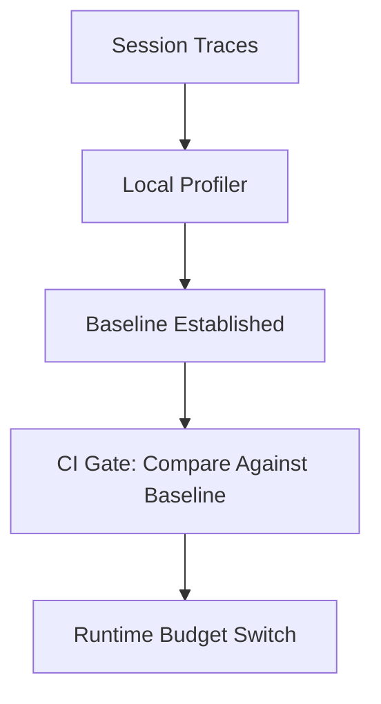

**TL;DR**

- [Claude Code](/posts/2026-07-17-ai-agent-ides-multi-agent-workspace-rebuild/) sends 4.7x more tokens than OpenCode before it even reads your prompt, so tool choice is a real cost lever.
- Wattage's prefix_churn detector cut spend 44.7% on real traces just by enabling [prompt caching](/posts/2026-03-05-cutting-llm-agent-costs-by-50-a-production-engineers-playbook/).
- Pair local profiling, CI regression gates, and runtime kill switches to prevent surprise bills rather than react to them.

A single afternoon of agent-assisted coding can quietly burn more money than a month of your CI bill, and you would never know from your provider's dashboard. Claude Code transmits 33,000 tokens before it reads a single prompt, compared to OpenCode's 7,000 [1]. That 4.7x difference is not a bug; it is the default behavior of a tool that never asked whether you cared. Cost regression detection for [coding agents](/posts/2026-07-10-persistent-state-attacks-coding-agents/) flips this: instead of discovering overspending on an invoice, you catch it the moment a commit makes your agent more expensive. The real value here is not monitoring. It is treating token spend like a test that CI can fail — and a test you wrote, not one a vendor shipped.

## The Hidden Token Tax: Why Coding Agents Cost More Than You Think

The overhead is structural, not incidental. Every agent re-sends system prompts, tool schemas, and conversation history on each turn so its context stays coherent. Systima's trace of real sessions found Claude Code pushed 33,000 tokens through the wire before ever reading the user's actual prompt, while OpenCode got by with 7,000 [1]. The same task, run through two tools, can differ in input cost by nearly five times before you have typed a word.

Tool calls make this worse: each function the agent invokes returns output that gets re-fed into the next turn's context; one long tool description can echo through a dozen later turns. An agent that retries a flaky API three times has tripled the tokens attached to that one step. Cache misses compound the damage further; when a stable prefix fails to hit the model provider's cache, you pay full price for content you have already sent once.

> [!IMPORTANT]
> The cost you can cut fastest is usually cache misses, not model choice. aireceipts traces show that when caching works, up to 85% of input tokens are served from cache instead of billed fresh [3].

## Seeing the Spend: Local Profilers for Early Cost Regression Detection

Provider dashboards show aggregate usage after the fact; they do not show which feature, which session, or which subagent drove the spend. Local profilers close that gap by reading the agent's own session files and turning them into a live cost view. Agentic Metric is the closest thing to a `top` command for your coding agents: a real-time TUI tracking tokens and cost across Claude Code, Codex, OpenCode, Qwen Code, and VS Code Copilot [4].

CCTray takes a lighter approach for macOS: a menu bar indicator for Claude API usage with color-coded burn rate. Green means under 300 tokens per minute; yellow spans 300 to 700; red fires above 700 [5]. That single red dot tells you an agent is running hot before you ever open a dashboard.

Both tools share a philosophy: they instrument what you already run. No proxy. No new SDK. The agent keeps its shape; you just get a window into what it is actually spending. The difference is scope: a real-time window versus a persistent receipt (each answering a question you did not know you had).

## The Ten Waste Patterns That Drain Your Agent Budget

Wattage, a token-spend profiler built for regression testing, catalogs ten specific ways agents waste money and turns each into an automated check [2]. Knowing the list means you can spot waste by eye before you wire up automation.

| Waste pattern | What it looks like | Why it costs you |
| --- | --- | --- |
| prefix_churn | Stable context re-sent instead of cached | Full price for content already sent |
| cache gaps | Reused prefixes never marked cacheable | Missed 85% cache discount [3] |
| non-convergence | Loops that thrash without progress | Unbounded spend on zero output |
| retry storm / model mismatch | Identical requests repeated; pricier models doing cheap-model work | Redundant bills and over-spec'd calls |

The strongest of these is prefix_churn, and Wattage proved it with a concrete number. Enabling prompt caching on a stable prefix took a real captured trace from $0.000199 down to $0.000110, a 44.7% reduction [2]. That is not a rounding error; it is a config change!

Model mismatch is the subtler killer: it never trips an alarm. A pricier model doing work a cheaper one could handle (say, a frontier model drafted for a job a budget model would finish) breaks nothing visible. That is exactly why nobody catches it without an explicit detector [2].

Two patterns deserve special attention in real codebases. Tool result bloat creeps in when a command returns megabytes of output that the agent then holds in context for every later turn (a single oversized read can quietly tax a dozen subsequent calls). Non-convergence loops are worse still: the agent keeps querying, editing, and re-querying without moving toward a result; each cycle bills the full context again [2].

Neither one announces itself; the bill arrives anyway!


Waste in coding agents is rarely one big mistake. It is ten small ones, each invisible on its own, that compound into a recurring bill. Name the patterns and they stop hiding.


## Make Cost Regressions Fail the Build: CI Budget Gates

Local profilers teach you what a healthy agent looks like. CI gates enforce it. Wattage plugs into existing pipelines and fails a pull request when a change makes the agent meaningfully more expensive, using regression thresholds instead of arbitrary caps [2]. You configure the conditions: score below a floor, cost delta percentage above a ceiling, or any critical waste pattern triggered.

But how do you make a dollar figure fail a build?

aireceipts attacks the same problem from the review side. It attaches an itemized cost receipt to the PR as a comment, so a reviewer sees the dollar impact of a change right beside the diff [3]. What did this change actually cost? The receipt answers that; it shows cache served 85% of input tokens, with costs attributed across Bash, Edit, Read, Write, and thinking calls [3].

The threshold choice is where most teams trip. Set it too tight and every refactor goes red; too loose and the gate never fires. Start wide (a ten percent delta), then tighten once you have a stable baseline [2].

The shift matters because it moves cost from a monthly surprise to a per-commit decision. When a test run tells you this refactor added eleven cents per invocation (an imaginary but realistic figure), you catch it before it ships; you do not wait for it to multiply across every user.

That is the whole point of a gate: make the cheap mistake visible at the exact moment it is still cheap to reverse.

## Kill Switches at Runtime: Enforcing Hard Budget Limits

CI gates protect the code you merge. They do nothing for an agent that runs wild at runtime and burns a budget on a runaway loop. What stops that? Runtime enforcement. AgentBudget frames itself as `ulimit` for [AI agents](/posts/2026-07-24-rotunda-agent-native-browser/): drop-in SDK integration for Python, Go, and TypeScript that imposes a hard dollar cap and stops the session when it is hit [6].

The value is a clean stop. Instead of discovering on the invoice that an agent spent three times what you planned, the session simply ends at the number you set. AgentBudget ships with 108 GitHub stars and a small API surface, which matters because a budget gate you cannot integrate in five minutes is one you will skip [6].

> [!WARNING]
> A hard kill is blunt. If your agent was mid-task, stopping it means losing that work. Set the ceiling generously enough to finish real work, and lean on CI regression gates for the fine-grained signal.

## Tracking Multi-Agent and Subagent Spend at Scale

Once a team shares agents, you need to attribute cost across tools and hierarchies, not just per session. ObservAgent gives Claude Code zero-config observability via hooks, tracking cost, tool usage, latency, and subagent trees in real time [7]. lazyagent visualizes that subagent hierarchy in a TUI or web app for Claude, Codex, and OpenCode, breaking token usage down so cache savings become visible [8].

For teams already running OpenTelemetry, Lumina offers OTel-native observability for LLM apps with cost tracking, replay testing, and semantic comparison [9]. The ecosystem is young; star counts reflect it: Agentic Metric leads at 201 while lazyagent sits around 77 [4][8]. Treat these as instruments you can extend, and read the source before you bet a team on them.

The deeper problem is that none of this shows up in provider dashboards. You see a dollar total, not the reason behind it. Wattage's detectors exist precisely because the bill alone cannot tell you whether that total came from caching you forgot to enable or a loop that never should have started [2].

## Practical Takeaways

1. Profile before you enforce: run a local profiler like Agentic Metric for a week to establish a baseline tokens-per-feature number before setting any gate [4].
2. Enable prompt caching on stable prefixes first; it is the highest-value change, worth up to 44.7% on real traces [2].
3. Wire a CI regression gate (Wattage) with a cost-delta threshold so expensive changes fail the build instead of shipping silently [2].
4. Add a runtime dollar cap (AgentBudget) as the backstop for loops that CI cannot see [6].
5. Attach cost receipts to PRs so reviewers evaluate dollar impact next to the diff, not weeks later on an invoice [3].

## Conclusion

Treating token spend as a regression test changes who feels the budget. Today most teams learn about agent cost from a finance person forwarding an invoice; flip the ordering and the engineer who wrote the expensive commit sees it first, because their build went red. The question worth watching is whether these open-source tools converge on a shared reporting format. If Wattage, aireceipts, and ObservAgent each emit spend in their own schema [2][3][7], team-wide cost visibility will stay a stitching problem long after the individual tools mature. Start by instrumenting one active agent and watching a week of real sessions.

## Frequently Asked Questions

### Do I really need all three layers: profiling, CI gates, and runtime limits?

No. Start with a local profiler for a week, then add a CI gate for whatever pattern you find. Runtime limits matter only if you run agents unattended in production.

### Which agent should I switch if I'm worried about token overhead?

The overhead gap is real: Claude Code's 4.7x input overhead over OpenCode before a single prompt [1] makes tool choice a cost lever, not a matter of taste. But overhead is only part of spend. Measure your own agent's cache hit rate before migrating, because a tool with low overhead and a high miss rate can still cost more overall.

### How big is the prompt caching win, exactly?

On captured traces, enabling caching on a stable prefix cut cost 44.7%, from $0.000199 to $0.000110 [2]. Separately, aireceipts receipts show cache serving 85% of input tokens in a best case [3]. Your number depends on how much of your agent's context is stable across turns. If your system prompt and tool schemas barely change, you capture most of that 85%; if every turn carries fresh file contents, caching helps far less. That stability ratio is the single variable that determines your upside, and it is worth measuring directly rather than assuming. If you suspect you have a cache-gap problem rather than a stability problem, start with the prefix_churn row in the waste-pattern table above.

### Are these cost tools production-grade or early-stage experiments?

Early. Star counts like 201 for Agentic Metric and 77 for lazyagent [4][8] signal a young ecosystem. Treat them as instruments you can read and extend, not platforms with SLAs. That is fine for detecting regressions, but budget accordingly before routing production traffic through them.

---

## Sources

| # | Publisher | Title | URL | Date | Type |
| --- | --- | --- | --- | --- | --- |
| 1 | Systima | "Claude Code Sends 4.7x More Tokens Than OpenCode Before Reading Your Prompt" | https://systima.ai/blog/claude-code-vs-opencode-token-overhead | 2026-07-12 | Blog |
| 2 | faizannraza (GitHub) | "Wattage — A token-spend profiler and cost-regression gate for AI agents" | https://github.com/faizannraza/wattage | 2026-09-02 | Documentation |
| 3 | anandgupta42 (GitHub) | "aireceipts — Itemized cost receipts for AI coding agents" | https://github.com/anandgupta42/aireceipts | 2026-07-26 | Documentation |
| 4 | MrQianjinsi (GitHub) | "Agentic Metric — top for your AI coding agents (token, cost tracking)" | https://github.com/MrQianjinsi/agentic-metric | 2026-08-28 | Documentation |
| 5 | goniszewski (GitHub) | "CCTray — macOS menu bar app to keep an eye on your Claude Code metrics" | https://github.com/goniszewski/cctray | 2026-05-05 | Documentation |
| 6 | AgentBudget (GitHub) | "AgentBudget — Real-time dollar budgets for AI agents" | https://github.com/AgentBudget/agentbudget | 2026-08-24 | Documentation |
| 7 | darshannere (GitHub) | "ObservAgent — Observability for Claude Code (cost, tools, subagents)" | https://github.com/darshannere/observagent | 2026-07-30 | Documentation |
| 8 | chojs23 (GitHub) | "lazyagent — Watch what your AI coding agents are doing" | https://github.com/chojs23/lazyagent | 2026-07-29 | Documentation |
| 9 | use-lumina (GitHub) | "Lumina — Open-source observability for LLM applications" | https://github.com/use-lumina/Lumina | 2026-02-27 | Documentation |
