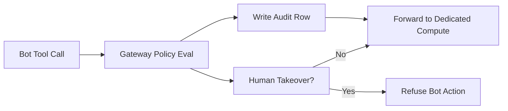

**TL;DR**

- OpenBot assigns each AI coworker a dedicated Docker container with its own browser, workspace, and tool access, gated by a fail-closed policy engine.
- The gateway routes every tool call through pre-action policy evaluation and writes an audit row before anything executes.
- Dedicated compute is not a tuning knob; it is the baseline for running autonomous agents safely at scale.

OpenBot, an MIT-licensed agent platform from CopilotKit, hit 4,654 GitHub stars in its first 25 days online [1]. Traction like that usually means a demo went viral. That is not what happened here. What made OpenBot spread is a design decision most agent frameworks ignore: every AI coworker gets its own computer. OpenBot's real contribution is not another orchestration layer: it is a production pattern that treats dedicated compute as a boundary rather than a convenience — and that changes what you can safely let an agent do (and what you cannot).

## Why Shared Compute Becomes a Liability the Moment Agents Act

Most teams run their first agent inside the same process that serves their API; same credentials; same network access. That works while agents only answer questions. It breaks the day an agent starts clicking buttons — writing files and calling external services expands the blast radius instantly.

The failure mode is what engineers call the 'agent did something unexpected' problem. Without an isolation boundary, an agent that misreads a page or hallucinates a tool call acts directly on production state. Results were never so fragile. Why tolerate that? OpenBot's answer is simple: make the sandbox the unit of deployment, not an afterthought.

> [!IMPORTANT]
> Isolation is not a security add-on you bolt on after launch. It is the property that determines whether you can hand an agent a browser at all. If you would not give a new contractor root access to production, do not give an untested agent process it either.

## One Container, One Browser, One Agent: The Dedicated Compute Model

OpenBot is a self-hosted agent platform, not a SaaS. You read or fork the MIT-licensed application code, add your own agents via an agents.yaml file, and run it on your own infrastructure [2]. The supervisor component creates, stops, resets, and lists a per-Bot computer container on demand [3].

Each Bot gets its own Docker container: a dedicated Chromium instance, a /workspace volume, and its own browser profile [3]. That last detail matters more than it sounds. A shared browser leaks state between conversations; cookies, tabs, and login sessions bleed across users and tasks.

A dedicated profile means each AI coworker starts from a clean, reproducible context every run; one agent's session cannot poison another's. For stricter requirements, computers can run under gVisor via COMPUTER_RUNTIME=runsc, adding a syscall-level sandbox on supported hosts [3]. A Bot's shell inherits only PATH, locale, terminal, and proxy variables — not the rest of the process environment — so credentials cannot leak through inherited state [3].

| Resource | Footprint | Source |
| --- | --- | --- |
| Minimum memory per deployment | 2 GB | [4] |
| Recommended for concurrent Bots | 4 GB | [4] |
| Per additional concurrent page | ~100 to 200 MB | [4] |
| Sandboxing layer | gVisor (runsc), optional | [3] |

The resource cost is modest and predictable. You need a 2 GB floor per deployment, plus roughly 100 to 200 MB per extra concurrent browser page [4]. That is cheap enough to make per-agent isolation the default rather than a luxury.

## The Gateway Is the Security Boundary, Not the Agent

Here is the architectural move that sets OpenBot apart — every tool call (browser, file, or MCP) returns to the server gateway before it touches the computer. The gateway resolves the target; it evaluates a Common Expression Language (CEL) policy; it writes an audit row; and only then does it forward the call [3]. The computer itself does not decide policy; the server gateway does.

There is no code path that acts without the record existing first. The audit row is written before the action executes; a race condition cannot skip the trail [3].

Deny rules evaluate before allow rules, and a missing or broken policy fails closed: a missing or empty policy permits nothing, and a broken deny rule denies [3]. OpenBot defaults to deny.

> [!TIP]
> Anchor your policy in denies. Write deny rules for the actions that would hurt you: file deletion, outbound email, dropping a table. Then keep allow rules narrow. An allow-only policy is one forgotten case away from a breach; a deny-anchored one is safe by default.


The gateway inverts the trust model. Instead of trusting the agent and promising to audit it later, OpenBot refuses to act until policy is satisfied and the audit row already exists. That ordering is what makes autonomy safe enough to ship.


## Audit Trails That Reconstruct What Actually Happened

A boundary is only as good as your ability to investigate after the fact. OpenBot's audit trail records permitted, refused, and failed actions, and every refusal names the rule that caused it [3]. When something goes wrong, you do not have to guess which policy fired; the trail tells you.

Each audit row records the initiator kind (person, routine, handoff, or deployment) [3]. That field lets investigators distinguish a human-driven action from an unattended scheduled run or a Bot-to-Bot handoff. In an incident, knowing the initiator changes the whole postmortem.

Secrets get careful handling. When an agent requests a secret, the audit entry records that a secret was requested or supplied and its character count, never the value [3]. Credentials are encrypted at rest with a deployment-supplied KEY_ENCRYPTION_KEY; APIs never return them; and they are redacted from audit events [3].

The pattern is deliberate: record, never reveal.

Human takeover is logged too. Events like help_requested, control_taken, and control_released become discrete audit rows. While a person drives the browser (not an agent), Bot actions are refused rather than queued [3].

No tug of war; an operator and an agent never fight over the same session.



## AG-UI Makes the Agent Framework a Swappable Detail

OpenBot is built on AG-UI, the Agent-User Interaction Protocol, which standardizes how an agent's events reach a UI or gateway. Agents built with LangGraph, Mastra, CrewAI, Pydantic AI, Google ADK, or written by hand all arrive the same way. The governance rides the protocol, never the framework [6].

This decoupling is the quiet enabler of the dedicated-compute pattern. Because the gateway and audit trail sit in front of a protocol rather than a framework, you can swap the underlying agent stack without rebuilding your safety controls.

The governance investment survives framework churn.

Bots hand work to other Bots through a typed message_bot tool, offered beside a Bot’s granted tools, so which Bots may reach which is an ordinary grant. The deployment controls chain depth through BOT_HANDOFF_MAX_DEPTH and BOT_HANDOFF_MAX_PER_RUN; both ceilings refuse, never truncate [3].

MCP servers such as Google Drive and Notion run through the same grant and policy engine; both are user-OAuth, so a Bot reaches them as the asking person and sees only what that person can see [3].

ClickHouse shipped a real example: a build-your-own analytics dashboard built on the ClickHouse MCP server and CopilotKit [8]. It is a governed tool surface attached to an agent (audit-logged, policy-gated), landing in B2B data tooling.

## Running Agents on a Schedule Without Burning Model Spend

Dedicated compute opens a second capability: routines, scheduled Bot runs you create conversationally, like 'every weekday at 9, post standup notes here' [5]. The v0.0.5 release grouped these routine and handoff features alongside SSO, Helm, and security hardening [9]. Scheduling is where autonomous agents get expensive; OpenBot puts hard guardrails around it.

A routine may fire at most every 15 minutes; a person may have at most 20 routines switched on at once [5]. Ten consecutive failures switch the routine off and post a final message saying so; nothing further fires until a person turns it back on [5]. The math is simple; these thresholds are a cost-control mechanism baked into the platform, not arbitrary limits.

Routines run from a separate worker process: a CronJob on Kubernetes, or a loop outside the single container; the Helm chart is the shape that runs the routines schedule without something outside the container [4]. That separation means a hung routine cannot take down your interactive Bot sessions, and the reverse holds too.

## From Laptop to Kubernetes: Choosing Your Deployment Shape

OpenBot scales with your isolation needs: a single Docker container runs the built app, the API, and Chromium together on one port, with an optional embedded PostgreSQL started via EMBEDDED_POSTGRES=on for a zero-dependency start [4]. That is the fastest path to trying the model.

For per-Bot dedicated computers and routine workers, you need the Kubernetes Helm chart. A cluster is the only shape that gives a Bot a computer of its own and runs the routines schedule without outside help [4]. Single-node Docker does not give the supervisor enough surface to spin up and tear down containers per Bot the way isolation demands.

The docs also call out platform notes for Google Cloud Run, AWS Fargate, and Azure Container Apps [4]. CopilotKit itself raised a $27M Series A led by Glilot Capital, NFX, and SignalFire to push this category further [7]. Treat it as a signal: dedicated compute is infrastructure now, not a feature.

| Deployment mode | Use case | Per-Bot computers |
| --- | --- | --- |
| Docker Compose + Bun | First boot, single user | No |
| Single container + embedded PostgreSQL | Self-host trial | No |
| Kubernetes Helm chart | Multi-Bot production | Yes |

## Lessons for Teams Putting Browsers in Front of LLMs

The pattern behind OpenBot generalizes to any team that wants to let an agent act rather than just answer. What should you copy? Three lessons stand out.

First, shared compute between agents is a liability, so isolation is the baseline. Each agent owns a container, a browser profile, and a filesystem, and its shell inherits only a few harmless variables instead of the full deployment environment [3]. This is the coworker model in practice: one computer per Bot, treated as its own workspace [10]. Multiple Bots coexist in one deployment without bumping into each other (each in its own container).

Second, an audit-first architecture changes how you debug incidents. When the audit row exists before the action, and every refusal names its rule, you reconstruct a failure from the record instead of from memory or guesswork [3]. The initiator field (person, routine, handoff, or deployment) is already what a good postmortem needs up front.

Third, CEL policies scale better than hardcoded allow-lists as your tool surface grows. One expression language covers tool names, page URLs, file paths, and MCP context; it fails closed when anything is missing [3]. Add a new tool? Write a rule, not a whitelist buried deep in the action handler.

## Practical Takeaways

1. Put a policy gate in front of every agent tool call, with deny rules evaluating before allow rules and a fail-closed default.
2. Give each autonomous agent its own container, browser profile, and filesystem instead of sharing process state with other agents.
3. Write the audit row before the action executes, and record the initiator kind (person, routine, handoff, deployment) for postmortems.
4. Decouple your agent framework behind a protocol like AG-UI so your governance investment survives framework swaps.
5. Cap scheduled agent runs with firing floors, enabled limits, and auto-disable-on-failure to prevent runaway model spend.

## Conclusion

Do not bolt isolation on after an incident. Gate every tool call behind a policy and an audit write before anything acts, and give each coworker its own container from day one. The open question worth tracking is cost at density: a 2 GB per-deployment floor is trivial for a few Bots, but heavy multi-tenancy will test whether the Chromium layer can be shared without sacrificing the isolation that makes the pattern safe. If you are about to put a browser and a filesystem in front of an LLM, design the perimeter before you write the first prompt.

## Frequently Asked Questions

### Do I need Kubernetes to run OpenBot?

Not to start. A single Docker container bundles the app, API, and Chromium, with optional embedded PostgreSQL [4]. You need the Helm chart only for per-Bot computers and routine workers.

### How does OpenBot prevent an agent from doing something harmful?

Every tool call passes through the gateway, which evaluates a CEL policy and fails closed on any missing rule. Nothing runs before an audit row exists [3].

### Does a Bot see my credentials when it runs?

No. A Bot's shell inherits only PATH, locale, terminal, and proxy variables, not the full process environment [3]. Credentials are encrypted at rest with a deployment-supplied key, never returned by APIs, and redacted from audit events, which record only the length, never the value [3]. The full risk model is covered in the gateway section above.

### Can I swap my agent framework without rebuilding governance?

Yes, and this is the main reason AG-UI matters. Agents built with LangGraph, Mastra, CrewAI, Pydantic AI, Google ADK, or by hand all arrive the same way, so governance rides the protocol rather than the framework [6]. Your isolation and audit investment survives a framework migration, which is where most teams lose their safety work when they re-platform.

### What happens if a scheduled routine keeps failing?

Ten consecutive failures switch the routine off and post a final message saying so, so nothing further fires until a person turns it back on [5]. The docs also enforce a 15-minute firing floor and a cap of 20 enabled routines per person [5]. We do not yet have production data on how often teams hit the auto-disable, so treat those thresholds as the vendor's defaults rather than measured norms.

---

## Sources

| # | Publisher | Title | URL | Date | Type |
| --- | --- | --- | --- | --- | --- |
| 1 | CopilotKit | "OpenBot GitHub Repository" | https://github.com/CopilotKit/OpenBot | 2026-09-11 | Documentation |
| 2 | CopilotKit | "OpenBot Product Page" | https://www.copilotkit.ai/openbot | 2026-09-11 | Documentation |
| 3 | CopilotKit | "OpenBot Architecture Documentation" | https://github.com/CopilotKit/OpenBot/blob/main/docs/architecture.md | 2026-09-11 | Documentation |
| 4 | CopilotKit | "OpenBot Deployment Documentation" | https://github.com/CopilotKit/OpenBot/blob/main/docs/deployment.md | 2026-09-11 | Documentation |
| 5 | CopilotKit | "OpenBot Routines Documentation" | https://github.com/CopilotKit/OpenBot/blob/main/docs/routines.md | 2026-09-11 | Documentation |
| 6 | AG-UI Protocol | "AG-UI: The Agent-User Interaction Protocol" | https://github.com/ag-ui-protocol/ag-ui | 2026-09-11 | Documentation |
| 7 | TechCrunch | "CopilotKit raises $27M to help devs deploy app-native AI agents" | https://techcrunch.com/2026/05/05/copilotkit-raises-27m-to-help-devs-deploy-app-native-ai-agents/ | 2026-05-05 | News |
| 8 | ClickHouse | "Building an agentic app with ClickHouse MCP and CopilotKit" | https://clickhouse.com/blog/building-an-agentic-application-with-clickhouse-mcp-server-and-copilotkit | 2025-06-12 | Blog |
| 9 | CopilotKit Blog | "OpenBot Updates v0.0.5" | https://www.copilotkit.ai/blog/openbot-updates-v0.0.5 | 2026-08-28 | Blog |
| 10 | CopilotKit | "OpenBot Coworkers Documentation" | https://github.com/CopilotKit/OpenBot/blob/main/docs/coworkers.md | 2026-09-11 | Documentation |

## Image Credits

- **Cover photo**: Image generated with gpt-5.4-image-2 (Agents' Codex AI illustration)
- **Figure 1**: Image generated with gpt-5.4-image-2 (Agents' Codex AI illustration)
