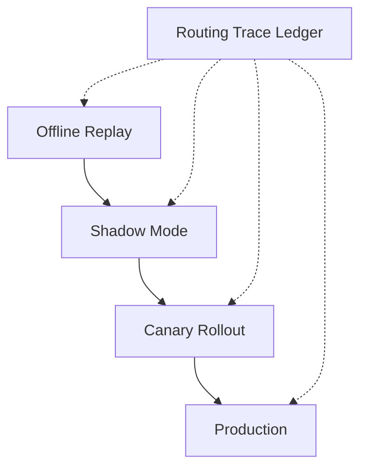

**TL;DR**

- Sprix SAGE Router adds checkpoint-aware routing on top of the A2A protocol, cutting wasted work by 43% versus a progress-masked baseline.
- Three decision modes (SELF, COLLABORATE, and HANDOFF) pick the cheapest continuer based on completed work, artifact portability, and contextual trust.
- Contextual trust (requirement-conditioned posteriors) reaches a Brier score of 0.0125 versus 0.0355 for naive reputation.

Most multi-agent stacks treat routing as a pre-execution step: discover agents, form a team, run; the A2A protocol, now a Linux Foundation project with 25,831 GitHub stars, hands you discovery and JSON-RPC transport, then stops [2]. When a task runs long and a specialist stalls, the stack cannot answer one question: who takes over? Sprix SAGE Router fills exactly that gap, adding checkpoint-aware SELF, COLLABORATE, and HANDOFF decisions against a live model of completed work. The real value of A2A routing is not transport; it is knowing which agent should keep working once the DAG is already half-done.

## The Routing Gap: Why A2A Discovery Isn't Enough

The A2A protocol, maintained by Google under the Linux Foundation, standardizes agent discovery and JSON-RPC 2.0 communication through Agent Cards [2]; that part works. What the protocol does not provide is a decision layer; once an agent is running, A2A holds no opinion about whether the incumbent should continue, recruit help, or hand the task to someone better suited. Should it? Nobody specified.

Static coalition formation shares this blind spot: frameworks like AutoGen model multi-agent conversation, and research systems such as DyLAN and GPTSwarm optimize team composition before anything runs [6]. None of them reconfigure mid-task with an explicit model of what has already been finished; that pre-execution decision is where the failure modes hide on long, multi-requirement jobs, and they are not subtle when they surface.

Consider a feature build that moves from planner to coder; if the coder stalls halfway through, a discovery-only stack either waits or blindly re-dispatches. It cannot tell whether the half-written code is portable to another agent, nor whether restarting means paying for completed requirements a second time [3]. Portability, not progress, is the missing signal: SAGE's premise is that these calls belong to execution state, not static metadata.

> [!NOTE]
> SAGE is a policy layer, not a transport. It assumes A2A handles discovery and messaging, then adds routing decisions on top.

## Three Routing Modes That Decide Who Keeps Working

Every routing decision is weighed against the same objective, then committed to one of three modes [1]. SELF means the incumbent continues: its capability and context already cover the remaining work. COLLABORATE recruits peers while the incumbent keeps ownership. HANDOFF transfers ownership outright when a specialist's edge outweighs the rework cost of migration: the specialist advantage, minus the transfer loss.

Because the three modes share one auditable objective, the choice is a comparison rather than a heuristic; what differs is assumed carry-forward. When ownership stays with the incumbent, completed artifacts count in full; when it transfers, a portability factor discounts how much of that work survives the handoff [1]. (The discount is the whole trick.)

| Mode | Ownership | When it wins | Key cost |
| --- | --- | --- | --- |
| SELF | Incumbent keeps | Context and capability are enough | No rework, accepts stall risk |
| COLLABORATE | Incumbent keeps | Needs help, can delegate | Coordination overhead |
| HANDOFF | Transfers to peer | Specialist edge exceeds transfer loss | Partial rework from portability |



## Checkpoint-Aware State: The Difference Between Progress and Position

SAGE's ExecutionState tracks active agents, active assignments, completed requirements, and in-flight requirements with their progress and quality metrics [3]; it also records per-artifact transferability. This is what lets the router distinguish a checkpoint from a vague progress bar: coarse progress says the task is 60% done, while checkpoint-aware state says which nodes are done and whether their output can move.

Artifact reuse is the mechanism that prevents double-charging. When the owner keeps an artifact, reuse equals the completed fraction alone; when ownership changes, reuse equals that fraction multiplied by a transferability term, reflecting the risk the next agent redoes part of the work (a portability discount) [4]. Without this discount, every handoff would look ruinously expensive and the router would almost never delegate.

The upshot is a continuation-cost projection per candidate, built from what is finished, what is in flight, observed quality, and whether artifacts survive a transfer; that projection feeds the utility comparison across all three modes.

```python
# Pseudocode: reusing completed artifacts to project continuation cost
reuse = completed_fraction                   # owner retained
if ownership_changes:
    reuse = completed_fraction * transferability  # discount for migration
expected_redo = 1.0 - reuse
candidate_cost = expected_redo * redo_unit_cost + handoff_friction
```

## Ranking Routes: The Utility Function That Makes Handoffs Safe

Behind the three modes sits a constrained utility function: it weighs predicted success probability against cost, latency, risk, handoff friction, and an exploration bonus [1]. That last term matters more than it appears to; it lets SAGE occasionally try a less-certain route to gather evidence instead of always exploiting the incumbent.

This is what separates SAGE from RouteLLM, which routes between strong and weak models before execution begins [6]; a mid-task, artifact-aware comparison is the whole point. RouteLLM has no notion of a half-finished DAG; SAGE's utility calculation is built around one.


A routing decision is only as good as its cost model. SAGE's reuse and transferability terms are what make HANDOFF economically sane; without them, the math always favors the incumbent.


## Contextual Trust: Why Global Reputation Misleads Specialist Routing

SAGE keeps two reliability posteriors per agent: a global one and one conditioned on the specific requirement [4]. It blends them at 35/65, favoring the requirement-conditioned estimate; the logic is simple: an agent that nails code generation should not inherit credit for schema design just because it shares an identity.

The benchmark makes the case: after 500 observations in a heterogeneous specialist scenario, requirement-conditioned trust hit a Brier score of 0.0125 ± 0.0018, versus 0.0355 ± 0.0008 for a single-reputation model [1]. Lower is better; the conditional model is far less confident in domains where the agent has no track record.

Beta belief updates and Thompson-style exploration sit under those posteriors; the result is a router that separates a generally reliable agent from one reliable for this exact requirement: the specialist distinction an A2A network lives or dies on. That distinction is precisely what a specialist-heavy A2A network needs.



## Benchmarked: What State-Aware Routing Actually Wins

SAGE's numbers come from controlled trajectory replay across 1,000 checkpoints over five seeds [1]. Progress-aware SAGE scored 0.298 utility versus 0.085 for always-continue, a 3.5x gap. Against always-handoff it scored 0.298 versus 0.290; the margin is thin, but SAGE wins it while doing far less wasted work.

Wasted work is the more interesting number for production: SAGE cut it to 0.059 versus 0.104 for progress-masked SAGE and 0.130 for always-handoff, a 43% reduction versus progress-masked SAGE [1]. Deadline misses run the same direction: 23.3% for SAGE, against 34.4% for always-continue and 30.5% for always-handoff; only the hidden-state oracle, at 19.6%, beat it.

| Policy | Utility | Wasted work | Deadline miss rate |
| --- | --- | --- | --- |
| Always-continue | 0.085 | n/a | 34.4% |
| Always-handoff | 0.290 | 0.130 | 30.5% |
| SAGE (progress-aware) | 0.298 | 0.059 | 23.3% |
| Hidden-state oracle | 0.375 | n/a | 19.6% |

> [!WARNING]
> These benchmarks replay recorded trajectories, not live traffic. Treat the 43% wasted-work reduction as proof the approach works, not a guarantee your workload sees the same figure.

## Production Integration: The Parts SAGE Deliberately Leaves Out

SAGE's sprix_a2a.py adapter converts A2A Agent Card declarations into normalized SAGE profiles [3]; that normalization exists because Agent Cards carry marketing text; SAGE wants locally calibrated capability scores instead of trusting whatever a card advertises. You calibrate those scores yourself, from real execution evidence.

For production you supply what SAGE does not: authenticated endpoint discovery, secure transport, and message lifecycle management [5]. Independent artifact evaluation must live outside the routing decision, so one buggy evaluator cannot poison both the score and the route; if you want a vector store for artifact embeddings during evaluation, [Pinecone](https://try.pinecone.io/tz9zm84oj8g3?utm_source=agentscodex&utm_medium=blog&utm_campaign=2026-09-18-state-aware-a2a-routing-sprix-sage-router) can hold that state. It is an evaluation concern, not a routing one.

The integration flow runs discovery, evidence, routing, dispatch, then evaluation [5]; routing sits in the middle, consuming state but never inventing it. That clean separation is what lets SAGE layer onto an existing A2A deployment without replacing your transport.

## Operational Safety: Permissions, Audit Trails, and Rollout Gates

SAGE filters by permission before ranking, removing unauthorized agents from the candidate set entirely [5]; every routing decision writes a RoutingTrace: an auditable record of why a given continuer was chosen. State persistence uses encryption and versioned snapshots; a degraded router rolls back to a known-good belief store.

The recommended rollout is deliberately conservative: offline replay, then shadow mode, then canary, then full production [5]. The ordering exists because trust posteriors are learned, not authored; a router with no history is just a well-meaning guess, no better than random assignment. A fresh deployment starts with uninformative beliefs and needs observed execution before its routing opinions deserve real weight.



## Where SAGE Stops: The Research Boundary Worth Respecting

SAGE is explicit about its own scope: it handles checkpoint-aware reconfiguration, not coalition optimality [6]. That boundary matters; the literature it sits beside (DyLAN, GPTSwarm, AFlow) forms and optimizes teams before execution, while SAGE reconfigures after it has already begun.

The project has attracted 3,690 GitHub stars since its August 2026 start [1]; it is not angling to be a better team-formation algorithm; it answers the question every discovery-only stack leaves open: given that a task is half done, who should finish it?

## Practical Takeaways

1. Treat routing as a runtime decision, not a pre-execution one. If your handoffs today depend on static Agent Cards, you are missing the state that makes them cheap.
2. Track per-artifact transferability, not just completion percentage. A half-finished node that cannot migrate is worth less than its fraction suggests.
3. Maintain requirement-conditioned trust, not a single global reputation. Blending 65% conditional keeps an agent's success in one domain from spilling into others.
4. Keep artifact evaluation separate from routing. An evaluator that feeds both the score and the route becomes a single point of silent failure.
5. Adopt the rollout gate order: offline replay, shadow, canary, production. Trust posteriors need real execution data before they earn production authority.

## Conclusion

Credit assignment is still the open problem: SAGE learns from outcomes today, but nobody can yet say which mid-task swap saved the run. Instrument checkpoints and artifact portability in your current pipeline first; those two inputs tell you whether the whole approach pays for itself at all. Then measure the rework you incur, and let your own number (not a vendor replay) show when handing work across beats the migration cost [1][3].

*This post may contain affiliate links. We may earn a small commission if you sign up through our links, at no extra cost to you.*

## Frequently Asked Questions

### How is SAGE different from RouteLLM?

RouteLLM routes between strong and weak models before a task starts, optimizing cost and quality up front [6]. SAGE decides during execution, after some requirements are already complete, and folds artifact-reuse and transferability into its cost projections.

### Do I have to replace A2A to use SAGE?

No. SAGE sits above A2A as a policy layer, not a transport replacement; keep A2A for discovery and JSON-RPC messaging, and let SAGE add the routing decision on top [5].

### Why does SAGE use two trust posteriors instead of one?

A single global reputation lets success in one domain leak into unrelated ones, so SAGE conditions reliability on the specific requirement instead. It blends the two estimates at 35% global and 65% conditional, which measurably improves calibration on specialized workloads [4]. The result is a router that can tell the difference between an agent that is generally solid and one that is solid for this exact task; that distinction is precisely why the conditional model posts a better Brier score after a few hundred observations.

### What happens if my artifact evaluator is wrong?

That is the risk SAGE's separation of concerns guards against. Artifact evaluation sits outside the routing decision, so one bad evaluator scores the artifact but does not poison the route [5]. A weak evaluator still degrades your state, though; see the production integration section above.

### Is the 43% wasted-work reduction a production number?

No. It comes from controlled trajectory replay over 1,000 checkpoints, not live traffic [1]. We do not yet have clean production-scale data on how that generalizes to a specific request mix, so treat the figure as directional rather than a deployment guarantee.

---

## Sources

| # | Publisher | Title | URL | Date | Type |
| --- | --- | --- | --- | --- | --- |
| 1 | Sprix AI | "Sprix SAGE Router GitHub Repository" | https://github.com/wang2122/sprix-sage-router | 2026-09-15 | Documentation |
| 2 | A2A Project (Linux Foundation) | "Agent2Agent (A2A) Protocol GitHub Repository" | https://github.com/a2aproject/A2A | 2026-09-18 | Documentation |
| 3 | Sprix AI | "SAGE A2A Integration Guide" | https://github.com/wang2122/sprix-sage-router/blob/main/docs/INTEGRATION.md | 2026-09-15 | Documentation |
| 4 | Sprix AI | "SAGE Checkpoint-Aware Algorithm Design" | https://github.com/wang2122/sprix-sage-router/blob/main/ALGORITHM.md | 2026-09-15 | Paper |
| 5 | Sprix AI | "SAGE Operations and Production-Readiness Guide" | https://github.com/wang2122/sprix-sage-router/blob/main/docs/OPERATIONS.md | 2026-09-15 | Documentation |
| 6 | Sprix AI | "SAGE Related Work and Research Boundary" | https://github.com/wang2122/sprix-sage-router/blob/main/RELATED_WORK.md | 2026-09-15 | Paper |
