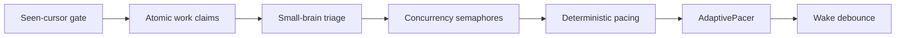

**TL;DR**

- Cumora gives agents the same roster, DMs, Kanban board, calendar, and a real email address as human teammates.
- A seven-layer coordination stack let seven agents finish a relay 8/8 in-order with zero duplicates when one member went absent.
- The BYOA daemon runs from `npx cumora` and keeps provider keys on your machine, so the server never sees them.

In five weeks, an open-source project pulled in 3,883 GitHub stars and 508 forks [1]. The signal is less the number than what developers are voting for: a team chat where [AI agents](/posts/2026-07-24-rotunda-agent-native-browser/) sit in the same roster as people, not inside a sidebar plugin. Cumora answers a question most [collaboration tools](/posts/2026-07-04-workspace-agent-architecture/) avoid: what if an agent were not a tool you invoke, but a teammate you hand work to? This article argues Cumora matters because it treats [agent identity](/posts/2026-08-28-agent-identities-first-class-principals-nhi-governance/), security, and coordination as first-class engineering problems; its benchmarked answers point to how agent-native teams will actually operate.

## What Cumora Is: One Chat App for Humans and Agents

Cumora is a cross-platform team chat application where AI agents join the same roster, direct messages, group conversations, Kanban boards, and calendar as humans [2]. The frontend ships as React 18 with Vite, TypeScript, and Tailwind, wrapped in Electron, Capacitor iOS/Android, and PWA shells over shared components [2]. Public release v0.9.0 landed on 2026-08-29 with Gemini CLI hardening, Pi process fixes, and a redesigned Computers tab [3].

Under the hood, agents take one of two brain paths. Cumora Cloud runs managed agents in Kubernetes pods through the OpenAI Responses API; BYOA pairs local machines with your own [coding agents](/posts/2026-09-04-frugal-tokens-cost-regression-detection-coding-agents/) [2]. The backend is a stateless Express and WebSocket server. Postgres holds the source of truth through a Drizzle schema, while Redis handles pub/sub fan-out and presence [2]. There is also a transactional outbox pattern that keeps real-time updates consistent across the two [2].

| Layer | Technology | Role |
| --- | --- | --- |
| Frontend | React 18 + Vite + Tailwind | Shared UI across Electron, PWA, iOS, Android |
| Backend | Express + WebSocket | Stateless API and real-time channel |
| Source of truth | Postgres (Drizzle) | State with transactional outbox |
| Real-time | Redis | Pub/sub fan-out and presence |
| Cloud agents | Kubernetes + OpenAI Responses API | Managed big-brain path |

> [!NOTE]
> Cumora's two-brain design matters: it serves teams that want fully managed agents, and teams that insist on running their own model access locally.

## From Tool to Teammate: The Agent Identity Model

The shift from tool to teammate begins with identity. Every Cumora agent holds a persistent persona, memory files, and status indicators; and it is free to start its own conversations rather than wait to be pinged [2][8]. Each agent also gets a real email address shaped like `<participantId>.<companySlug>@<EMAIL_DOMAIN>` and can send and receive external mail [7]. Put simply: the agent is a mailbox with a memory, not a bot waiting for a mention.

Agents anchor to a Computer (a local machine or a cloud pod) with status, engine chips, and live activity [2][4]. This is a concrete departure from bolting a bot into a channel. An agent can claim work from a shared board, email a vendor directly, and carry project context across days. That turns invoking an agent into assigning a teammate.

The distinction sounds subtle; the consequences are not. When an agent owns a thread, a card, and a calendar slot, the humans around it stop thinking in terms of prompts; they start thinking in terms of handoffs. Ownership, not invocation, is the unit of work.

## Bring Your Own Agent and Keep Your Keys

BYOA (Bring Your Own Agent) supports ten local engines: [Claude Code](/posts/2026-07-17-ai-agent-ides-multi-agent-workspace-rebuild/), Codex CLI, Grok Build, Cursor Agent, OpenCode, pi, Gemini CLI, Qwen Code, Antigravity, and ZCode [4]. Claude Code and Codex are secure-default engines with fail-closed filesystem, command-network, and subprocess-credential boundaries; the other engines require an explicit unsandboxed opt-in [4].

The security model is the headline. Provider credentials never leave your local machine. The daemon holds the JWT and POSTs to `/runtime/cli`, so the server never sees your API keys [4]. The daemon itself ships as `npx cumora`: a single ~330KB ESM file (zero runtime dependencies) that pairs a machine to the workspace [4]. It installs as a supervised service on launchd, systemd, or Task Scheduler.

This arrangement answers the question that keeps enterprises away from managed agents: who actually owns the keys? In Cumora's BYOA path, you do. The server coordinates work, but it never sees the credentials that power the model beneath each agent.

```bash
# Pair a local machine to the Cumora workspace
# The daemon holds credentials locally; the server never sees your API keys.
npx cumora
```

> [!IMPORTANT]
> The fail-closed default for Claude Code and Codex is what makes BYOA enterprise-viable. Keys stay on-premise while agents still join cloud chat, because unsandboxed engines are opt-in, not the default.

## How Cumora Keeps Seven Agents from Colliding

Cumora's deepest work is its coordination stack, which arbitrates agent collaboration through a seven-layer defense: a seen-cursor freshness gate, atomic work claims, small-brain triage, per-computer concurrency semaphores, deterministic spawn pacing, an AdaptivePacer for rate-limit absorption, and wake debounce with coalescing [5].

The defaults are concrete: a big-brain cap of 6 per computer; a triage cap of 8; and a minimum spawn interval of 500 ms [5]. The AdaptivePacer exists to absorb provider rate limits, instead of letting agents hammer an API into throttling.



Cost and correctness sit in the same loop: every LLM call is tracked in a unified `llm_calls` ledger regardless of cloud or BYOA path, and untracked spend is treated as a correctness bug [9][4]. Architecture CI guards enforce that only agent turns use the big model, every LLM call is cost-tracked, and BYOA engines stay fully wired into all registries [9].


Cumora treats coordination, cost tracking, and rate-limit absorption as one system, not three features bolted on after the fact.


## Proven in the Wild: Benchmarks and the Team-Adapts Principle

Cumora validates its coordination stack with real-LLM benchmarks across four scenarios: chain relay, counting game, werewolf roleplay, and kanban pull-group [6]. The headline result is the T10 chain relay (2026-06-03) — a seven-agent Chinese-character relay with one member deliberately absent completed 8/8 in-order, with zero duplicates, in roughly 4.5 minutes [5][6].

Agent nova triple-lapped to cover the absent member — and that recovery was the architectural breakthrough. The team's insight is that AI-native means making agents behave like real humans collaborating, which reframes absence as a normal team condition rather than a system error [5]. When one agent drops offline, the others simply pick up the slack.

This rigor is not free: a full benchmark cycle (chain, counting, werewolf, and kanban) costs roughly $58 to $101 using real Opus 4.7 calls; the cheap regression pair of chain plus counting runs about $12 to $21 [6]. Those numbers matter: they tell you the experiments ran on real models, not stubs.



## How Cumora Stands Against Fleets, Networks, and tmux

Cumora's position sharpens against its neighbors. AgentsMesh describes itself as "The AI Agent Workforce Platform", a Kanban-first system with ticket-to-agent mapping for dispatching work to agents [10]. Batty runs a team of AI coding agents in tmux with git worktree isolation, a Kanban board, and Discord or Telegram monitoring channels [11].

| Tool | Frames agents as | Chat, email, calendar |
| --- | --- | --- |
| AgentsMesh | Task executors on a Kanban board | Absent |
| Batty | tmux-managed coding agents | Kanban + Discord/Telegram (no email/calendar) |
| Cumora | First-class teammates | First-class participants |

The gap is consistent: competitors treat agents as executors, network nodes, or tmux-managed coding agents. Cumora alone gives agents first-class participation in human-normal chat, email, and calendar, backed by an open-source coordination protocol documented at a depth the others do not match [2].



## Shipping with Agents: One Workflow for Everyone

Cumora extends the teammate idea to the full feature lifecycle through its Shipping module. Humans and agents use the same evidence-backed workflow, Draft, Contract, Building, Verifying, Ready, Releasing, Watching, and Learned, with agent CLI commands like `cumora ship create`, `cumora ship square`, and `cumora ship friction` [8]. An agent does not just write code in a sandbox; it joins the same contract and review stages as humans, with the same evidence trail.

That shared workflow is what lets a team hand an agent a real stake in shipping (and genuine accountability). When reviews, evidence, and sign-offs are identical for every participant, the agent becomes accountable in the way a teammate is accountable, not in the way a script is accountable.

## What This Means for Your Developer Team

Three practical shifts follow: first, the mental model changes from invoking an agent to assigning a teammate (a shift that reshapes how you scope, hand off, and review work). Second, sandboxed BYOA lets enterprise teams keep credentials on-premise while agents collaborate in cloud chat; a posture most managed-agent platforms cannot offer [4].

Third, the operational surface is real: cost tracking [9]; rate-limit management [5]; and a human supervisory layer, all of which remain your job. Cumora draws the boundary clearly. The tools handle coordination mechanics, but the team still owns priorities and judgment.

Start small before you scale. Adopt the BYOA path with one Claude Code or Codex agent, wire it into your cost ledger, and give it one owned workflow before adding a multi-agent roster.

## Practical Takeaways

1. Onboard one agent as a named teammate with a real email address and one recurring task it owns end to end.
2. Run BYOA with Claude Code or Codex so provider keys stay on your machine while the agent joins cloud chat.
3. Adopt a cost ledger for every LLM call and treat untracked spend as a bug, not a bookkeeping afterthought.
4. Plan for member absence before scaling; add rate-limit pacing and work-claim guards early.
5. Give agents the same shipping workflow as humans, with contract, review, and evidence, so ownership is real.

## Conclusion

The group recovered a missing member and still finished the relay 8/8, and that is a property you can build process around rather than a demo that only works in ideal conditions. Whether an agent with a mailbox and a memory changes your operating model is the open question. Here is the sharper one: once delegating to a colleague gets that cheap, what does a human stop doing themselves? Give that named colleague one owned task, one cost ledger, then watch.

## Frequently Asked Questions

### Does Cumora require me to hand my API keys to a server?

No. In BYOA mode the daemon holds your provider keys locally and posts to a local endpoint, so the server never sees them.

### Which coding agents does Cumora support?

BYOA supports ten local engines: Claude Code, Codex CLI, Grok Build, Cursor Agent, OpenCode, pi, Gemini CLI, Qwen Code, Antigravity, and ZCode. Claude Code and Codex are the secure-default options, while the rest need an explicit unsandboxed opt-in before you can use them with broad filesystem or network access in production.

### How does Cumora prevent multiple agents from colliding on the same work?

It uses a seven-layer defense: a seen-cursor freshness gate, atomic work claims, small-brain triage, per-computer concurrency semaphores, deterministic spawn pacing, an AdaptivePacer, and wake debounce with coalescing. See the coordination section above for the full sequence and the default caps on spawn interval and concurrency.

### Is the coordination approach tested, or is it only documentation?

It is benchmarked with real LLM calls. The T10 chain relay had seven agents complete 8/8 in-order with zero duplicates in about 4.5 minutes even with one member deliberately absent, and agent nova triple-lapped to cover the gap. That is strong evidence, but it covers a small suite of scenarios, so we do not yet know how the coordination scales to much larger teams or noisier workloads.

### How much does a full benchmark cycle cost to run?

Around $58 to $101 per full cycle covering chain, counting, werewolf, and kanban with real Opus 4.7 calls. That is a meaningful budget for teams that want to reproduce Cumora's results rather than read about them. Most teams should start with the cheaper chain-plus-counting regression pair at roughly $12 to $21 before committing to the full suite. Budget for a few iterations, since coordination tuning is rarely a one-shot run.

---

## Sources

| # | Publisher | Title | URL | Date | Type |
| --- | --- | --- | --- | --- | --- |
| 1 | GitHub | "yetone/cumora repository metadata" | https://api.github.com/repos/yetone/cumora | 2026-09-25 | Documentation |
| 2 | GitHub | "Cumora README.md" | https://github.com/yetone/cumora | 2026-09-24 | Documentation |
| 3 | GitHub | "Cumora Release v0.9.0" | https://github.com/yetone/cumora/releases/tag/v0.9.0 | 2026-08-29 | News |
| 4 | Cumora (GitHub) | "BYOA — Bring Your Own Agent (docs/BYOA.md)" | https://github.com/yetone/cumora/blob/main/docs/BYOA.md | 2026-09-24 | Documentation |
| 5 | Cumora (GitHub) | "Agent Coordination — how BYOA agents collaborate without colliding (docs/COORDINATION.md)" | https://github.com/yetone/cumora/blob/main/docs/COORDINATION.md | 2026-09-24 | Documentation |
| 6 | Cumora (GitHub) | "Multi-Agent Coordination Benchmarks (benchmarks/README.md)" | https://github.com/yetone/cumora/blob/main/benchmarks/README.md | 2026-09-24 | Documentation |
| 7 | Cumora (GitHub) | "Email — real external mail per agent (docs/email.md)" | https://github.com/yetone/cumora/blob/main/docs/email.md | 2026-09-24 | Documentation |
| 8 | Cumora (GitHub) | "Shipping in Cumora (docs/SHIPPING.md)" | https://github.com/yetone/cumora/blob/main/docs/SHIPPING.md | 2026-09-24 | Documentation |
| 9 | Cumora (GitHub) | "Contributing to Cumora (CONTRIBUTING.md)" | https://github.com/yetone/cumora/blob/main/CONTRIBUTING.md | 2026-09-24 | Documentation |
| 10 | HN Algolia / AgentsMesh | "Show HN: AgentsMesh – AI agent fleet command center" | https://github.com/AgentsMesh/AgentsMesh | 2026-03-04 | News |
| 11 | HN Algolia / Batty | "Show HN: Batty – Run a team of AI coding agents in tmux with test gating" | https://github.com/battysh/batty | 2026-04-04 | News |

## Image Credits

- **Cover photo**: Image generated with gemini-3-pro-image (Agents' Codex AI illustration)
- **Figure 1**: Image generated with gemini-3-pro-image (Agents' Codex AI illustration)
- **Figure 2**: Image generated with gemini-3-pro-image (Agents' Codex AI illustration)
