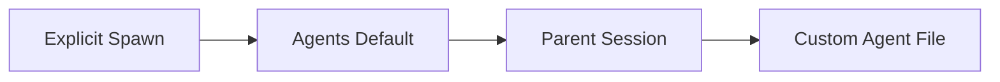

**TL;DR**

- No format has won: Codex layers TOML manifests, SKILL.md and AGENTS.md ship Markdown instructions, Conductor declares YAML workflows, and A2A skips manifests via Agent Cards.
- Codex resolves a setting as explicit spawn, then the [agents] default, then the parent session, and an agent file changes only the fields it sets.
- Pick by the property you cannot lose: enforceability for structured files, iteration speed for Markdown, interoperability for protocol discovery.

Picture this as an illustration, not a survey: two teams building the same agent can end up with three different configuration files. One writes TOML into a .codex/agents/ directory. Another drops instructions into a SKILL.md file (plain Markdown, nothing to compile) and trusts the runtime to honor them. A third declares the whole workflow in YAML and never lets the model decide what runs next. This fragmentation is not a passing phase; it is the field deciding how much structure an agent deserves. Declarative agent configuration has split into four competing models, and none has won. We argue the split forces one question before you write a single line: which property can you not afford to lose? Most teams answer it wrong — they pick the format they recognize instead of the one their workload actually needs.

## How Declarative Agent Configuration Split Into Four Models

Each model claims a different slice of the problem. Structured manifests such as Codex TOML or Conductor YAML buy enforceability: the parser rejects a file the moment a key is wrong. Markdown instructions trade that validation for writability. Protocol discovery refuses to define behavior at all, and a code-first approach argues the extra abstraction is rarely worth it.

The split is recent and still accelerating: OpenAI's Codex defines custom agents in standalone TOML files [1][2]. Microsoft shipped Conductor in May 2026 for deterministic YAML orchestration [3]; Anthropic has argued for code over heavier frameworks since December 2024 [4]. Google's A2A protocol connects all of these without standardizing any single configuration format [5].

Put another way, the ecosystems disagree on what configuration even means: Codex treats it as a per-agent manifest, Conductor as a whole workflow, A2A as a handshake, and Anthropic as a few lines of code — a different unit of configuration altogether [4]. Choosing a stack means choosing the definition you will actually live with.



## How Codex Layers Configuration Instead of Duplicating It

Codex custom agents live in standalone TOML files, under .codex/agents/ for project-scoped agents or ~/.codex/agents/ for personal ones [1][2]. Every file defines name, description, and developer_instructions — everything else is an override [1]. You can add model, sandbox_mode, mcp_servers, and skills.config to change runtime behavior or attach tooling [1].

The real design choice is how Codex resolves conflicts. Each file is not a complete self-contained manifest — it is a layer. Codex resolves a setting from an explicit spawn value, then the matching [agents] default in config.toml, then the parent session, and only then the custom agent file [1]. An agent file that sets only model leaves the previously resolved reasoning effort untouched [2].

```toml
# .codex/agents/reviewer.toml
name = "reviewer"
description = "Reviews pull requests for correctness and style"
developer_instructions = "Flag hidden coupling and unsafe refactors."
```

Because only the fields a file sets actually change, everything else falls through to the parent. Settings such as sandbox_mode, mcp_servers, and skills.config inherit from the parent session when a custom agent file omits them [1]. You write the delta, not the duplicate — and a smaller file tends to mean fewer merge conflicts. Fewer surprises.



> [!TIP]
> Keep model overrides in the agent file but leave sandbox and tool settings in the parent. One change to the parent then propagates to every agent instead of being copied into each TOML file.

Codex ships three built-in agents: default (a general-purpose fallback), worker (execution-focused), and explorer (read-heavy) [1]. A custom agent whose name matches a built-in, such as explorer, takes precedence over it [1]. A PR review pipeline split across three custom agents, pr_explorer, reviewer, and docs_researcher, each with its own model and MCP server settings, is one documented pattern [1]. Adoption is moving fast too: the Codex CLI repository passed 127,805 GitHub stars by early October 2026 [6].

## How SKILL.md and AGENTS.md Turn Instructions Into Delegation

Markdown becomes a control surface the moment a runtime treats it as one; the shift is quieter than it sounds. Codex supports AGENTS.md and skill instructions as delegation triggers, not just as documentation: current releases delegate when you ask directly, or when an applicable AGENTS.md or skill instruction requests it [1]. The CLI, the IDE, and the desktop app all honor those requests [1][6].

That writability is the whole appeal: a human edits a file they already understand (and already have open in their editor), agent behavior changes, and there is no new syntax to learn. For teams iterating prompts daily, the trade is worth it. For teams that must audit exactly what an agent is allowed to do, the trade runs the other way. A structured manifest rejects a bad file the moment a key is wrong. Markdown leaves that check to your review process.

The point worth internalizing is what Markdown triggers, not what it stores. An AGENTS.md file or a skill instruction does not merely describe behavior; it can request that work be handed to a subagent [1]. That turn, from prose to request, blurs the line between documentation and configuration.

For a codebase where reviews keep missing the same category of bug, a skill instruction can route the diff to a dedicated reviewer agent without the developer changing how they call the tool [1]. The file, not the invocation, carries the routing decision.

## How Conductor Routes YAML Workflows Without Spending Tokens

Microsoft Conductor, released May 2026, takes the opposite stance [3]. You define a multi-agent workflow in YAML and the routing between agents is deterministic; Jinja2 templates and expression evaluation handle conditions and branching, so the workflow topology is declared rather than discovered at runtime [3].

The headline result is cost: because routing resolves before any model runs, the orchestration layer consumes zero tokens [3]; each agent also gets its own isolated session with no shared conversation state [3].

Conductor is provider-agnostic at the per-agent level: it supports GitHub Copilot and Anthropic Claude, with per-agent model overrides across providers [3]; a single workflow can run one model on the planning stage and another on the review stage.

It borrows CI/CD semantics: static parallel groups run multiple agents concurrently, with configurable failure modes (fail_fast, continue_on_error, or all_or_nothing) [3]. The result reads like a pipeline definition. It feels closer to a build script than to a conversation.

> [!WARNING]
> Deterministic routing is a ceiling, not just a floor. If your task needs the model to improvise its own path, a static YAML topology will fight you.

Consider a design-review workflow: an architect agent drafts the plan, a reviewer agent critiques it, and the evaluator-optimizer cycle repeats until it passes [3]. Declared once in YAML, the loop runs with no per-step routing cost.

## How A2A Skips the Manifest Altogether

Google's A2A protocol answers a different question: what if you did not need a shared format at all? TOML, Markdown, and YAML all answer one question: how to declare a single agent's behavior. A2A declines to answer that question, and that omission is the whole feature.

A2A uses protocol-level capability discovery through Agent Cards rather than declarative manifests [5]. Those cards detail capabilities and connection info, but they do not define behavior, tools, or orchestration topology [5].

It lets agents built with Google ADK, LangGraph, or BeeAI interoperate without agreeing on a shared configuration format [5]. It also preserves opacity: agents collaborate without sharing internal memory or tool implementations [5].

A2A complements a manifest. It never substitutes for one. It negotiates who can talk to whom and on what terms, but never dictates what an agent is supposed to do. If you need to constrain a single agent's behavior, that constraint still belongs in a manifest.

## Why Anthropic Reaches for Code Before Manifests

Anthropic draws a line the manifest debate often ignores: workflows versus agents. Workflows keep LLMs and tools orchestrated through predefined code paths; agents let the LLM direct their own process and tool usage [4]. That distinction exists before you choose any configuration format, and it decides what you end up configuring at all.

The practical advice is blunt: Anthropic warns that frameworks often add abstraction layers that obscure the underlying prompts and responses and make them harder to debug, and suggests starting with LLM APIs directly [4]. Many of the same patterns, prompt chaining, routing, parallelization, orchestrator-workers, fit in a few lines of code [4]. Building Effective Agents was first published in December 2024 and updated in August 2026 [4].

A code-defined approach keeps every orchestration decision visible in the same place you would debug it. The guardrails, however, are yours to build; code gives you control but provides no schema and no inheritance for free.

## How the Four Models Fit a Decision Table

No single model wins on every axis, and none claims to. The choice comes down to one thing: the axis that breaks your workflow first if you get it wrong. The table below maps each approach to its primitive and primary strength.

| Model | Primitive | What it declares | Choose it when |
| --- | --- | --- | --- |
| OpenAI Codex | TOML files | Agent delta: name, description, instructions, optional model and tools | You want layered production agents [1] |
| SKILL.md / AGENTS.md | Markdown files | Delegation triggers honored by CLI, IDE, and desktop | You iterate agent instructions daily |
| Microsoft Conductor | YAML workflow | Deterministic multi-agent topology | Cost and determinism matter most [3] |
| Google A2A | Agent Cards (protocol) | Capabilities and connection info, not behavior | You run a heterogeneous, vendor-neutral fleet [5] |
| Anthropic patterns | Code (LLM APIs) | Workflow versus agent distinction | You want full control over prompts [4] |


The formats answer different questions, not the same one. Structured files enforce. Markdown lowers the edit barrier. A2A connects; code maximizes control. Pick the answer your workload is actually asking for.


One honest caveat: Microsoft's own announcement is the source of that zero-token figure, so treat it as a design property rather than an independent measurement [3]. The table is an aid, not a benchmark: verify the numbers that matter against your own stack before you budget around them.

## Practical Takeaways

1. If you need auditable, layered agent configuration, standardize on Codex TOML and lean on the precedence chain instead of copying shared settings into every file.
2. If you rewrite agent instructions daily, keep behavior in AGENTS.md or skill instructions and accept that your review process is the guardrail.
3. If cost and determinism are your constraints, declare the topology in Conductor YAML so routing resolves without spending tokens [3].
4. If you run a heterogeneous fleet across frameworks, skip the manifest wars and let A2A Agent Cards handle discovery [5].

## Conclusion

Decide by the property you cannot afford to lose, not the tool you already recognize. Structured files fail loudly when they are wrong; readable prose keeps the edit barrier near zero. A shared protocol lets independent systems interoperate, and raw control leaves every decision in the writer's hands. The trap is standardization by habit, picking the familiar option and then bending the workload to fit it. Name the single property whose removal breaks you tomorrow, and let that answer decide whether you optimize for enforceability, edit speed, or reach. Then ask one forward-looking question none of these docs answers yet: when a schema standard finally lands, which of these models will map onto it with the least rework?

## Frequently Asked Questions

### Does every Codex agent file need every setting defined?

No. Only the fields a file sets actually change. Omitted settings such as sandbox_mode, mcp_servers, and skills.config inherit from the parent session [1].

### What does zero-token orchestration actually mean?

It means routing is resolved by Jinja2 templates and expression evaluation before any model runs, so no tokens are spent deciding what runs next [3]. The figure comes from Microsoft's announcement, so verify it on your own workflow before budgeting around it.

### Should I use a manifest, Markdown instructions, or a protocol?

Match the model to the constraint you cannot lose. A TOML or YAML manifest rejects a bad file the moment a key is wrong. Markdown keeps the edit barrier low when you rewrite instructions daily. A protocol like A2A handles discovery without standardizing behavior [5]. Start from the decision table in this article and pick the axis that matters most for your team.

### How do custom agents interact with built-in agents in Codex?

Codex ships three built-ins: default, worker, and explorer [1]. A custom agent whose name matches a built-in takes precedence, so you can override the explorer with your own read-heavy agent without touching the built-in.

### Is A2A an alternative to TOML or Markdown manifests?

No, it operates at a different layer. A2A Agent Cards advertise capabilities and connection info, but do not define behavior, tools, or orchestration topology [5]. Use it for discovery across heterogeneous agents, and pair it with a manifest when you need to constrain what any single agent does.

---

## Sources

| # | Publisher | Title | URL | Date | Type |
| --- | --- | --- | --- | --- | --- |
| 1 | OpenAI | "Codex Subagents Documentation" | https://developers.openai.com/codex/subagents | 2026-10-01 | Documentation |
| 2 | OpenAI | "Codex Config Basics — Configuration Precedence" | https://learn.chatgpt.com/docs/config-file/config-basic | 2026-10 | Documentation |
| 3 | Microsoft Open Source Blog | "Conductor: Deterministic orchestration for multi-agent AI workflows" | https://opensource.microsoft.com/blog/2026/05/14/conductor-deterministic-orchestration-for-multi-agent-ai-workflows/ | 2026-05-14 | Blog |
| 4 | Anthropic | "Building Effective Agents" | https://www.anthropic.com/engineering/building-effective-agents | 2024-12-19 | Blog |
| 5 | Google | "Agent2Agent Protocol (A2A)" | https://github.com/google/A2A | 2026-04 | Documentation |
| 6 | OpenAI | "OpenAI Codex CLI Repository" | https://github.com/openai/codex | 2026-10-03 | Documentation |

## Image Credits

- **Cover photo**: Image generated with gemini-3-pro-image (Agents' Codex AI illustration)
- **Figure 1**: Image generated with gemini-3-pro-image (Agents' Codex AI illustration)
